# Scouter APM 설치부터 실행까지

출처: https://m.blog.naver.com/occidere/221005212584

본 포스팅에서는 Scouter Quick Demo가 아닌 정식 버전을 가지고 수행하도록 하겠다.

데모 프로그램은 스카우터를 간편히 설치 및 실행 테스트를 수행할 수 있는 패키지로, 메인 프로그램과 크게 다를 것이 없으나, 이미 개발자 분들이 잘 소개해놓은 문서가 있기에 굳이 소개할 필요가 없다고 생각된다.

스카우터 퀵 데모 설치 및 실행 문서: https://github.com/scouter-project/scouter/blob/master/scouter.document/main/Quick-Start_kr.md

## 1. Scouter 다운로드

### 1.1. Agent 및 Server 다운로드

제일 먼저
- [scouter-v0.6.0.tar.gz](https://github.com/scouter-project/scouter/releases/download/v0.6.0/scouter-v0.6.0.tar.gz) : Agent, Server 가 포함
- [scouter.client.product-win32.win32.x86_64.zip](https://github.com/scouter-project/scouter/releases/download/v0.6.0/scouter.client.product-win32.win32.x86_64.zip) : 윈도우 64비트 Client 프로그램
을 다운받는다.

다른 버전들은 Scouter 깃헙의 release에서 찾을 수 있다(https://github.com/scouter-project/scouter/releases/)


##### :speech_balloon: Agent, Server 다운로드

```bash
wget https://github.com/scouter-project/scouter/releases/download/v0.6.0/scouter-v0.6.0.tar.gz
```

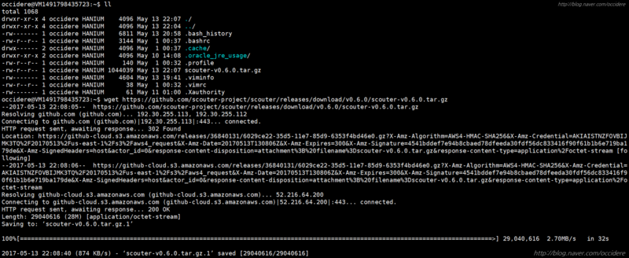


##### :speech_balloon: 다운로드가 완료되었으면 압축풀기를 진행한다.

```bash
tar -zxvf scouter-v0.6.0.tar.gz
```

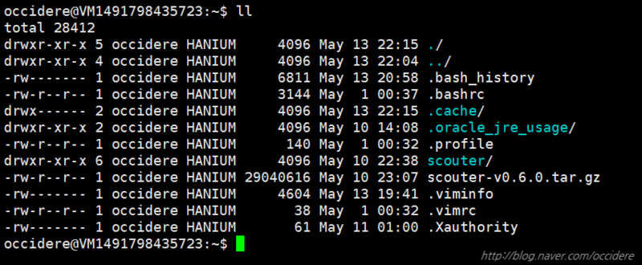

압축풀기가 끝나면 scouter라는 폴더가 생성된다. 이 곳으로 이동한다.


##### :speech_balloon:  scouter 폴더로 이동
```bash
cd scouter
```
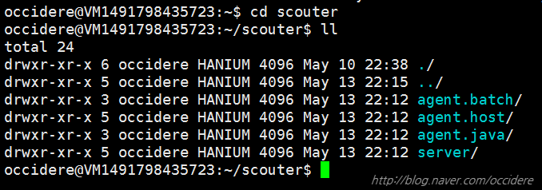

폴더 내부를 확인하면 server와 agent(batch: 독립실행용, host: OS 데이터 수집용, java: WAS  데이터 수집용)가 있는 것을 확인 할 수 있다.

본 예시에서는 batch(단독 실행형 자바 배치 모니터링 에이전트)에 대해서는 다루지 않을 것이며, 해당 예시는 깃허브의 사용법을 참고하도록 한다.
(https://github.com/scouter-project/scouter/blob/master/scouter.document/main/Stand-alone-Java-Batch-Agent_kr.md)


### 1.2. Tomcat 다운로드

본 예시에서는 원활한 진행을 위하여 스카우터 퀵 데모에서 사용한 tomcat과 jmeter를 사용하도록 하겠다.

**tomcat은 알다시피 웹 컨테이너고, jmeter은 tomcat에 부하테스트를 진행할 프로그램이다.**


##### :speech_balloon: 데모 다운로드

```bash
wget https://github.com/scouter-project/scouter-demo/releases/download/v0.4.21/demo-env1.tar.gz
```

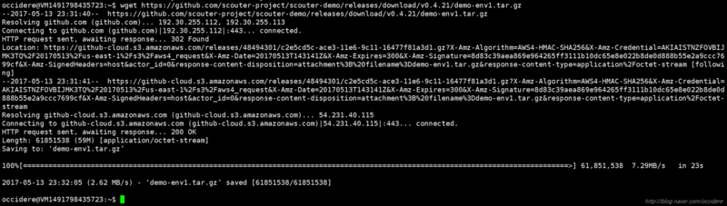


##### :speech_balloon: 다운로드 받은 데모를 압축푼다.

```bash
tar -zxvf demo-env1.tar.gz
```

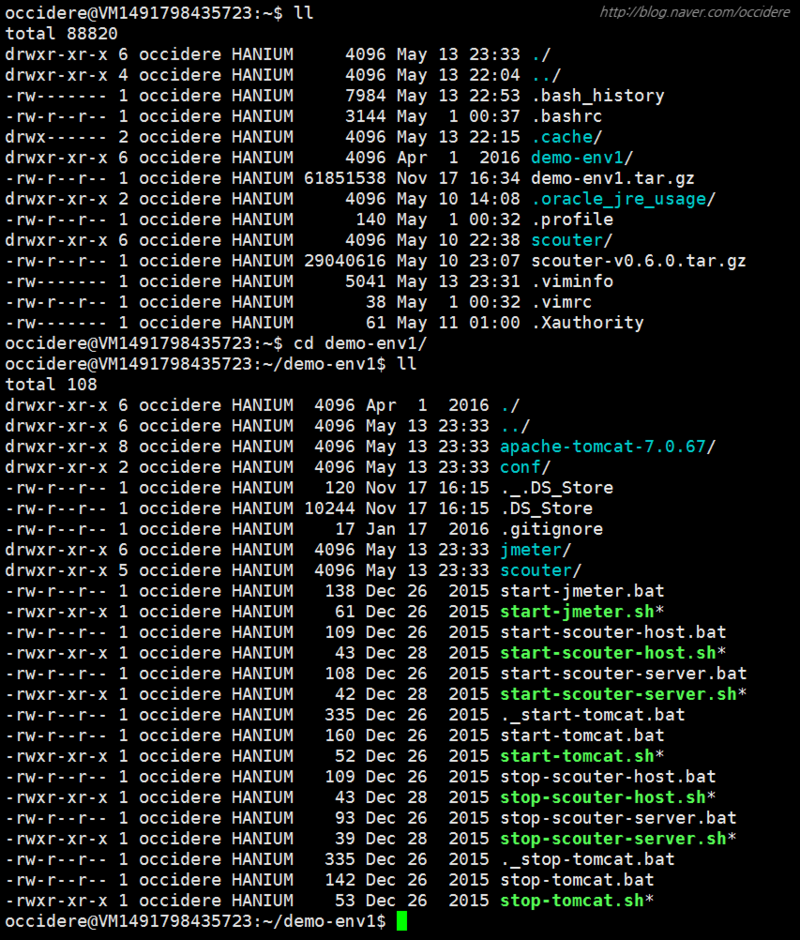

우리가 필요한 파일은 demo-env1폴더 내부의 apache-tomcat-7.0.67/ 폴더와, jmeter/ 폴더, start-jmeter.sh 파일로 총 3개이다.


##### :speech_balloon: 이 3개를 scouter폴더로 옮겨준다.

```bash
mv apache-tomcat-7.0.67/ jmeter/ start-jmeter.sh ~/scouter
```

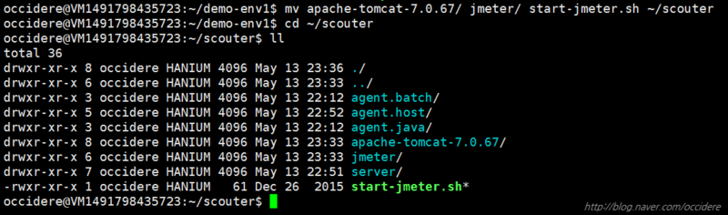


### 1.3. Client 다운로드

윈도우 64비트: [scouter.client.product-win32.win32.x86_64.zip](https://github.com/scouter-project/scouter/releases/download/v0.6.0/scouter.client.product-win32.win32.x86_64.zip)

다른 버전은 역시 깃허브의 다운로드 페이지를 참고한다.(https://github.com/scouter-project/scouter/releases/)

다운받은 zip 파일을 적당한 위치에 압축풀기를 진행한다.
본 예시에서는 그냥 c:\에 풀어놓도록 하겠다.

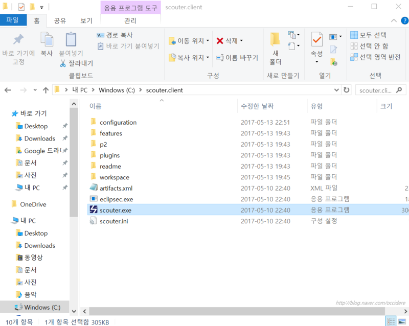

실행 파일은 당연히 scouter.exe이다.
지금 당장은 실행시켜봤자 아무 의미가 없으므로 그냥 넘어간다.

## 2. 환경설정

*이 아래는 옵션 설정이다. 따로 건들지 않아도 스카우터에선 알아서 default 값으로 진행해주기 때문에 너무 귀찮다면 스킵해도 문제는 없으나, 해주는 것을 권장한다. 본 예시에서는 진행하도록 하겠다.*

*단, Java Agent 설정은 반드시 해줘야 한다.*

### 2.1. Host Agent 설정

##### :speech_balloon: host 의 설정을 진행해주기 위하여 agent.host/conf로 이동한다.

```bash
cd ~/scouter/agent.host/conf
```

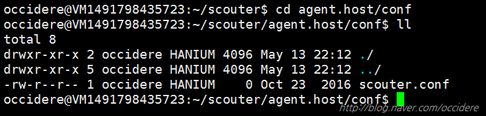


##### :speech_balloon: 내부에 있는 scouter.conf를 열어서 편집한다.

```bash
vi scouter.conf
```

```bash
# Server IP(default:127.0.0.1)
net_collector_ip = 127.0.0.1

# Port Setting(default:6100)
net_collector_udp_port=6100
net_collecotr_tcp_port=6100
```

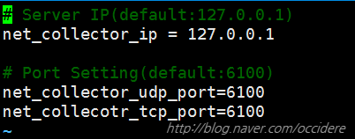

- **net_collector_ip**는 이 에이전트에서 수집한 데이터를 보낼 서버의 ip주소이다.
    - 기본값은 localhost(127.0.0.1)이며, 본 예시에서는 agent와 server가 같은 시스템에서 구동되기 때문에 127.0.0.1로 적용하였다.

- **net_collector_udp_port**는 에이전트와 서버간 udp 통신시 사용할 포트번호이다.
    - 기본값은 6100이다.

- **net_collector_tcp_port**는 에이전트와 서버간 tcp 통신시 사용할 포트번호이다.
    - 기본값은 6100이다.


추가적인 자세한 설정 옵션은
https://github.com/scouter-project/scouter/blob/master/scouter.document/main/Configuration_kr.md#host-agent-options
에 소개되어 있다.


### 2.2 Java Agent 설정

#### 2.2.1. agent.java 설정

##### :speech_balloon: agent.java 폴더로 이동해준다.

```bash
cd ~/scouter/agent.java
```


##### :speech_balloon: 이후 conf 폴더를 만들어준다.

```bash
mkdir conf
```

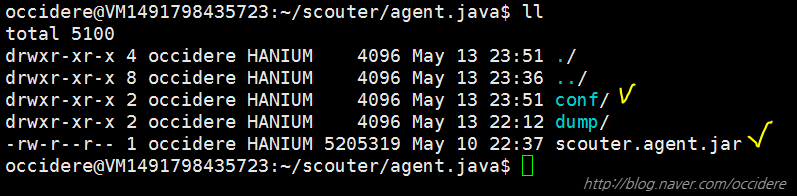

여기서 conf/ 폴더에는 환경설정 파일이 담길 것이고, scouter.agent.jar은 톰캣이 실행되면서 함께 실행될 jar 파일이다.

두개가 모두 있는지 반드시 확인한다.


##### :speech_balloon: 이후 conf 폴더로 이동하여 환경설정 파일을 만들어준다.

```bash
cd conf
vi scouter.conf
```

##### :speech_balloon: 내부에 아래와 같이 입력해준다.

```bash
# Scouter Server IP Address (Default : 127.0.0.1)
net_collector_ip=127.0.0.1

# Scouter Server Port (Default : 6100)
net_collector_udp_port=6100
net_collector_tcp_port=6100

# Scouter Name(Default : tomcat1)
obj_name=MyTomcat
```

세부 설명들은 host agent와 동일하므로 생략하도록 하겠다.


#### 2.2.2. Tomcat 설정

이 부분이 제일 중요하다. 본인은 이 설정을 제대로 못해서 3일동안 고생했었다.

이 설정을 왜 해주냐 하면, **톰캣이 실행되면서, 본인의 정보를 Server로 보낸다는 것을 명시하기 위해 필요**하다.

##### :speech_balloon: apache 폴더 내의 bin폴더로 이동하여 catalina.sh를 수정한다.

```bash
cd apache-tomcat-7.0.67/bin/
vim catalina.sh
```

파일을 열었다면, 40%쯤 아래로 내리다 보면 친절하게 스카우터 옵션 부분을 표시해놓았다.
(대충 240 번째 줄 쯤 된다)

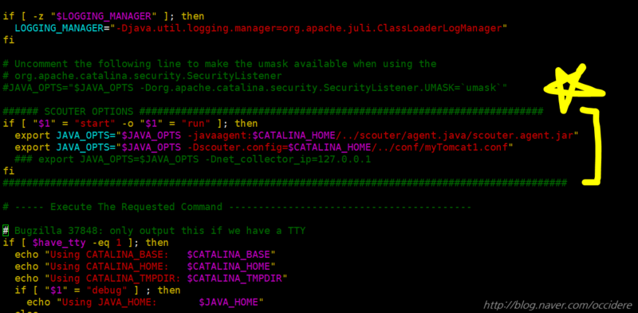


##### :speech_balloon: 사진에서 보이는 ########## SCOUTER OPTIONS ######### 내부를 아래와 같이 수정해준다.

```bash
export AGENT_HOME="/home/본인의계정/scouter/agent.java/" # the location of scouter.agent.jar

if [ "$1" = "start" -o "$1" = "run" ]; then
  export JAVA_OPTS="$JAVA_OPTS -javaagent:$AGENT_HOME/scouter.agent.jar"
  export JAVA_OPTS="$JAVA_OPTS -Dscouter.config=$AGENT_HOME/conf/scouter.conf"
fi
```

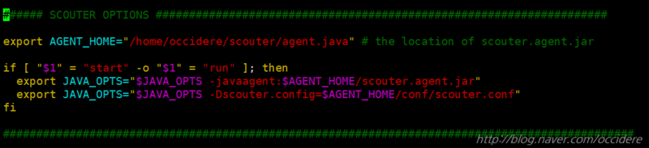

* **AGENT_HOME은 scouter.agent.jar 파일이 위치한 경로**를 넣어주면 된다. **절대경로**를 넣어줘야 한다.
* **javaagent: 뒤에는 scouter.agent.jar 파일의 풀 경로**를 넣어주면 된다.
본 예시에서는 AGENT_HOME이 해당 경로이므로 이를 넣어주었다.
결국 **$AGENT_HOME/scouter.agent.jar** 은 **/home/사용자계정/scouter/agent.java/scouter.agent.jar 과 동일**한 것이다.
* **Dscouter.config= 뒤에는 설정파일의 풀 경로**를 넣어주면 된다.


##### :speech_balloon: 이후 톰캣을 실행시킨 뒤, 제대로 실행되는지 확인해본다.

```bash
./startup.sh
pstree -ha
```

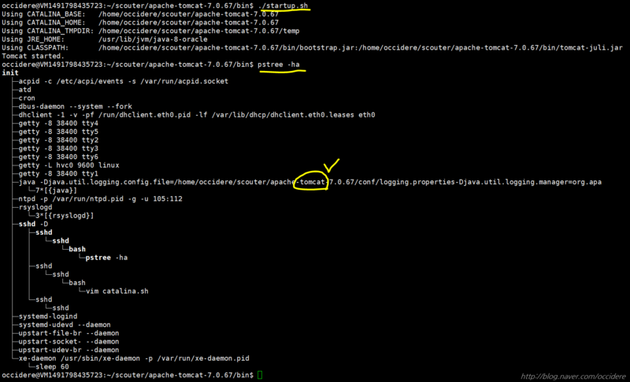

pstree -ha 결과에 tomcat 프로세스가 없거나, ./shutdown.sh를 했을 때 에러가 나면 위의 설정과정이 틀린 것이다.


### 2.3. Server 설정

##### :speech_balloon:  서버 설정을 위해 server폴더로 이동한다.

```bash
cd ~scouter/server/conf
```

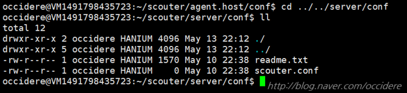


##### :speech_balloon: scouter.conf 파일을 열어서 서버 설정을 진행한다.

```bash
vi scouter.conf
```

```bash
# database directory
db_dir=/user/home/scouter/server/database

# log directory
log_dir=/user/home/scouter/server/logs

# udp port
net_udp_listen_port=6100

# tcp port
net_tcp_listen_port=6100
```

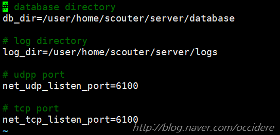

* db_dir은 서버의 정보가 저장될 데이터베이스의 경로이다.
    * 기본값은 /user/home/scouter/server/database 이다.

* log_dir은 서버의 로그가 저장될 경로이다.(생각보다 많이 열어보게 될 것이다.)
    * 기본값은 /user/home/scouter/server/logs 이다.

* net_udp_listen_port는 서버가 udp 연결을 받아들일 포트번호이다.
    * 기본값은 6100이다.

* net_tcp_listen_port는 서버가 tcp 연결을 받아들일 포트번호이다.
    * 기본값은 6100이다.


자세한 설정은 아래의 블로그에 잘 나와있다.
http://www.popit.kr/scouter-open-source-apm-config/


## 3. 테스트 실행

이제 모든 설정이 끝났으므로 실행을 시켜보도록 하겠다.

실행 순서는 크게 상관은 없으나 아래와 같이 해주는 것을 권장한다.
1. tomcat 실행
2. host agent 실행
3. server 실행
4. client 실행
5. jmeter로 부하 테스트

### 3.1. tomcat 실행

##### :speech_balloon:  톰캣이 설치된 폴더 내의 bin 폴더로 이동한 뒤, startup.sh를 실행해준다.

```bash
cd ~/scouter/apache-tomcat-7.0.67/bin
./startup.sh
```


##### :speech_balloon:  이후 pstree -ha | grep tomcat를 통해 실행 여부를 확인한다.

```bash
pstree -ha | grep tomcat
```

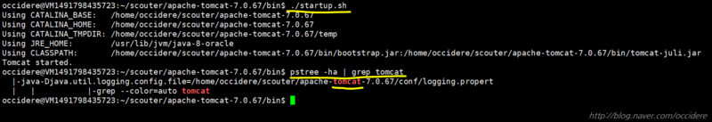


### 3.2. host 실행

##### :speech_balloon: agent.host 폴더로 이동하여 host.sh를 실행시킨다.

```bash
cd ~/scouter/agent.host
./host.sh
```


##### :speech_balloon: 이후 pstree -ha | grep host 를 통해 실행 여부를 확인한다.

```bash
pstree -ha | grep host
```

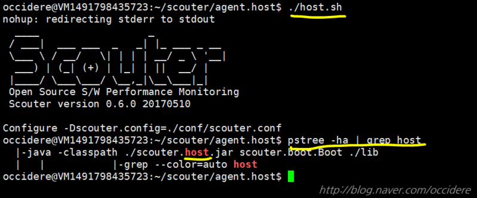


### 3.3. Server 실행

##### :speech_balloon: server 폴더로 이동하여 startup.sh를 실행시킨다.

```bash
cd ~/scouter/server
./startup.sh
```


##### :speech_balloon: 이후 pstree -ha | grep boot.jar 을 통해 실행 여부를 확인한다.

```bash
pstree -ha | grep boot.jar
```

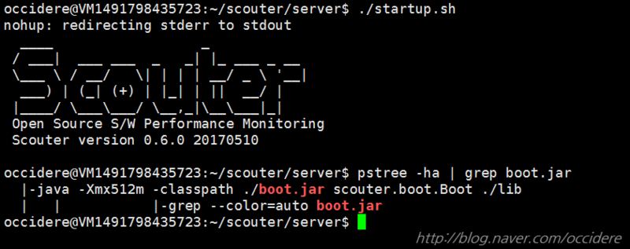


### 3.4. Client 실행

아까 다운받은 클라이언트 폴더로 들어가서 scouter.exe를 실행시킨다.

이후 로그인 창이 나오면 아래와 같이 입력한다.
**Server:** 서버의 주소와 포트를 입력한다. 본 예제에서는 localhost이므로 127.0.0.1이고. 6100포트를 사용하므로 최종적으로 **127.0.0.1:6100** 과 같이 입력하면 된다.
ID/PW는 초기값인 **admin/admin**을 입력하면 된다.

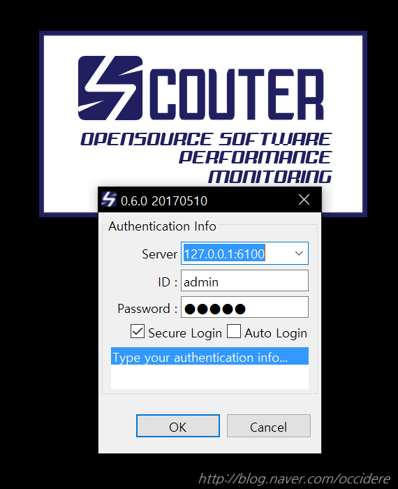

접속에 성공하면 아래와 같은 화면을 볼 수 있다.

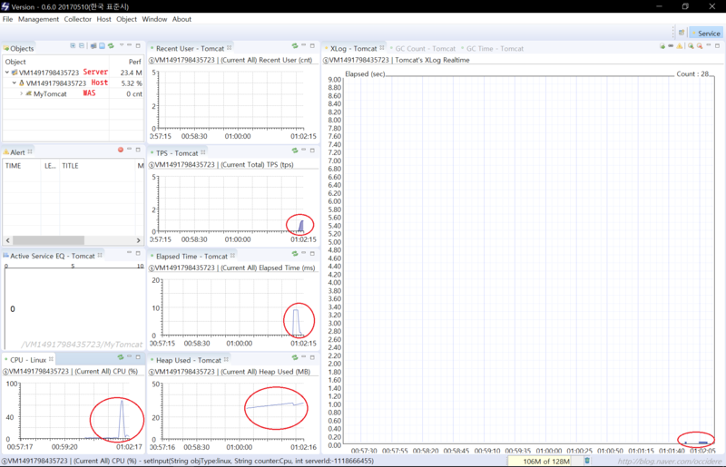

붉은색 원 안에 표시는 curl localhost:8080/jpetstore 명령어를 통해 톰캣 서버에 접속한 기록이 측정된 것이다.
우측 창인 XLog를 잘 보면 아주 조그맣게 네모 칸이 찍혀있는 것을 볼 수 있다.
이 작은 네모 1개가 1개의 접속요청을 뜻한다.(x축은 요청 시간, y축은 응답 시간)

이렇게 명령어를 노가다로 쳐서 확인하기에는 무리가 있다.

따라서 부하 테스트를 진행하기 위해 jmeter를 이용한다.


### 3.5. jmeter를 이용한 부하테스트 실시

##### :speech_balloon: scouter 폴더로 이동하여 ./start-jmeter.sh 명령어를 통해 부하 테스트를 실시한다.

```bash
cd ~/scouter
./start-jmeter.sh
```

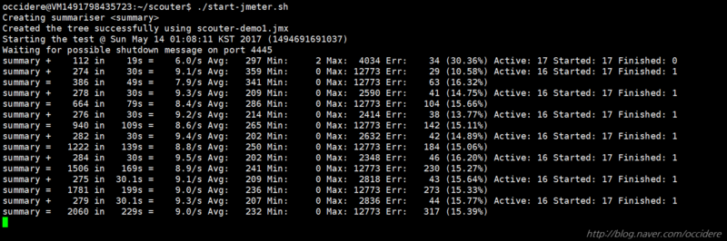

Client를 확인해보면 이전과는 확연히 다른 접속을 볼 수 있다.

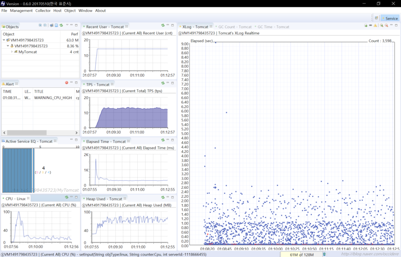

##### :speech_balloon:  jmeter를 종료하려면 Ctrl + C를 누르면 된다.

##### :speech_balloon:  종료는 적당히 알아서 다 꺼주면 된다.
- host 종료: scouter/agent.host/ 내부의 ./stop.sh 실행
- tomcat 종료: apache.../bin 내부의 ./shutdown.sh 실행
- server 종료: scouter/server/ 내부의 stop.sh 실행
- client 종료: 그냥 끄면 됨

본 포스팅에서는 실행에 중점을 두었으므로 세부 데이터 분석은 다음 기회에 소개하도록 하겠다.

## 4. 만들어두면 좋은 파일들

이 챕터는 단순히 귀차니즘이 만들어낸 산물이다.

매번 tomcat실행 -> host실행 -> server 실행, 종료를 하기 귀찮으므로 allstart, allstop 파일을 만들어서 한번에 실행, 한번에 종료를 하게 해준다.

### 4.1. allstart.sh 생성

##### :speech_balloon: scouter 폴더 내부에 allstart.sh를 생성해준다.

```bash
cd ~/scouter
vi allstart.sh
```

##### :speech_balloon: 이후 아래의 내용을 입력한 뒤 저장한다.

```bash
# !/bin/bash

cd ~/scouter/apache-tomcat-7.0.67/bin/
./startup.sh
cd ../../agent.host/
./host.sh
cd ../server/
./startup.sh
cd ..
```

내용은 별거 없다. 그냥 내가 직접 치면서 돌아다닐 경로를 적어놓고 컴퓨터가 알아서 실행하도록 해놓은 것 뿐이다.


##### :speech_balloon: 마지막으로 실행가능하게 권한을 바꿔준다.

```bash
chmod 755 allstart.sh
```


### 4.2. allstop.sh 생성

##### :speech_balloon: scouter 폴더 내부에 allstop.sh를 생성한다.

```bash
cd ~/scouter
```

##### :speech_balloon: 이후 아래의 내용을 입력한 뒤 저장한다.

```bash
# !/bin/bash

cd ~/scouter/apache-tomcat-7.0.67/bin/
./shutdown.sh
cd ../../agent.host/
./stop.sh
cd ../server/
./stop.sh
cd ../
```

역시나 이 마찬가지로 종료 명령어들을 순차적으로 적어준 것에 불과하다.


##### :speech_balloon: 마지막으로 실행가능하게 권한을 바꿔준다.

```bash
chmod 755 allstop.sh
```


### 4.3. 간단한 테스트

만든 파일들을 간단히 테스트해보자.

##### :speech_balloon: allstart 실행

```bash
./allstart.sh
```

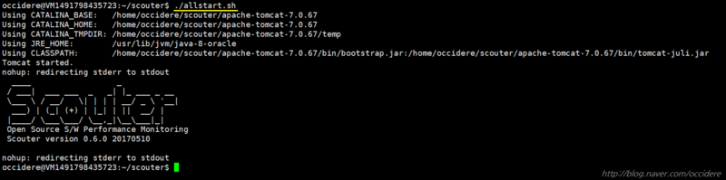

##### :speech_balloon: 실행 결과 확인

```bash
pstree -ha
```

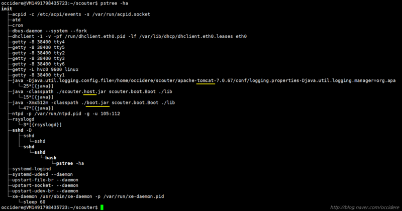


##### :speech_balloon: allstop.sh 실행

```bash
./allstop.sh
```

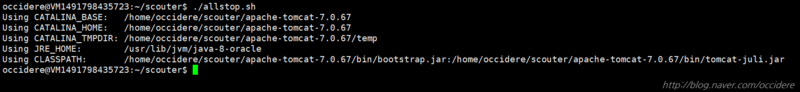


##### :speech_balloon: 실행 결과 확인

```bash
pstree -ha
```

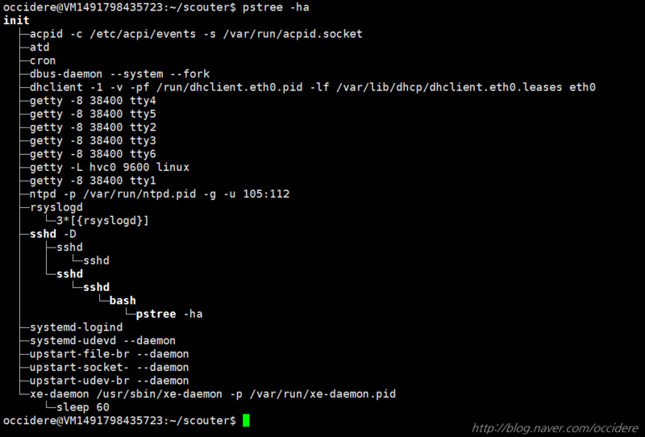


## 5. 마치며...

여기까지 해서 Scouter APM의 설치부터 실행 및 테스트까지 시연해 보았다.

본 포스팅에서 다루지 못한 추가적인 설정법이나 데이터 활용법등을 잘 정리해놓은 블로그를 소개하며 글을 맺도록 하겠다.

[오픈소스 성능 모니터링 도구 Scouter 설정하기](http://www.popit.kr/scouter-open-source-apm-config/)

[내 서비스에 Scouter APM을 적용해보기](http://kingbbode.tistory.com/12#comment13418057)

[[오픈소스컨설팅]Scouter 설치 및 사용가이드(JBoss)](https://www.slideshare.net/ienvyou/scouter-jboss)

~~http://dslee1.blogspot.kr/2016/03/scouter-apm.html~~  페이지 없음

[스카우터(scouter)를 통해 톰캣 성능 모니터링을 해보자!](http://acet.pe.kr/620)