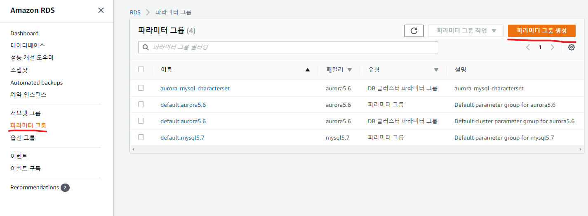
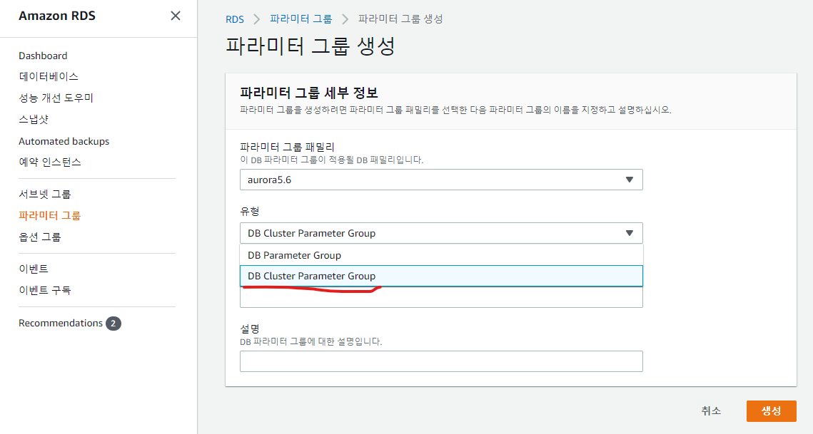

# AWS RDS 관련

## 목차
1. [Amazon RDS Aurora 생성 방법](./aws-create-aurora-mysql-db.md)
1. [Aamzon RDS 리소스 암호화](./aws-rds-resouces-encryption.md)

## :bomb: troubleshooting
### 1. mysql character set 인코딩 변경 방법

참고 : https://designdevelop.tistory.com/68

DB를 생성하면 "파라미터 그룹(PARAMETER GROUPS)" 페이지에 두개의 파라미터 그룹이 생성된 것을 볼 수 있다. 여기에서 "유형" 컬럼은 보면 "파라미터 그룹", "DB 클러스터 파라미터 그룹" 두개가 생성 된 것을 볼 수 있는데, 여기서 "DB 클러스터 파라미터 그룹"을  클릭해 들어가 보자

1. 파라미터 그룹 > DB 클러스터 파라미터 그룹 > 파라미터 그룹 생성

2. "유형" > DB Cluster Parameter Group 선택

3. 생성된 파라미터 그룹 편집
4. "character" 검색

파라메터들은 모두 'engine-default'로 되어 있는데 이 값은 'latin-1'이다. 한글 지원을 위해 아래 항목을 utf8로 바꾼다.

- character-set-client : utf8
- character-set-connection : utf8
- character-set-database : utf8
- character-set-filesystem : utf8
- character-set-results : utf8
- character-set-filesystem : utf8
- character_set_server: utf8

5. 'collation'로 검색

 항목 값을 utf8_general_ci로 수정

- collation_connection : utf8_general_ci
- collation_server : utf8_general_ci

6. 저장 (save changes)
7. 데이터베이스 메뉴 > instance 선택 > 수정
8. RDS 설정 화면에서 DB parameter group 설정을 추가한 parameter group으로 변경
9. Modify DB Instance 버튼으로 설정 변경 완료
10. RDS 리부트
11.  'show variables like 'c%';' 쿼리로 변경 확인

