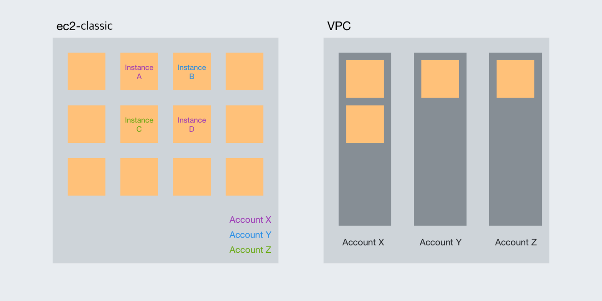

# AWS VPC 에 대해서 알아보자 (아마존 웹 서비스 네트워크의 기초)

tags: aws, vpc, subnet, 서브넷

## 참고 URL
- vpc에 대해서 구체적으로 설명하고 있다. https://www.44bits.io/ko/post/understanding_aws_vpc#%EB%93%A4%EC%96%B4%EA%B0%80%EB%A9%B0-%EC%95%84%EB%A7%88%EC%A1%B4-vpc%EB%A5%BC-%EA%BC%AD-%EC%9D%B4%ED%95%B4%ED%95%B4%EC%95%BC%ED%95%98%EB%82%98%EC%9A%94

## 목차
1. [들어가며: 아마존 VPC를 꼭 이해해야 하나요?](#들어가며-아마존-vpc를-꼭-이해해야-하나요)
1. [아마존 버추얼 프라이빗 크라우드(Amazon VPC)의 이해](#아마존-버추얼-프라이빗-클라우드amazon-vpc의-이해)
1. [아마존 VPC는 언제 사용할까요?](#아마존-vpc는-언제-사용할까요)
1. [기본 VPC의 구성 요소들](#아마존-vpc는-언제-사용할까요)
    1. [VPC](#vpc)
    1. [서브넷(Subnet)](#서브넷subnet)
    1. [라우트 테이블(Route Table)](#라우트-테이블route-table)
    1. [인터넷 게이트웨이(Internet Gateway)](#인터넷-게이트웨이internet-gateway)
    1. [DHCP 옵션셋(DHCP options set)]((#dhcp-옵션셋dhcp-options-set))
    1. [네트워크 ACL(Network ACL) / 시큐리티 그룹(Security Group)](#네트워크-aclnetwork-acl--시큐리티-그룹security-group)
1. [첫 번째 스텝: VPC 생성하기](#첫-번째-스텝-vpc-생성하기)
1. [두 번째 스텝: 서브넷 만들기](#두-번째-스텝-서브넷-만들기)
1. [세 번째 스텝: 인터넷 기이트웨이 만들기](#두-번째-스텝-서브넷-만들기)
1. [마치며](#마치며)

## 들어가며: 아마존 VPC를 꼭 이해해야 하나요?
아마존 웹서비스를 사용하다 보면 VPC나 서브넷과 같은 개념을 자주 접하게 됩니다. 하물며 AWS의 가장 기본이 되는 서비스인 EC2 인스턴스를 만들 때도 VPC와 서브넷을 지정해야합니다. 이러한 개념을 정확히 모르더라도 AWS를 사용하는게 불가능한 것은 아닙니다. 그렇다면 VPC를 꼭 이해해야할까요? AWS를 충분히 활용하기 위해서는 그렇습니다.

아마존 웹 서비스는 서버 호스팅 서비스가 아닌 클라우드 서비스로 분류됩니다. 클라우드서비스에는 기존 서버 호스팅과 차별화된 중요한 특징들이 있습니다. 중요한 차이중 하나가 바로 네트워크 환경을 직접 설계할 수 있다는 점입니다.
처음부터 이러한 차이가 부각 되었던 것은 아닙니다. 독립된 네트워크 환경을 구성할 수 있는
버추얼 프라이빗 클라우드(VPC, Virtual Private Cloud)는 2011년 8월에 처음 릴리스 되었습니다. 현재는 AWS에서 제공되는 대부분의 서비스가 VPC에 의존적입니다. VPC를 의식하지 않고도 AWS를 사용할 수 있습니다만, 그 뒤에는 아마존 웹서비스에서 계정 생성 시 함께 생성되는 기본 VPC(Default VPC)가 있습니다.

따라서 AWS의 서비스들을 제대로 이해하고 사용하기 위해서는 VPC에 대한 기본적인 이해는 필수적입니다. 이 글에서는 기본 VPC의 구성 요소들을 살펴보고 직접 만들어가면서 VPC를 배워보겠습니다.


## 아마존 버추얼 프라이빗 클라우드(Amazon VPC)의 이해

VPC를 만들어 보기에 앞서 VPC가 무엇인지 이해해야 합니다. 아마존 VPC의 공식 웹페이지에서는 VPC를 다음과 같이 소개합니다.

> Amazon Virtual Private Cloud(VPC)를 사용하면 AWS 클라우드에서 논리적으로 격리된 공간을 프로비저닝하여 고객이 정의하는
가상 네트워크에서 AWS 리소스를 시작할 수 있습니다. IP 주소 범위 선택, 서브넷 생성, 라우팅 테이블 및 네트워크 게이트웨이
구성 등 가상 네트워킹 환경을 완벽하게 제어할 수 있습니다. VPC에서 IPv4와 IPv6를 모두 사용하여 리소스와 애플리케이션에 
안전하고 쉽게 액세스할 수 있스빈다. [- 아마존 버추얼 프라이빗 클라우드(Amazon Virtual Private Cloud)](https://aws.amazon.com/ko/vpc/) 

이 소개에서 `논리적으로 격리된 공간을 프로비저닝한다`는 내용에 주목해 주세요. 아마존 웹 서비스는 기본적으로 다양한 고객들이 사용하는
공용 환경입니다. 사용자들은 이 환경 위에서 EC2 인스턴스와 RDS 데이터베이스를 비롯한 다양한 리소스들을 생성해서 사용합니다.
클라우드 위에서 생성한 리소스들은 기본적으로 네트워크를 통해서 접근합니다. 이 때 하나의 계정에서 생성하는 리소스들만의 격리된
네트워크를 만들어주는 기능이 바로 VPC입니다. VPC를 사용하면 특정 사용자의 리소스들이 논리적으로 격리된 네트워크에서 생성되기
때문에 다른 사람들은 접근하는 것은 물론 보는 것도 불가능합니다.

2019년 현재 VPC는 모든 사용자에게 강제적으로 적용되어 있습니다. 따라서 VPC 없이는 대부분의 서비스를 사용하는 것이 불가능합니다.
앞서 이야기했습니다만 아마존 VPC가 처음부터 강제적으로 적용되어 있던 것은 아닙니다. 아마존 VPC가 정식 서비스로 릴리스 된 것은 
2011년 8월입니다. 이 이전에는 EC2-클래식(EC2 Classic) 네트워크 환경이 사용되었습니다.

> EC2-Classic 사용을 통해 다른 고객과 공유하는 단일 일반 네트워크에서 인스턴스가 실행됩니다. Amazon VPC 사용을 통해 AWS 계정에
속하도록 논리적으로 독립된 Virtual Private Cloud(VPC)에서 인스턴스가 실행됩니다.
Amazon EC2의 최초 출시 당시 EC2-Classic 플랫폼이 도입되었습니다. 2013년 12월 4일 이후에 AWS 계정을 생성한 경우 
EC2-Classic을 지원하지 않으니 VPC에서 Amazon EC2 인스턴스를 시작해야 합니다. 
계정이 EC2-Classic을 지원하지 않는 경우 기본 VPC가 생성됩니다. 기본적으로 인스턴스를 시작할 때 이를 기본 VPC에 시작합니다. 
또는 기본 VPC가 아닌 VPC를 생성하고 인스턴스를 시작할 때 이를 지정할 수 있습니다. [– Amazon EC2 네트워크 및 보안 EC2-Classic](https://docs.aws.amazon.com/ko_kr/AWSEC2/latest/UserGuide/ec2-classic-platform.html)

위의 내용에서 알 수 있듯이 EC2-클래식 네트워크 환경은 다른 사용자들과 함께 사용하는 공용 공간입니다. 
과거에는 EC2-클래식과 EC2-VPC 네트워크 환경을 선택해서 사용할 수 있었습니다. 
물론 아마존 VPC 출시 이전에는 EC2-클래식 네트워크 환경만 제공되었습니다.

아마존 VPC가 릴리스 되고 2년이 지난 2013년 12월 4일 이후 생성된 AWS 계정에서는 EC2-Classic 네트워크 환경을 더 이상 
사용할 수 없습니다. 따라서 더 이상 아마존 VPC는 선택사항이 아닙니다. 하지만 EC2 인스턴스 하나를 만들기 위해서 사용자가 
직접 네트워크 환경을 직접 구축해야한다면 불편하고 복잡할 것입니다. 사용자가 직접 네트워크 환경을 설계할 수 있다는 것은
아주 큰 장점이지만, 바로 사용할 수 있는 기본 환경을 제공하는 것도 중요합니다. 따라서 AWS에서는 AWS 계정을 생성할 때 
리전 별로 기본 VPC를 함께 생성해줍니다. 이 기본 VPC를 사용하면 아마존 VPC를 크게 의식하지 않더라도 EC2-클래식
네트워크를 사용하듯이 쉽게 AWS에서 제공하는 서비스들을 이용할 수 있습니다.
또한 기본 VPC를 사용하더라도 EC2-클래식과 달리 격리된 네트워크 환경의 장점을 누릴 수 있습니다.




하지만 AWS 위에서 프로덕션 환경을 구축하기 위해서는 아마존 VPC에 대한 좀 더 깊은 이해를 필요로 합니다
직접 VPC를 디자인하고 구축하진 않더라도 최소한 기본 VPC가 어떻게 구성되어 있는지만 이해하고 있더라도 큰 도움이 
될 것입니다. 이 글의 최종 목표는 기본 VPC 구성 요소들을 살펴보고, 마법사를 사용하지 않고 기본 VPC를 직접 만들어보는
일입니다.  


## 아마존 VPC는 언제 사용할까요?
아마존 VPC는 언제 사용하는 걸까요? 아마존 웹 서비스를 사용하는 동안 거의 항상 사용하고 있습니다.
의식해본 적이 없을 수도 있습니다만 EC2 생성 과정의 한 장면을 같이 살펴보겠습니다.


이 화면의 중간 쯤에 네트워크(Network)라는 항목이 보입니다. 바로 이 네트워크 속성이 EC2 인스턴스를 실행할 VPC를 
선택하는 항목입니다. VPC를 지정하지 않는 방법은 없습니다. 반드시 인스턴스가 속할 하나의 VPC를 지정해야만 합니다.
그 바로 아래의 서브넷도 VPC 리소스 중 하나입니다. 서브넷은 VPC에 속해있는 리소스이며, 하나의 인스턴스는 반드시 
하나의 서브넷에 속해야 합니다. 단, 기본값을 사용한다면 기본 VPC에서 인스턴스가 생성될 것입니다.

EC2를 만들 때 VPC가 필요한 걸 확인했으니, 이번에는 RDS도 한 번 만들어 보겠습니다.


RDS를 만드는 과정 중 세 번째 단계에서 네트워크 설정을 하게 됩니다. 자세히 보시면 EC2의 네트워크 설정과 아주 
비슷한 것을 알 수 있습니다. VPC와 서브넷을 선택해야 합니다. 여기서 서브넷 그룹은 EC2의 설정 방식과 는 조금 다릅니다만, 
하나의 RDS 인스턴스가 하나의 서브넷에 속해야 한다는 것은 다르지 않습니다.

서버리스 환경에서 함수를 실행해주는 AWS 람다(AWS Lambda)는 어떨까요? 람다는 생성시에는 별도로 VPC지정하는 항목이 없습니다.


하지만 웹 콘솔에서 함수 생성 후 상세화면을 확인해보면 네트워크를 선택할 수 있는 설정을 찾을 수 있습니다. 
람다 함수는 VPC를 지정하지 않고도 실행할 수 있짐난, 이 경우 VPC 내부에서만 접근 가능한 리소스를 사용할 수 없습니다.
네트워크 항목에서 특정 VPC를 지정하면, 해당 VPC에서 람다 함수가 실행되므로 같은 네트워크 환경에 있는 리소스를 
사용할 수 있습니다. 어떤가요? VPC를 거의 항상 사용하고 있다는 의마가 조금 와닿으시나요.

그럼 이제 본격적으로 VPC가 어디에 있는지 찾아보겠습니다. VPC는 중의적인 이름입니다. VPC 그 자체가 리소스의 이름입니다.
VPC 그 자체가 리소스의 이름입니다. 하지만 동시에 버추얼 프라이빗 클라우드(VPC)를 구축하기 위한 일체의 리소스를 제공하는 
서비스의 이름이기도 합니다.  웹 콘솔 메뉴에서 VPC를 찾아보면 VPC 대시보드에 접속할 수 있습니다.


대시보드에 접속해보면 VPC와 관련된 리소스 목록이 무더기로 출력됩니다. 대시보드 메인에서 확인할 수 있는 리소스의 종류만 
무려 17가지나 됩니다. 이 리소스들을 지금 당장 전부 이해해야하는 건 아닙니다. 그 중에서도 기초가 되는 기본 VPC를 
구축하기 위한 리소스에 대해서 알아보겠습니다.


## 기본 VPC의 구성 요소들
계정을 처음 만들었을 때 하나의 리전에서 만들어지는 리소스들은 다음과 같습니다.

- 1 VPC
- n 서브넷(subnet) (n은 사용할 수 있는 가용존의 개수)
- 1 라우트 테이블(Route Table)
- 1 네트워크 ACL(Network ACL)
- 1 시큐리티 그룹(Security Group)
- 1 인터넷 게이트웨이(Internet Gateway)
- 1 DHCP 옵션셋(DHCP options set)

이렇게 7개 리소스가 이게 전부입니다. VPC를 처음 시작할 때는 이정도면 충분합니다. 공부해야할 리소스가 17개에서
7개로 줄어들었습니다. 그럼 하나씩 알아보도록 하겠습니다. 

## VPC
VPC는 프라이핏 클라우드를 만드는 데 가장 기본이 되는 리소스입니다. VPC는 논리적인 독립 네트워크를 구성하는 리소스입니다로
이름과 IPv4 CIDR 블록을 필수적으로 가집니다.

CIDR 블록은 IP의 범위를 지정하는 방식입니다. CIDR 블록은 IP주소와 슬래시(/) 뒤에 따라오는 넷마스크 숫자로 구성되어있습니다. 
이 숫자는 IP범위를 나타냅니다. 이 숫자가 32이면 앞에 기술된 IP 정확히 하나를 가리킵니다. 예를 들어 192.168.0.0/32는 192.168.0.0을
가리킵니다.  범위는 지정된 IP부터 2^(32-n)개가 됩니다. 예를들어 뒤의 숫자가 24라면, 2^(32-24)=256개의 IP 주소를 의미합니다. 
에를들어 192.168.0.0/24는 192.168.0.0 ~ 192.168.1.255까지의 IP를 의미합니다.

> CIDR를 정확하게 이해하기 위해서는 IP 주소의 2진수 표기와 서브넷 마스크와 같은 개념을 알아야 합니다. 여기서는 이 정도만 알아둬도 큰
어려움은 없습니다.

클라우드에서 생성하는 자원들은 기본적으로 특정 네트워크 위에서 생성되며 이에 접근하기 위한 프라이빗 IP를 가집니다.
이 리소스들을 특정한 VPC 위에서 만들어집니다. 따라서 VPC의 CIDR 범위 안에서 적절한 IP를 할당 받게 됩니다. 예를 들어서 
192.168.0.0/24 CIDR 블록을 가진 VPC에서 생성한 EC2 인스턴스는 192.168.0.127이라는 IP를 할당 받을 수 있습니다. VPC의 범위 내에서 
할당 가능한 IP가 모두 할당되면 더 이상 리소스를 만들 수 없습니다. 따라서 적절한 크기의 VPC를 만들어야 합니다. 
하나의 VPC의 최대 크기는 16입니다. 이 경우 2^(32-16)=65536개의 IP를 사용할 수 있습니다. 이보다 큰 VPC는 생성할 수 없습니다. 


VPC를 만들 때 또 하나 고려해야할 점이 있습니다. CIDR의 범위를 지정하는데 특별한 제약은 없습니다만, 
인터넷과 연결되어 있는 경우 문제가 발생할 수 있습니다. 예를 들어 52.12.0.0/16을 CIDR 블록으로 지정한 경우를 생각해보겠습니다. 
이 VPC에서 52.12.0.0/16로 접속하는 트래픽은 VPC 내부로 라우트 됩니다. 그런데 이 범위의 IP는 인터넷에서 사용할 수 있는 IP입니다. 
따라서 이 VPC에서는  52.12.0.0/16에 속한 인터넷 IP에 접근하는 것이 원천적으로 불가능합니다. 
인터넷 연결이 필요한 경우 반드시 사설망 대역을 사용해야 하며, 인터넷 연결이 필요하지 않더라도 가능하면 사설망 
대역을 사용하는 것을 권장합니다. 사설망 대역은 10.0.0.0/8, 172.16.0.0/12, 192.168.0.0/16가 있습니다.

VPC는 독립된 네트워크 환경으로 구성되기 때문에 CIDR이 같거나 겹치더라도 생성하는 것이 가능합니다.
하지만 추후에 다수의 VPC를 함께 사용하는 경우 IP 대역이 겹치면 문제가 발생할 수 있습니다. 
VPC를 만드는 것은 쉽습니다만 한 번 만들고 나면 기존 CIDR을 변경하는 것은 불가능합니다.
문제가 생겨서 VPC 내부의 모든 자원을 이동하는 건 매우 힘든 일입니다.
따라서 프로덕션 환경을 구축할 때는 VPC 제약사항들을 충분히 이해하고 CIDR을 정하는 것이 좋습니다.
기본 VPC의 CIDR 블록은  172.31.0.0/16입니다.

> 기존 CIDR을 변경하는 것은 불가능하지만, 2017년 8월부터는 이미 만들어져있는 VPC에 새로운 CIDR을 추가할 수 있습니다. 
자세한 내용은 관련 공지를 확인해주세요.


## 서브넷(Subnet)
VPC만 가지고는 아직 아무것도 할 수 없습니다. VPC는 다시 한 번 CIDR 블록을 가지는 단위로 나눠집니다. 
서브넷은 실제로 리소스가 생성되는 물리적인 공간인 가용존Available Zone과 연결됩니다. 
VPC가 논리적인 범위를 의미한다면, 서브넷은 VPC 안에서 실제로 리소스가 생성될 수 있는 네트워크라고 
생각할 수 있습니다. 다른 서비스의 리소스를 생성할 때 VPC만 지정하는 경우는 없습니다. 
VPC와 서브넷을 모두 지정하거나 서브넷을 지정하면 VPC는 자동적으로 유추되기도 합니다.

하나의 VPC는 N개의 서브넷을 가질 수 있습니다. 서브넷의 최대 크기는 VPC의 크기와 같습니다. 
VPC와 동일한 크기의 서브넷을 하나만 만드는 것도 가능합니다. 서브넷을 만들지 않을 수도 있지만, 
이 경우 VPC로 아무것도 할 수 없습니다. 일반적으로 사용할 수 있는 가용존을 고려해서 적절한 크기의 
서브넷들을 가용존 수만큼 생성해서 사용합니다. 
N 가용존만큼 서브넷을 만들어 리소스를 분산하면 재해 대응 측면에서도 유리합니다.

서브넷의 넷마스크 범위는 16(65535개)에서 28(16개)을 사용할 수 있으며, VPC CIDR 블럭 범위에 속하는 
CIDR 블럭을 지정할 수 있습니다. 하나의 서브넷은 하나의 가용존과 연결 됩니다. 리전에 따라서 사용가능한 
가용존의 갯수는 다릅니다. 따라서 재해 대응을 위해 가용존만큼 서브넷을 나누는 경우 특정 리전에서 
사용가능한 가용존의 갯수를 미리 확인할 필요가 있습니다. 모든 가용존을 사용하지 않더라도 2개 이상의 
가용존을 사용하는 게 일반적입니다. 
기본 VPC에서는 가용존 갯수만큼 넷마스크 20의 서브넷들을 자동적으로 생성합니다.


## 라우트 테이블(Route Table)
라우트 테이블은 서브넷과 연결되어있는 리소스입니다. 서브넷에서 네트워크를 이용할 때는 이 라우트 
테이블을 사용해서 목적지를 찾게 됩니다. 라우트 테이블은 서브넷과 연결되어있지만 VPC를 생성할 때 
만들어지고 VPC에도 연결되어 있습니다. 
이 라우트 테이블은 VPC에 속한 서브넷을 만들 때 기본 라우트 테이블로 사용됩니다.

하나의 라우트 테이블은 VPC에 속한 다수의 서브넷에서 사용할 수 있습니다. 자동 생성되는 라우트 테이블에는 
한 가지 룰만이 정의되어있습니다. VPC의 CIDR 블럭을 목적지로 하는 경우 타깃이 local인 규칙입니다. 
예를 들어 VPC의 CIDR 블럭이 172.31.0.0/16일 때 이 네트워크 안에서 목적지가  172.31.0.0/16 범위에 있는 
리소스를 찾는다면 VPC 내부에서 찾습니다. 이 규칙은 삭제할 수 없습니다. * 인터넷을 연결하거나 다른 
VPC와 통신하기 위해서는 라우트 테이블에 라우트 규칙을 추가적으로 정의해야만 합니다.

> 앞서 VPC 절에서는 VPC를 디자인할 때 주의해야할 내용들에 대해서 소개했습니다. 
예를 들어 사설망의 CIDR 블럭을 사용해야하는 이유는, 라우트 테이블의 기본 규칙이 VPC의 CIDR 블럭에 의해 
점유되기 때문입니다. 따라서 사설망이 아닌 CIDR을 사용하면 인터넷과 연결하는 라우트 규칙을 정의하더라도 
통신할 수 없게됩니다. 또한 비슷한 이유로 사설망에 해당하는 CIDR 블럭을 사용하더라도, 
다른 VPC와 통신할 때 CIDR이 겹치는 부분과는 통신할 수 없습니다.


## 인터넷 게이트웨이(Internet Gateway)
VPC는 기본적으로 격리되 네트워크 환경입니다. 따라서 VPC에서 생성된 리소스들은 기본적으로 인터넷을 
사용할 수가 없습니다. 인터넷에 연결하기 위해서는 인터넷 게이트웨이가 필요합니다. 라우팅 테이블에 인터넷 
게이트웨이를 향하는 적절한 규칙을 추가해주면 특정 서브넷이 인터넷과 연결됩니다. 
하지만 서브넷과 인터넷 게이트웨이를 연결하는 것만으로는 인터넷을 사용할 수 없습니다. 
인터넷을 사용하고자 하는 리소스는 퍼블릭 IP를 가지고 있어야합니다.


## DHCP 옵션셋(DHCP options set)
DHCP 옵션셋은 TCP/IP 네트워크 상의 호스트로 설정 정보를 전달하는 DHCP 표준입니다. 
이 기능을 사용하면 도메인 네임 서버, 도메인 네임, NTP 서버, NetBIOS 서버 등의 정보를 설정할 수 있습니다. 
일반적으로 VPC 생성 시 만들어지는 DHCP 옵션셋을 그대로 사용합니다.


## 네트워크 ACL(Network ACL) / 시큐리티 그룹(Security Group)
네트워크 ACL은 주고(outbound) 받는(inbound) 트래픽을 제어하는 가상 방화벽입니다. 
하나의 네트워크 ACL은 다수의 서브넷에서 재사용할 수 있습니다. EC2 인스턴스를 사용해보았다면 ACL보다는 
시큐리티 그룹에 익숙할 것입니다. 시큐리티 그룹은 인스턴스의 앞단에서 트래픽을 제어하는 가상 방화벽인 반면, 
네트워크 ACL은 서브넷 앞단에서 트래픽을 제어하는 역할을 합니다. 따라서 네트워크 ACL의 규칙을 통과하더라도 
시큐리티 그룹의 규칙을 통과하지 못 하면 인스턴스와는 통신하지 못 할 수 있습니다. 
이 두 가지 리소스를 통해서 안전한 네트워크 환경을 구축할 수 있습니다.


## 첫 번째 스텝: VPC 생성하기
여기까지 VPC의 개념에 대해서 알아보았으니 이제 실제로 VPC를 만들어보도록하겠습니다.

이 예제에서는 버지니아(us-east-1) 리전에서 VPC를 생성해보겠습니다. 
VPC 대시보드에서 VPC 목록Your VPCs으로 들어갑니다. VPC 목록에는 버지니아 리전에 생성되어있는 기본 VPC가 나타납니다만, 
여기서는 기본 VPC를 삭제해둔 상태입니다.

> 기본 VPC가 필요한 상황에서 실수로 삭제해버렸다면 문제가 될 수 있습니다. 이럴 경우 
아마존 지원 센터Support Center에 문의하면 기본 VPC를 복구해줍니다. 기본 VPC는 기본 VPC라는 
특별한 표식이 딸려있기는 합니다만, 사실 직접 VPC를 구성한다고 해서 다른 점이 있는 것은 아닙니다. 
따라서 VPC의 구성 원리를 이해한다면 VPC가 지워진다고 걱정할 필요는 없습니다.


오른쪽 위에서 VPC 만들기(Create VPC) 버튼을 클릭합니다.


VPC를 생성할 때 지정해야할 값은 4가지가 있습니다. 이름 태그Name tag는 중요하지만 선택사항입니다. 
필수적으로 입력해야하는 값은 IPv4 CIDR 블록 하나 뿐입니다. 이 값을 지정할 때는 특별한 이유가 없다면 
반드시 사설망 대역 범위 내에서 지정하시기 바랍니다. 
사설망 대역으로는 10.0.0.0/8,  172.16.0.0/12, 192.168.0.0/16가 있습니다. 
여기서는 이름 태그를 New Default, IPv4 CIDR 블록을 10.0.10.0/16으로 지정하겠습니다.


VPC가 정상적으로 생성된 것을 확인할 수 있습니다. VPC를 만드는 건 이걸로 끝입니다. 
한 가지 확인해야하는 점은 DNS 관련 설정값입니다. 기본 VPC는 DNS 해석(DNS Resolution) 기능과 
DNS 호스트네임(DNS hostnames)이 모두 활성화 되어있습니다. DNS 해석 기능은 DNS 호스트네임을 IP로 해석할 때 
AWS에서 제공하는 DNS 서버를 사용하는 기능입니다. 
이 기능은 새로 만든 VPC에서도 기본적으로 활성화되어있습니다. DNS 호스트네임은 VPC 내부에서 생성되는 
인스턴스에 퍼블릭 DNS 호스트네임을 할당해주는 기능입니다. 이 기능인 DNS 해석과 달리 기본적으로 
비활성화되어있습니다. VPC를 선택하고 오른쪽 위의 액션(Actions),
DNS 호스트네임 수정(*Edit DNS Hostnames) 메뉴를 선택해 이 기능을 활성화해줍니다.
 
> * 작년 11월에는 AWS 서울 리전에서 대규모 장애가 발생했던 적이 있습니다. 
이 장애의 원인이 바로 AWS 내부 DNS 서버였다고 합니다. 
자세한 내용은 당시 [AWS의 장애 공지](https://aws.amazon.com/ko/blogs/korea/follow-up-to-the-november-22-event-in-aws-seoul-region/)를 
확인해보시기 바랍니다.


VPC를 시작하는 것은 생각만큼 만만치 않습니다만, VPC를 직접 만드는 건 허무할만큼 쉽습니다. 
하지만 앞서 이야기했듯이 VPC만으로는 아무것도 할 수가 없습니다. 
이제 서브넷을 만들어야합니다. 그 전에 VPC와 함께 만들어진 자원들을 하나씩 살펴보겠습니다.

VPC와 함께 이 VPC에서 기본으로 사용될 라우트 테이블이 함께 만들어집니다.


이 라우트 테이블은 실제로는 서브넷과 연결됩니다. 하지만 VPC에도 연결이 되어있는데, 
여기에 연결된 라우트 테이블이 VPC에 속한 서브넷을 생성할 때 서브넷과 자동으로 연결됩니다. 
앞서 설명했듯이 라우트 테이블은 기본적으로 하나의 룰을 가지고 있습니다. 
이 룰은 VPC 내부에서 VPC 내부의 다른 자원을 찾을 때 사용하는 규칙입니다.


VPC와 함께 만들어지는 리소스는 하나가 더 있습니다. 바로 DHCP 옵션 셋(DHCP Options Sets) 입니다.


DHCP 옵션 셋은 도메인 네임 서버, 도메인 네임, NTP 서버, NetBIOS 서버 등의 정보를 가지고 있습니다. 
일반적으로는 기본값을 그대로 사용합니다.

VPC의 보안을 담당하는 ACL과 시큐리티 그룹(Security Group) 리소스도 생성됩니다.


ACL은 서브넷의 앞단에서 방화벽 역할을 하는 리소스입니다. ACL에는 인바운드와 아운바운드 규칙이 따로 있습니다. 
VPC와 함께 생성되는 ACL에는 인바운드와 아웃바운드 규칙 각각 2개의 규칙을 가지고 있습니다. 
규칙의 번호는 우선 순위를 나타냅니다. 번호가 *인 규칙은 다른 어떤 룰에도 매치하지 않을 경우 사용하는 
기본 규칙입니다. 이미지에서 확인할 수 있듯이 기본 규칙은 모든 트래픽을 차단Deny합니다. 하지만 이 ACL에서는 
기본 규칙이 사용되지 않습니다. 왜냐하면 100번 규칙에서 모든 트래픽을 허용Allow하고 있기 때문입니다.


마지막 하나는 인스턴스 앞단에서 방화벽 역할을 하는 시큐리티 그룹입니다.


ACL이 서브넷의 트래픽을 제어한다면 시큐리티 그룹은 인스턴스의 트래픽을 제어합니다. VPC를 만들 때 생성되는 
시큐리티 그룹은 VPC 내부의 통신을 허용하기 위한 특별한 규칙을 가지고 있습니다. 먼저 이 시큐리티 그룹의 
아웃바운드 규칙은 모든 트래픽에 대해서 허용되어있습니다. 반면에 인바운트 규칙이 흥미롭습니다. 
트래픽을 제어하는 규칙의 소스Source에는 일반적으로 CIDR을 지정합니다. 흥미로운 건 CIDR 대신 
시큐리티 그룹의 ID를 지정하면, 해당하는 시큐리티 그룹을 가진 리소스에 대해서만 트래픽을 하용하는 것이 가능합니다. 
더 흥미로운 점은 기본 시큐리티 그룹에 유일한 인바운드 규칙의 소스가 바로 시큐리티 그룹 자기 
자신의 ID라는 점입니다. 얼핏 이상해보입니다만, 이 규칙들을 가진 인스턴스들 간에 트래픽을 허용하기 위한 
용도로 사용됩니다. 따라서 VPC 내부의 리소스들 간에 통신을 허용하기 위해서는 각각의 리소스들이 모두 
이 시큐리티 그룹을 사용해야합니다.


여기까지 VPC를 만들고, VPC와 함께 만들어지는 리소스들에 대해서 살펴보았습니다. 앞서 이야기했듯이 
기본 VPC에는 7개의 리소스가 있습니다. 그런데 VPC 하나를 만들었을 뿐인데 
VPC, 라우트 테이블, DHCP 옵션셋, 네트워크 ACL, 시큐리티 그룹 이렇게 5개의 리소스가 만들어졌습니다. 
이제 남은 것은 서브넷과 인터넷 게이트웨이입니다.


## 두 번째 스텝: 서브넷 만들기

VPC는 논리적인 구획을 나눠줄 뿐이기 때문에 이것만으로는 아무것도 할 수 없습니다. 
구체적인 예를 들어본다면 VPC 위에 직접 EC2 인스턴스를 만들 수는 없습니다. 
이러한 리소스들은 VPC가 아닌 VPC 안에서 가용존과 연결된 서브넷 위에 만들어집니다. 
따라서 앞서 만든 VPC에 속한 서브넷을 만들어야합니다.


VPC 대시보드에서 서브넷 목록Subnets 메뉴에 들어갑니다. 아직은 아무런 서브넷이 없습니다. 
서브넷 생성(*Create subnet) 버튼을 클릭합니다.

> *기본 VPC가 있다면 기본 VPC에 속한 서브넷이 존재할 것입니다.


CIDR과 서브넷 개념을 이해한다면, VPC를 만드는 것만큼이나 서브넷을 만드는 것도 간단합니다. 
이름 태그(Name tag)는 VPC와 마찬가지로 옵션입니다. VPC는 앞서 생성한 VPC ID를 찾아서 선택합니다. 
다음은 가용존(Available Zone)을 지정합니다. 버지니아 리전의 가용존은 a부터 f까지 총 6개가 있습니다. 
선호 없음(No preference)을 지정하면 이 중에 하나가 자동적으로 선택됩니다. 여기서는 us-east-1a를 선택합니다. 
VPC의 CIDR이 나오고 이 범위에서 이보다 작은 CIDR 블럭을 지정해주어야합니다. 
CIDR 블럭은 위에 출력되는 VPC의 CIDR 블럭 범위 내에서 이보다 작은 범위를 지정해야합니다. 
현재 VPC의 IP 범위는 10.10.0.0부터 10.10.255.255까지입니다. 
이 서브넷의 IP 범위는 10.10.0.0부터 10.10.0.255까지 사용하겠습니다. 
CIDR 블럭 표현법으로는 10.10.0.0/24입니다. 생성(Create)을 클릭하면 서브넷이 만들어집니다.

같은 방법으로 가용존 us-east-1b, CIDR 블럭 10.10.1.0/24을 가진 서브넷을 하나 더 만듭니다.


서브넷 목록에서 2개의 서브넷이 만들어진 것을 확인할 수 있습니다. 
서브넷의 상세 내용을 확인해보면 앞서 VPC와 함께 만들어진 네트워크 ACL과 라우트 테이블이 함께 
지정되어있는 것을 확인할 수 있습니다. 이 리소스들에 대해서는 첫 번재 이터레이션에서 간략히 살펴보았습니다.

```
> 왜 서브넷을 2개 만드나요?

이 예제에서는 서브넷을 2개 만들었습니다. 
서브넷을 2개 만드는 게 의아하게 느껴질 수도 있습니다. 가용존 하나와 연결된 하나의 서브넷만 있더라도 
EC2 인스턴스를 생성하는 것은 가능합니다. 하지만 EC2를 비롯한 많은 AWS의 서비스에서는 멀티AZ라는 
개념을 지원하고 있습니다. 이는 하나 이상의 가용존에 유사한 리소스를 동시에 배치하는 기능입니다.

이렇게 하는 이유는 장애 대응과 관련이 있습니다. 하나의 리전에는 다수의 가용존들이 있습니다. 
이 가용존은 단순히 가상적으로 분리되어있는 것이 아니고, 물리적인 공간도 분리되어있습니다. 
따라서 다수의 가용존에 유사한 리소스를 배치함으로써 하나의 가용존에 문제가 생기더라도 서비스에 
장애가 발생하지 않도록 설계하는 것이 가능합니다. AWS에서는 리전 당 2개 이상의 가용존을 제공하며, 
2개 이상의 가용존(서브넷)을 전제로 네트워크를 설계하는 것을 권장합니다.

서브넷을 만든다고 추가 비용이 발생하는 것은 아니므로, 여기서도 2개를 만들었습니다. 
기존 VPC에 속한 서브넷 역시 리전에서 제공하는 가용존 수만큼 생성되어있습니다.
```

이제 이 서브넷 위에 EC2 인스턴스를 생성할 수 있습니다. EC2 대시보드로 이동해서 EC2 인스턴스를 직접 
만들어보겠습니다. 인스턴스 목록(Instances)에서 인스턴스 생성(Launch Instance) 버튼을 클릭합니다.


인스턴스 생성 과정은 간략히 설명하도록 하겠습니다. 인스턴스 생성 과정은 총 7단계에 걸쳐서 이루어집니다. 
첫 번째 단계에서는 Amazon Linux AMI를 선택합니다. 두 번째 단계에서는 인스턴스 타입을 선택합니다. 
t2.nano나 프리티어가 적용되는 t2.micro를 선택합니다. 세 번째 단계에서는 인스턴스의 세부 사항들을 선택합니다.


VPC는 바로 이 단계에서 설정합니다. 네트워크(Network)에서 앞서 만든 VPC를 지정하고, 
서브넷은 아무거나 하나를 선택합니다. 이 인스턴스에 외부에서 접속을 하려면 퍼블릭 아이피를 할당할 필요가 있습니다. 
따라서 퍼블릭 IP 자동할당(Auto-assign Public IP)을 활성(Enable)로 지정합니다. 
4, 5 기본값을 사용합니다. 6단계 역시 기본값을 사용합니다. 이 단계에서 기본값을 사용하면 22번 포트를 
허용하는 시큐리티 그룹을 임시로 생성합니다. 7단계에서는 리뷰를 하고 인스턴스를 생성합니다.


생성(Launch) 버튼을 클릭하면 마지막으로 SSH 키를 설정하는 단계가 진행됩니다. 
이미 AWS에 등록된 키가 있는 경우 이를 사용합니다. 없는 경우 새로운 키 페어 생성(Create a new key pair)을 
선택하고 키 페어를 다운로드 받아둡니다. 인스턴스 생성(Launch Instances) 버튼을 클릭하면 인스턴스가 생성됩니다.

지금 생성한 인스턴스의 상세 정보 화면에서 할당된 퍼블릭 IP를 확인할 수 있습니다.


AWS에서 인스턴스를 만들어보았다면 보통 이렇게 인스턴스를 생성하면 SSH에 접속이 가능해야합니다. 
접속이 가능한 지 확인해보기 위해서 텔넷 명령어로 이 아이피의 22번 포트에 접속해봅니다.

```bash
$ telnet 54.175.41.41 22
Trying 54.175.41.41...

```

아무런 응답이 오지 않습니다. 시간이 지나도 계속 응답이 오지 않을 것입니다. 
EC2 인스턴스에 외부에서 접속하기 위해서는 이 인스턴스에서 인터넷 액세스가 활성화되어있어야합니다. 
이 조건에 대해서는 [아마존 공식 문서](https://docs.aws.amazon.com/ko_kr/vpc/latest/userguide/VPC_Internet_Gateway.html)에서 확인할 수 있습니다.

> VPC 서브넷의 인스턴스에 대한 인터넷 액세스를 활성화하려면 다음을 수행해야 합니다.
> * VPC에 인터넷 게이트웨이를 연결합니다.
> * 서브넷의 라우팅 테이블이 인터넷 게이트웨이를 가리키는지 확인합니다.
> * 서브넷의 인스턴스에 전역적으로 고유한 IP 주소(퍼블릭 IPv4 주소, 탄력적 IP 주소 또는 IPv6 주소)가 있는지 확인합니다.
> * 네트워크 액세스 제어 및 보안 그룹 규칙에서 적절한 트래픽이 인스턴스로, 그리고 인스턴스에서 흐르도록 허용되는지 확인합니다.

네 가지 조건을 모두 만족해야만 인스턴스에서 인터넷 액세스가 가능하고, 거꾸로 외부에서 SSH에 접속하는 것도 가능해집니다. 
먼저 마지막 조건부터 살펴보겠습니다. ACL(네트워크 액세스 제어)의 경우 모든 연결을 허용하고 있기 때문에 조건이 충족되어있습니다. 
또한 시큐리티 그룹(보안 그룹) 역시 인스턴스 생성시 만들어지는 시큐리티 그룹에서 22번 포트를 허용하고 있습니다. 
3번째 조건은 퍼블릭 IP할당을 이야기합니다. 인스턴스 생성시에 퍼블릭 IP 자동 할당을 활성화했으므로 이 조건 역시 충족합니다.

문제는 첫 번째와 두 번째 조건입니다. VPC와 서브넷을 만들었지만 아직 인터넷 게이트웨이를 만들거나 
라우트 테이블에서 연결한 적은 없습니다. 따라서 외부에서 SSH로 접속하는 것도 불가능한 상황입니다. 
다음 단계에서는 인터넷 게이트웨이를 만들고, SSH를 통해 이 인스턴스에 접속해보겠습니다.


## 세 번째 스텝: 인터넷 게이트웨이 만들기
VPC와 서브넷을 만들고, 서브넷에 속한 인스턴스도 만들어보았습니다. 하지만 이 인스턴스에 접속하지는 못 하고 있는 상황입니다. 
앞서 살펴보았듯이 이 문제를 해결하려면 다음 두 가지 조건을 추가적으로 만족해야합니다.

> * VPC에 인터넷 게이트웨이를 연결합니다.
> * 서브넷의 라우팅 테이블이 인터넷 게이트웨이를 가리키는지 확인합니다.

먼저 첫 번째 조건부터 시작해보겠습니다. 다시 VPC 대시보드로 돌아가서 한 단계 씩 진행해보겠습니다. 
인트넷 게이트웨이 목록(Internet Gateways)에서 인터넷 게이트웨이 생성(Create internet gateway) 버튼을 클릭합니다.


화면에서 확인할 수 있듯이 지정해야하는 값은 이름 태그 하나인데, 이마저도 지정하지 않아도 됩니다. 
바로 인터넷 게이트웨이를 생성합니다.


생성된 인터넷 게이트웨이는 연결되지 않음(detached) 상태(Status)입니다. 액션 버튼을 클릭하고 
VPC 연결(Attach to VPC)을 선택합니다. 앞서 만든 VPC를 선택하고 연결(Attach)을 클릭합니다. 
이제 VPC와 인터넷 게이트웨이가 연결되었습니다.

이제 남은 건 두 번째 조건입니다. 서브넷의 라우팅 테이블이 인터넷 게이트웨이를 가리키도록 하는 일입니다. 
라우트 테이블 목록(Route Tables)에서 서브넷에 연결된 라우트 테이블을 찾습니다.


라우트 규칙 목록(Routes) 탭을 선택하면 VPC 내부 연결을 위한 규칙만 있는 것을 확인할 수 있습니다. 
라우트 수정(Edit Routes)를 클릭하고 라우트 추가(Add Route)를 클릭합니다.


목적지(Destination)은 0.0.0.0/0을 지정하고 타깃(Target)은 앞서 생성한 인터넷 게이트웨이의 ID를 지정합니다. 
라우트 저장(Save routes) 버튼을 클릭합니다. 라우트 규칙은 위에서부터 차례대로 적용됩니다. 
첫 번째 규칙은 VPC CIDR 범위의 접근에 대해서 VPC 내부로 라우트하는 규칙입니다. 
두 번째 규칙은 그 이외의 모든 IP 접근(0.0.0.0/0은 모든 IP를 의미합니다)에 대해서 인터넷 게이트웨이로 라우트하는 규칙입니다.

이제 모든 조건을 만족했습니다. 다시 텔넷을 사용해 두 번째 스텝에서 만들었던 인스턴스에 다시 접속해봅니다.

```bash
$ telnet 54.175.41.41 22
Trying 54.175.41.41...
Connected to ec2-54-175-41-41.compute-1.amazonaws.com.
Escape character is '^]'.
SSH-2.0-OpenSSH_7.4

```

이제는 정상적으로 반응이 오는 것을 확인할 수 있습니다. SSH로 접속하는 것도 물론 가능합니다.

```bash
$ ssh ec2-user@54.175.41.41

       __|  __|_  )
       _|  (     /   Amazon Linux AMI
      ___|\___|___|

https://aws.amazon.com/amazon-linux-ami/2018.03-release-notes/
[ec2-user@ip-10-10-1-66 ~]$

```

여기까지 직접 VPC를 만들어보았습니다. 여기까지 셋업한 내용이 실제로 계정 생성시 만들어지는 기본 VPC와 거의 같은 상태입니다. 앞서 살펴본 기본 VPC의 구성 요소는 다음과 같습니다.

- 1 VPC
- n 서브넷Subnet
- 1 라우트 테이블Route Table
- 1 네트워크 ACLNetwork ACL
- 1 시큐리티 그룹Security Group
- 1 인터넷 게이트웨이Internet Gateway
- 1 DHCP 옵션셋DHCP options set

여기서는 편의상 서브넷을 2개만 만들었습니다만 서브넷을 가용존 수만큼 조금 더 큰 CIDR 범위로 만들어주면 기본 VPC와 완전히 같습니다.


## 마치며

기본적인 구조만 이해한다면 아마존 VPC를 만드는 것 자체는 크게 어려운 일은 아닙니다. 기본 VPC를 실수로 지워도 직접 
만들어낼 수 있습니다. 또한 각 리소스들의 역할에 대해서 이해한다면 원하는 모양으로 VPC를 커스터마이징하는 것도 가능합니다. 
프로덕션 환경을 구축하는 경우에는 대부분 기본 VPC보다 복잡한 네트워크를 직접 디자인하고 구성해서 사용하게 됩니다. 
기본 VPC는 다른 AWS 리소스들을 사용하고 인터넷에서 접근 가능한 최소한의 네트워크 구성이라고 이해하셔도 무방합니다. 
기본 VPC의 서브넷들은 기본적으로 인터넷 게이트웨이 연결되어있는데 이러한 서브넷들을 퍼블릭 서브넷이라고 부릅니다. 
따라서 기본 VPC나 이 글에서 함께 만들어본 VPC는 퍼블릭 서브넷들로 구성된 VPC입니다.

그렇다면 인터넷 게이트웨이에 직접 연결되지 않은 서브넷도 있을까요? 이러한 서브넷을 프라이빗 서브넷이라고 합니다. 
이어지는 글에서는 퍼블릭 서브넷과 프라이빗 서브넷을 구성된 VPC를 만드는 방법에 대해서 소개하겠습니다
(기억을 더듬어보시면, 이 글에서 이미 프라이빗 서브넷과 퍼블릭 서브넷을 모두 만들어보았다는 걸 알 수 있습니다).