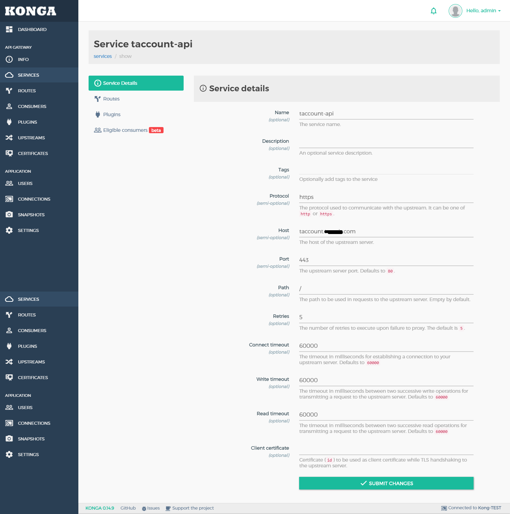
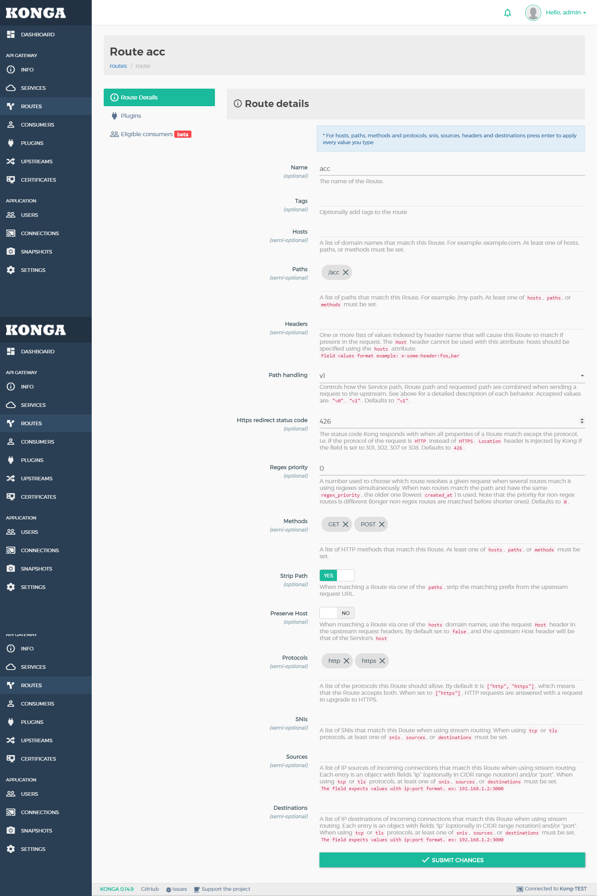
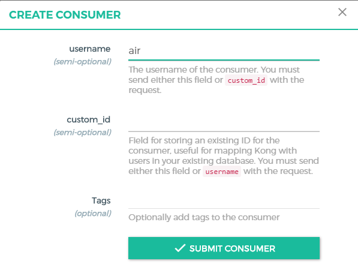
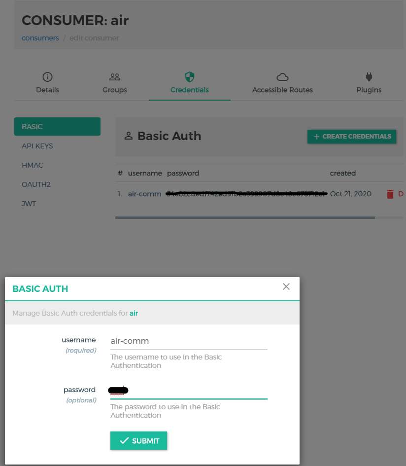
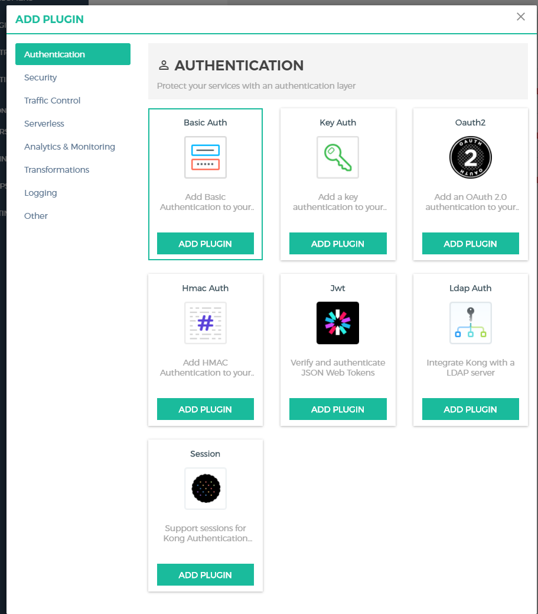
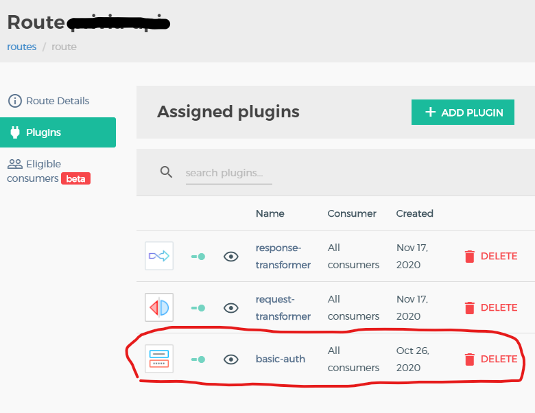
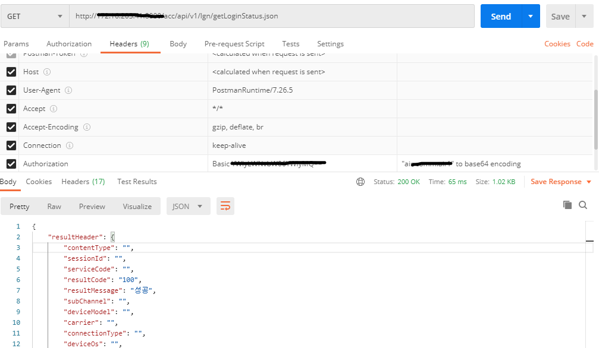
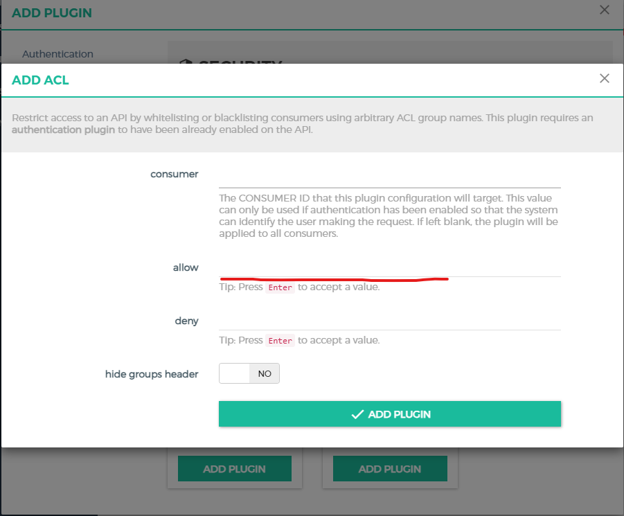
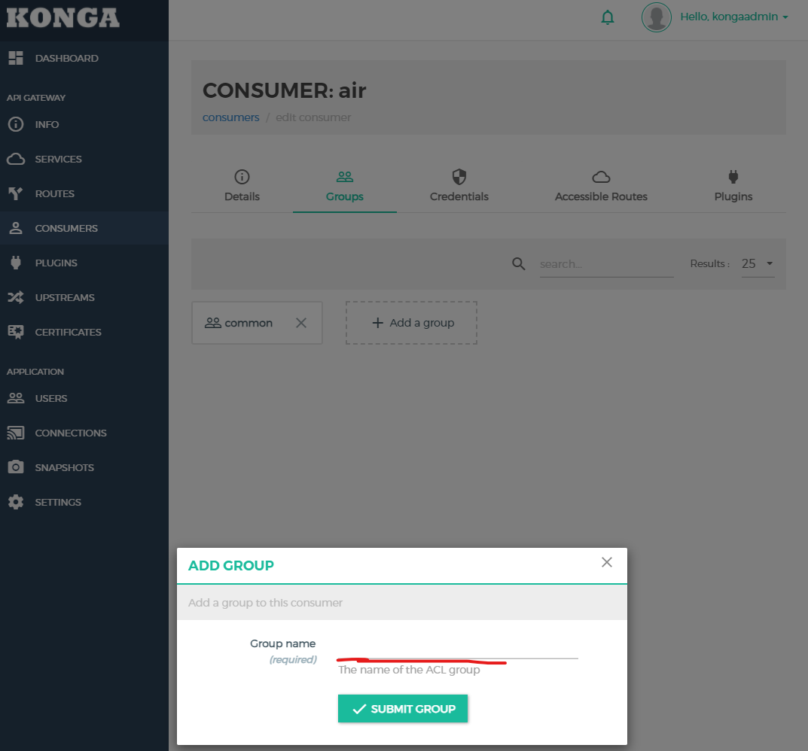

# Konga - Kong Admin GUI Manager
tags: API, gateway

## https://github.com/pantsel/konga

## 개요

## service 등록 방법

> 용어설명 
    - upstream server : 목적지 서버

- Protocol: upstream server 프로토콜 입력
- Host: upstream server 도메인주소
- Port: upstream server 사용 포트
- Path: upstream server path (기본값으로 '/')

## Route 등록 방법

- Paths: 1 path 값 (예제: /acc)
- Method: Route 가능하게 할 method 설정
- Strip Path : yes로 해야 /acc 빼고 upstream server로 호출

## Authorization(Basic-Auth) 셋팅 방법
### 1. Consumer 등록
1. Dashboard > CONSUMERS 메뉴 클릭 > Consumer 등록 버튼 클릭
1. username 입력 후 sumbmit 버튼 클릭

### 2. Consumer Basic Auth 키 등록
- Consumer 상세페이지 > Credentials 탭 클릭 > Basic Auth 메뉴 클릭 > CREATE CREDENTIALS 버튼 클릭
- username, password(**password 반드시 기억해놓자**) 입력 후 submit 버튼 클릭

### 3. Route 상세페이지 > Plugins 메뉴 > ADD PLUGIN 버튼 > Authentication > Basic Auth ADD PLUGIN

### 4. Route 연결 확인

### 5. 접속테스트

## ACL(Access Control List, 접근 제어 목록) group 셋팅 방법
 Router(또는 Service)에 Basic-Auth 만 등록하게 되면 Basic-Auth가 발급된 Consumer는 모든 API 사용이 가능하다. 각 Consumer 마다 사용할 수 있는 API를 control 하려면 ACL Plugin 으로 관리하면 된다.

### 1. Route 상세페이지 > Plugins 메뉴 > ADD PLUGIN 버튼 > Security > Acl ADD PLUGIN
- allow 영역에 `Acl 그룹명`(그냥 텍스트)을 입력하고 엔터
- 여러 Acl 그룹을 등록할 수 있다.

### 2. Consumer에 Acl group 등록하기
- 위 route에서 Acl plugin에 등록된 `Acl 그룹명`을 입력한다.

### 3. Acl group에 등록된 Consumer만 해당 Router를 이용 가능해진다.