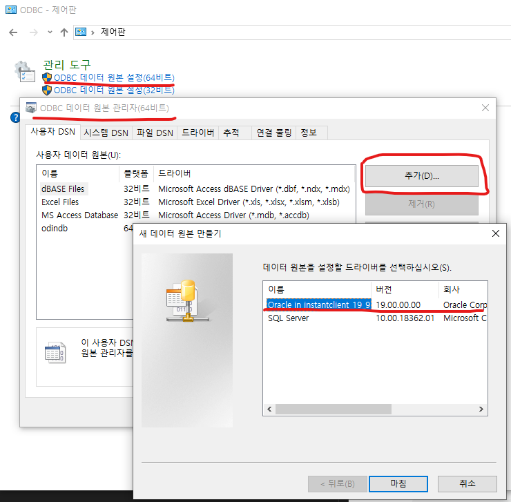
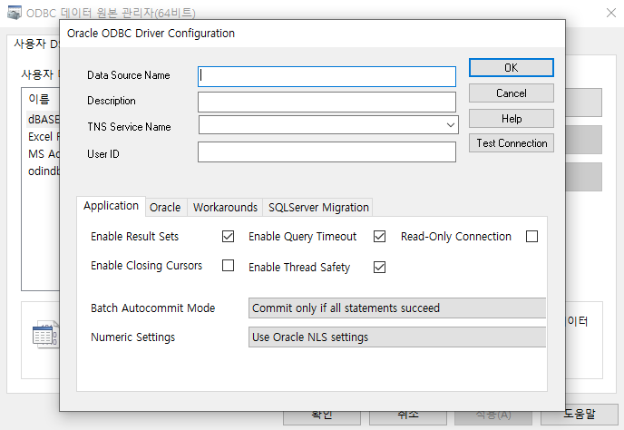

# Windows 에 ODBC 설정 방법
MS office 제품들(excel, access, .. )에서 Oracle 접속을 위한 설정인 것으로 보인다.

## 1. instance 관련 Package 다운로드
다운로드 경로: https://www.oracle.com/database/technologies/instant-client/winx64-64-downloads.html

### 1.1. Basic Package 다운로드 
https://download.oracle.com/otn_software/nt/instantclient/19900/instantclient-basic-windows.x64-19.9.0.0.0dbru.zip

### 1.2. ODBC Package 다운로드
https://download.oracle.com/otn_software/nt/instantclient/19900/instantclient-odbc-windows.x64-19.9.0.0.0dbru.zip


## 2. Package 압축 해제
특정 폴더에 앞서 다운 받은 zip files 를 같은 경로에 압축 해제한다.
(압축풀기시 `알아서풀기`로 하면 폴더명이 같아 같은 경로에 압축이 풀린다.)

예시로 아래 디렉토리에 Package 압축을 풀었다는 전제로 설명한다.
```
D:\instantclient_19_9\
```

## 3. 윈도우 환경변수를 설정한다.
- 파일탐색기 -> 내 PC 우측클릭 -> 속성 -> 고급 시스템 설정 -> 환경변수 버튼 클릭
- 4개 변수 추가
```
ORACLE_HOME=D:\instantclient_19_9
TNS_ADMIN=%ORACLE_HOME% ( tnsnames.ora 파일이 위치할 폴더 )
NLS_LANG=KOREAN_KOREA.KO16MSWIN949 ( 한글관련 설정 )
PATH=... %ORACLE_HOME% ( 기존 패스에 추가 )
```

## 4. 컴퓨터 재기동

## 5. 드라이버 설치
odbc_install.exe 명령어 실행
```
D:\instantclient_19_9\odbc_install.exe
```

## 6. `ODBC 데이터 원본 설정(64비트)` 에서 드라이버 셋팅
> ODBC 드라이버 종류는 64bit, 32bit 두가지가 있다. 이 문서는 64bit 기준으로 설명하고 있지만 32bit는 단지 `ODBC 데이터 원본 설정(32비트)` 창에서 똑같이 진행하면 된다.

`5. 드라이버 설치` 를 하고 `ODBC 데이터 원본 설정(64비트)` 창을 띄우고 추가 버튼을 클릭하면 `새 데이터 원본 만들기` 창에서 `Oracle in instantclient_19_9` 드라이버를 선택할 수 있다.
> 만약 `Oracle in instantclient_19_9` 드라이버가 보이지 않으면 컴퓨터를 다시 껏다 키거나 `환경변수` 설정을 다시 확인하자 

<figure>
    
    <figcaption>새 데이터 원본 만들기</figcaption>
</figure>

드라이버를 선택하면 `Oracle ODBC Driver Configuration` 창이 뜨고 여기에 oracle 관련 정보를 셋팅하고 Text connection 를 눌러 접속 테스트 해보자

<figure>
    
    <figcaption>Oracle ODBC Driver Configuration</figcaption>
</figure>

1. Data Source Name: 그냥 database schema 명 을 넣었다. 
2. Description: (optional)
3. TNS Service Name: D:\instantclient_19_9\ 경로에 `tnsnames.ora`을 넣었다면 접속 정보를 선택 할 수 있는 셀렉트 박스가 뜬다.
4. User ID: 접속할 계정정보

> tnsnames.ora 의 내용이 정상적으로 되어 있지 않으면 `ORA-12154: TNS: 지정된 접속식별자를 분석할 수 없다` 는 오류 가 나타남.
