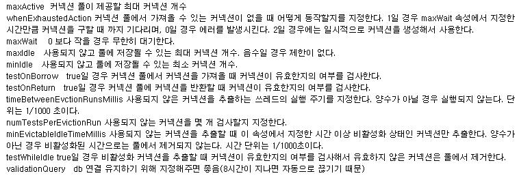

# DBCP 오류 
에러 관련 리서치중에 에러내용과 해결방법을 스크립한 블로그가있어 참고하기 위해 기록한다.

## 원본 
- https://m.blog.naver.com/tyboss/70176230775

## 이하 본문

출처 : http://linuxism.tistory.com/579
- 에러메시지 일부분
    
    is longer than the server configured value of 'wait_timeout'.

- 문제 내용 및 해결책

    IBATIS 커넥션 에러 J2EE 개발 관련/IBATIS && MYBATIS 2012/03/22 08:46
    
    시나리오 : was에 war를 배포하고 몇일이 지난후 갑자기 화면에 에러를 뿜으며 아래와 같은 메세지를 보여줬다. 제길.. 멍미.

에러 메세지:
```
exception

org.springframework.web.util.NestedServletException: Request processing failed; nested exception is org.springframework.dao.DataAccessResourceFailureException: SqlMapClient operation; SQL [];
--- The error occurred while applying a parameter map.
--- Check the aretias.category.selectChildCategorys-InlineParameterMap.
--- Check the statement (query failed).
--- Cause: com.mysql.jdbc.exceptions.jdbc4.CommunicationsException: The last packet successfully received from the server was 64,780,193 milliseconds ago. The last packet sent successfully to the server was 64,780,193 milliseconds ago. is longer than the server configured value of 'wait_timeout'. You should consider either expiring and/or testing connection validity before use in your application, increasing the server configured values for client timeouts, or using the Connector/J connection property 'autoReconnect=true' to avoid this problem.; nested exception is com.ibatis.common.jdbc.exception.NestedSQLException:
--- The error occurred while applying a parameter map.
--- Check the aretias.category.selectChildCategorys-InlineParameterMap.
--- Check the statement (query failed).
--- Cause: com.mysql.jdbc.exceptions.jdbc4.CommunicationsException: The last packet successfully received from the server was 64,780,193 milliseconds ago. The last packet sent successfully to the server was 64,780,193 milliseconds ago. is longer than the server configured value of 'wait_timeout'. You should consider either expiring and/or testing connection validity before use in your application, increasing the server configured values for client timeouts, or using the Connector/J connection property 'autoReconnect=true' to avoid this problem.
    org.springframework.web.servlet.FrameworkServlet.processRequest(FrameworkServlet.java:656)
    org.springframework.web.servlet.FrameworkServlet.doGet(FrameworkServlet.java:549)
    javax.servlet.http.HttpServlet.service(HttpServlet.java:617)
    javax.servlet.http.HttpServlet.service(HttpServlet.java:717)
    org.springframework.web.filter.CharacterEncodingFilter.doFilterInternal(CharacterEncodingFilter.java:88)
    org.springframework.web.filter.OncePerRequestFilter.doFilter(OncePerRequestFilter.java:76)
root cause
org.springframework.dao.DataAccessResourceFailureException: SqlMapClient operation; SQL [];
--- The error occurred while applying a parameter map.
--- Check the aretias.category.selectChildCategorys-InlineParameterMap.
--- Check the statement (query failed).
--- Cause: com.mysql.jdbc.exceptions.jdbc4.CommunicationsException: The last packet successfully received from the server was 64,780,193 milliseconds ago. The last packet sent successfully to the server was 64,780,193 milliseconds ago. is longer than the server configured value of 'wait_timeout'. You should consider either expiring and/or testing connection validity before use in your application, increasing the server configured values for client timeouts, or using the Connector/J connection property 'autoReconnect=true' to avoid this problem.; nested exception is com.ibatis.common.jdbc.exception.NestedSQLException:
--- The error occurred while applying a parameter map.
--- Check the aretias.category.selectChildCategorys-InlineParameterMap.
--- Check the statement (query failed).
--- Cause: com.mysql.jdbc.exceptions.jdbc4.CommunicationsException: The last packet successfully received from the server was 64,780,193 milliseconds ago. The last packet sent successfully to the server was 64,780,193 milliseconds ago. is longer than the server configured value of 'wait_timeout'. You should consider either expiring and/or testing connection validity before use in your application, increasing the server configured values for client timeouts, or using the Connector/J connection property 'autoReconnect=true' to avoid this problem.
    org.springframework.jdbc.support.SQLStateSQLExceptionTranslator.doTranslate(SQLStateSQLExceptionTranslator.java:104)
    org.springframework.jdbc.support.AbstractFallbackSQLExceptionTranslator.translate(AbstractFallbackSQLExceptionTranslator.java:72)
    org.springframework.jdbc.support.AbstractFallbackSQLExceptionTranslator.translate(AbstractFallbackSQLExceptionTranslator.java:80)
    org.springframework.jdbc.support.AbstractFallbackSQLExceptionTranslator.translate(AbstractFallbackSQLExceptionTranslator.java:80)
    org.springframework.orm.ibatis.SqlMapClientTemplate.execute(SqlMapClientTemplate.java:203)
    org.springframework.orm.ibatis.SqlMapClientTemplate.queryForList(SqlMapClientTemplate.java:293)
    com.aretias.jkholdings.repository.CategoryRepositoryImpl.selectChildCategorys(CategoryRepositoryImpl.java:22)
    com.aretias.jkholdings.service.CategoryServiceImpl.getChild(CategoryServiceImpl.java:19)
    com.aretias.jkholdings.controller.BaseController.getFirstDeptCategoryList(BaseController.java:42)
    com.aretias.jkholdings.controller.UserController.goLoginPage(UserController.java:23)
    sun.reflect.NativeMethodAccessorImpl.invoke0(Native Method)
    sun.reflect.NativeMethodAccessorImpl.invoke(NativeMethodAccessorImpl.java:39)
    sun.reflect.DelegatingMethodAccessorImpl.invoke(DelegatingMethodAccessorImpl.java:25)
    java.lang.reflect.Method.invoke(Method.java:597)
    org.springframework.web.bind.annotation.support.HandlerMethodInvoker.invokeHandlerMethod(HandlerMethodInvoker.java:176)
    org.springframework.web.servlet.mvc.annotation.AnnotationMethodHandlerAdapter.invokeHandlerMethod(AnnotationMethodHandlerAdapter.java:426)
    org.springframework.web.servlet.mvc.annotation.AnnotationMethodHandlerAdapter.handle(AnnotationMethodHandlerAdapter.java:414)
    org.springframework.web.servlet.DispatcherServlet.doDispatch(DispatcherServlet.java:790)
    org.springframework.web.servlet.DispatcherServlet.doService(DispatcherServlet.java:719)
    org.springframework.web.servlet.FrameworkServlet.processRequest(FrameworkServlet.java:644)
    org.springframework.web.servlet.FrameworkServlet.doGet(FrameworkServlet.java:549)
    javax.servlet.http.HttpServlet.service(HttpServlet.java:617)
    javax.servlet.http.HttpServlet.service(HttpServlet.java:717)
    org.springframework.web.filter.CharacterEncodingFilter.doFilterInternal(CharacterEncodingFilter.java:88)
    org.springframework.web.filter.OncePerRequestFilter.doFilter(OncePerRequestFilter.java:76)
```

시나리오 환경 
- TOMCAT4.5 / JDK 5.0 / MYBATIS / SPRING 3.0 / DBCP

원인 
 - 마지막으로 DB에 커넥션을 맺은후 사용이 없다 보니 데이터 베이스 커넥션이 끝겼다. 

해결책
 - 특정 시간마다 커넥션을 확인 하는 셋팅을 지정한다. 

DBCP 설정 코드:
```xml
<!-- DataSource Configuration -->

<bean id="dataSource" class="org.apache.commons.dbcp.BasicDataSource" destroy-method="close">

    <property name="driverClassName" value="${jdbc.driverClassName}"/>

    <property name="url" value="${jdbc.url}"/>

    <property name="username" value="${jdbc.username}"/>

    <property name="password" value="${jdbc.password}"/>

    <property name="initialSize" value="5"/>

    <property name="maxActive" value="20"/>

    <property name="minIdle" value="5"/>

    <property name="maxWait" value="3000"/>

    <property name="poolPreparedStatements" value="true"></property>

    <property name="maxOpenPreparedStatements" value="50"></property>

       

    <!-- 특정 시간마다 validationQuery를 실행 셋팅 시작 -->

    <property name="validationQuery" value="select 1"/>

    <property name="testWhileIdle" value="true"/>

    <property name="timeBetweenEvictionRunsMillis" value="7200000"/>

    <!-- 특정 시간마다 validationQuery를 실행 셋팅 끝 -->

</bean>
```

출처 - http://fbwotjq.tistory.com/entry/IBATIS-%EC%BB%A4%EB%84%A5%EC%85%98-%EC%97%90%EB%9F%AC

--- 

DB에 접속중인 세션을 오랫동안 사용하지 않거나, 네트워크에 문제가 발생하는 경우 DB 세션이 끊어질 수 있다.
DB 세션이 끊어지는 경우 App 입장에서는 재접속 처리를 해주어야 다시 정상적인 서비스가 가능해 진다.

재접속 처리 방법 중에 JDBC에 autoReconnect=true 옵션을 주는 방법이 있는데, 이 옵션을 잘못 사용하는 경우 얘기치 않은 문제가 발생할 수 있다.
autoReconnect 옵션은 쿼리를 수행한 다음 DB 세션에 문제가 있으면 단순히 SQLException 리턴 후 재접속 처리를 한다.
문제는 트랜잭션 구동 환경에서  수행중이던 트랜잭션은 롤백이 되어야 하고, 남은 트랜잭션은 수행이 되지 않아야 되는데, autoReconnect 옵션은 이런 처리를 해주지 않기 때문이다.

아래 예시는 3개의 쿼리로 이루어진 트랜잭션에서 첫번째 UPDATE 구문 실행후 DB 커넥션 종료 상황이다.
1개의 쿼리는 Rollback, 1개의 쿼리는 에러 리턴, 나머지 1개의 쿼리는 Commit 처리가 되면서 데이터 정합성이 깨지는결과를 초래하고 있다.

```sql
BEGIN;

UPDATE tb_work SET cnt = cnt+1 WHERE id = 10 ;

INSERT INTO tb_work_log VALUES (10, 20, 30) ;  # 커넥션 에러 발생 및 SQLException 리턴 후 재접속 (기존 UPDATE 쿼리는 자동 롤백)

DELETE FROM tb_work_list WHERE id = 10 ; # 새로운 세션에서 새로운 트랜잭션으로 진행됨

COMMIT ;
```

위와 같은 문제를 막기 위해서 autoReconnect=true인 환경에서는 SQLException이 발생하는 경우에, 
해당 트랜잭션이 더 이상 진행되지 않도록 App 단에서 직접 예외 처리를 해줘야 하고, 
MySQL 레퍼런스 메뉴얼에서도 autoRecoonect 옵션 사용은  권장하지 않고 있다.

http://dev.mysql.com/doc/refman/5.0/en/connector-j-reference-configuration-properties.html

 

Property Name | Definition | Default Value | Since Version
---|---|---|---
autoReconnect | Should the driver try to re-establish stale and/or dead connections? If enabled the driver will throw an exception for a queries issued on a stale or dead connection, which belong to the current transaction, but will attempt reconnect before the next query issued on the connection in a new transaction. The use of this feature is not recommended, because it has side effects related to session state and data consistency when applications don't handle SQLExceptions properly, and is only designed to be used when you are unable to configure your application to handle SQLExceptions resulting from dead and stale connections properly. Alternatively, investigate setting the MySQL server variable "wait_timeout" to some high value rather than the default of 8 hours. | false | 1.1

트랜잭션을 사용하는 환경이라면 DB 세션의 재접속 처리는 JDBC의 autoReconnect 설정이 아닌 DBCP의 validationQuery 기능을 사용하는 것이 적합하다.
DBCP 설정 관련 apache 문서 : http://commons.apache.org/dbcp/configuration.html

출처 - http://blog.naver.com/PostView.nhn?blogId=seuis398&logNo=70118975290

---


dbcp pooling설정에 validationQuery적용

tomcat dbcp를 이용하여 검색데이터 추출할 때, mysql 사용. 
mysql wait_timeout 설정(기본값 28800 , 8시간) 에 의해 커넥션이 연결된 이후 해당 
커넥션의 close 없이 8시간이 지나면 해당 커넥션을 종료.

- issue : 종료된 커넥션을 dbcp의 connection pool 에선 여전히 가지고 있는 상태.
    
    이런 상황에서 DB 관련 프로그램이 호출되면 커넥션 관련 에러가 발생.
- solution : java에서 DB를 사용하기 전에 해당 connection 이 정상적인지 검사를 하도록 하는 것.
    
    이 옵션이 validationQuery.

```
<bean id="dataSource" class="org.apache.commons.dbcp.BasicDataSource" destroy-method="close">
<property name="driverClassName" value="${jdbc.driverClassName}"/>
<property name="url" value="${jdbc.url}"/>
<property name="username" value="${jdbc.username}"/>
<property name="password" value="${jdbc.password}"/>
<property name="validationQuery" value="select 1"/>
</bean>

<Resource name="jdbc/livesearch" auth="Container"
type="javax.sql.DataSource"
maxActive="10" maxIdle="30" maxWait="10000"
username="${jdbc.username}" password="${jdbc.password}"
driverClassName="com.mysql.jdbc.Driver"
url="${jdbc.url}"
validationQuery="select 1"
/>
```
와 같이 사용하면 된다.

<참고>
오라클의 경우 : validationQuery="select 1 from dual"

출처 : blog.hoonie.net

전에 기록한 "DBCP의 validationQuery는 약인가? 독인가?"에서 validationQuery는 필수가 아니라고 했었다. 그렇다면 만약 DBCP에서 바라보고 있는 DB 서버가 어떠한 이유로 사용 불가 상태에 들어갔다가 다시 사용 가능해 진다면 validationQuery가 없어도 DBCP는 Connection Pool을 제대로 복구할까?
DBCP 공식 사이트에서 관련된 내용을 검색해 보니 DBCP는 검증기능을 사용하지 않는 경우에도 DB서버가 셧다운 되었다가 다시 기동되면 자동으로 새로운 Connection 객체들을 Pool에 로딩한다 한다. 
단, DBCP의 프러퍼티를 기본값으로 설정되어 있고, 사용하는 JDBC 드라이버가 select 등의 쿼리 실행시 발생하는 예외상황에 대해 SQLException을 제대로 보고한다는 전제하에 굳이 validationQuery를 사용하지 않아도 된다고 한다. 적어도 최근 버전의 DBCP에서는 validationQuery는 돌다리도 두드려보는 개념인것 같다. 
다음은 DBCP사이트의 Wiki(DBCP공식사이트) 에서 확인한 내용이다.

Q: Without using validation of connections (testOnBorrow = false, testOnReturn = false, timeBetweenEvictionRunsMillis = -1) and after shutdown and restarting the database again, it looks like the pool is cleaning its old connections by itself. So it turns out that we always have valid connections. How can you explain this and when is explicit validation necessary? 

A: During the connection activation (when borrowing a connection) the setAutoCommit and other connection init methods are called. If one of these methods throws a SQLException then the connection is also considered broken and removed from the pool. 

So if you are using one of the "default*" properties and the JDBC driver correctly reports the SQLExceptions on the "set*" methods then you don't need an extra validationQuery.

참고 사이트 : [Apache commons DBCP SITE](http://commons.apache.org/proper/commons-dbcp/configuration.html)

<참고 이미지>



 
========================================================================

mysql wait_timeout 설정(기본값 28800 , 8시간) 에 의해 커넥션이 연결된 이후 해당
커넥션의 close 없이 8시간이 지나면 해당 커넥션을 종료 시키게 된다.


문제는 이렇게 종료된 커넥션을 dbcp의 connection pool 에선 여전히 가지고 있는 상태라는 것이다.
이런 상황에서 DB 관련 프로그램이 호출되면 커넥션 관련 에러가 발생된다.

해결방법은 java에서 DB를 사용하기 전에 해당 connection 이 정상적인지 검사를 하도록 하는 것이다. 이 옵션이 validationQuery 파라메터이다.

```xml
<bean id="dataSource" class="org.apache.commons.dbcp.BasicDataSource" destroy-method="close">
  <property name="driverClassName" value="${jdbc.driverClassName}"/>
  <property name="url" value="${jdbc.url}"/>
  <property name="username" value="${jdbc.username}"/>
  <property name="password" value="${jdbc.password}"/>
  <property name="validationQuery" value="select 1"/>
 </bean>
```

http://blog.naver.com/PostView.nhn?blogId=pignbear&logNo=150037833102&redirect=Dlog&widgetTypeCall=true

================================================================

운영툴 에러 발생.. 로그는 아래와 같다..

에러로그:
```
com.mysql.jdbc.exceptions.jdbc4.CommunicationsException:
 ...., which  is longer than the server configured value of 'wait_timeout'. You should consider either expiring and/or testing connection validity before use in your application, increasing the server configured values for client timeouts, or using the Connector/J connection property 'autoReconnect=true' to avoid this problem.
```

자상하게도 autoReconnect=true 로 바꾸거나 wait_timeout 을 수정하라고 한다..

wait_timeout 은 connection 증가로 그리 땡기진 않고..autoReconnection 을 추가하기로 했다.
설정은 jdbc 커넥션 설정 파일에서 url 에 "autoReconnection=true" 를 넣어주면 된다.

* url=jdbc:mysql://ip:port/dbname?useUnicode=true&characterEncoding=utf8&autoReconnect=true
* validationQuery="select 1"

그리고 이 외에도 validationQuery를 넣어주는 데 이유는 한번 커넥션이 끊어진다음 재시도를 하는 경우 문제가 있는 처음 한번의 시도는 에러가 나게 된다. 이때 넣어주는게 validationQuery로 모든 사용자쿼리를 실행 전에 한번 이 쿼리를 실행하게 된다.(그러므로 DB로서는 추가적인 부하가 됨) 쿼리가 한번 더 실행되는 것인 만큼 가장 간단한 쿼리여야 한다.

## validationQuery description

Parameter | Default | Description
---|---|---
validationQuery |  | The SQL query that will be used to validate connections from this pool before returning them to the caller. If specified, this query MUST be an SQL SELECT statement that returns at least one row.

보통은 SELECT 1 을 많이 쓴다.(oraqle은 SELECT 1 FROM DUAL)
추가적인 쿼리인 만큼 access가 많은 곳에선 조심해서 써야 할듯?

jdbc 설정과 관련된것은 아래 링크를 참조함..
http://commons.apache.org/dbcp/configuration.html

출처 - http://netholic.tistory.com/137

================================================================

DBCP의 validationQuery 약인가? 독인가?

출처 : http://www.hoonie.net/blog/64

현재 담당하고 있는 프로젝트와 Apache의 Commons에 있는 DBCP를 사용하여 구현된 Connection Pool 관리자로부터 Connection을 받아서 쓰고 있다. 그런데 DB 서버의 부하를 점검해 본 결과, 당연하게도 DBCP의 validationQuery로 할당한 SQL문의 호출이 가장 많았다.
솔루션의 성격상 DB 서버에 대한 Access가 빈번히 일어나고 그 응답 또한 빠른시간을 필요로하기 때문에 DB의 부하를 가능한 줄여야 하는데 DBCP에서 Connection 객체를 받아 올 때 마다 실행되는 validationQuery는 엄청난 부하를 야기하고 있었다. 값비싼 객체인 DB와의 Connection을 효율적으로 관리하여 DB 관련 프로세스의 효율을 높이고자 사용하는 DBCP가 아이러니하게도 DB 서버의 부담을 높이는 작용을 하고 있었던 것이다.
과연 validationQuery는 반드시 필요한가? DBCP의 API 문서를 확인한 결과, BasicDataSource의 Validation Query는 필수가 아닌 선택적인 기능으로서 할당되었을 경우에만 수행되는 것으로 나와 있다. 단, 이 기능을 사용하고자 할당한 경우에는 해당 쿼리의 실행결과 반드시 1개 이상의 resultset이 나와야 한다고 명시되어 있다.
만약 자신의 프로젝트에서 DBCP를 사용하고 있다면, 그리고 validationQuery를 설정하여 사용하고 있다면 해당 쿼리가 최경량의 SQL문을 사용하고 있는지 확인하는 것은 잊지 말아야 할 것이다.
추천되는 쿼리는 Oracle의 경우

select 1 from dual;

MySQL의 경우

select 1;

정도를 사용하면 좋을 것이다. 이외의 쿼리를 validationQuery로 사용 중 이라면 지금 당장 쿼리 실행 소요 시간을 비교해 보라. 

출처 [DBCP의 validationQuery 약인가? 독인가?](http://blog.naver.com/jinhi21c/20047234856)|작성자 빛나리

================================================================

timeBetweenEvctionRunsMillis - 사용되지 않는 커넥션을 추출하는 쓰레드의 실행 주기를 지정

이값을 알맞게 지정해서 사용되지 않는 커넥션을 제거하는것이 좋다 보통 10~20분 단위 검사

testWhileIdle - true 일 경우 비활성화 커넥션을 추출할때 커넥션이 유효한지 여부를 검사해서 유효하지 않으면 제거

출처 [트랜잭션 , 컨넥션 풀 관련](http://blog.naver.com/0131v/110106613454)|작성자 김상현

 

================================================================

Batis, DBCP, MySQL 을 사용하는 웹어플리케이션 구동 중, 일정 시간 동안 컨넥션을 사용하지 않다가 사용을 하면 컨넥션이 이미 종료 되었다고 나타나는 문제가 발생했다.

Communications link failure due to underlying exception

뭐 사실 .. 어느 정도 사용을 하는 어플리케이션이라면 이런 문제는 발생하지 않을거다.
MySQL 은 기본적으로 컨넥션을 통해서 8시간 동안 request가 오지 않는다면, 강제적으로 컨넥션을 닫아버린다.
( 이는 물론 MySQL 의 설정을 변경함으로써 값을 바꿀 수는 있다. 하지만, 좋은 방법이라고 생각되지는 않는다. )

다음과 같은 iBatis 설정에서도 당연히 동일한 문제가 발생했다.

```xml
  <dataSource type="DBCP">
   <property name="JDBC.Driver" value="com.mysql.jdbc.Driver" />
   <property name="JDBC.ConnectionURL" value="jdbc:mysql://데이터베이스접속url?autoReconnect=true" />
   <property name="JDBC.Username" value="id" />
   <property name="JDBC.Password" value="password" />
   <property name="JDBC.DefaultAutoCommit" value="true" />
   <property name="Pool.MaximumActiveConnections" value="5" />
   <property name="Pool.MaximumIdleConnections" value="3" />
   <property name="Pool.MaximumWait" value="60000" />
  </dataSource>
```

다음과 같이 설정값을 변경함으로써 해당 문제를 해결 할 수 있다.

```xml
  <dataSource type="DBCP">
   <property name="driverClassName" value="com.mysql.jdbc.Driver" />
   <property name="url" value="jdbc:mysql://데이터베이스접속url?autoReconnect=true" />
   <property name="username" value="id" />
   <property name="password" value="password" />
   <property name="defaultAutoCommit" value="true" />
   <property name="maximumActiveConnections" value="5" />
   <property name="maximumIdleConnections" value="3" />
   <property name="maximumWait" value="60000" />
   <!-- validationQuery:유효 검사용 쿼리( 1개 이상의 row를 반환하는 쿼리를 넣어주면 된다. ) --> 
   <property name="validationQuery" value="select 1"/>
   <!-- testWhileIdle:컨넥션이 놀고 있을때 -_-; validationQuery 를 이용해서 유효성 검사를 할지 여부. -->
   <property name="testWhileIdle" value="true"/>
   <!-- timeBetweenEvictionRunsMillis:해당 밀리초마다 validationQuery 를 이용하여 유효성 검사 진행 -->
   <property name="timeBetweenEvictionRunsMillis" value="7200000"/>
  </dataSource>
```

이렇게 설정하면 컨넥션을 풀에서 가지고 올때도, validationQuery 를 통해서 유효성 검사를 진행하게 되는데,
뭐 퍼포먼스가 문제 될거라고 생각된다면 -_-aa .. testOnBorrow( default : true ) 값을 false 로 추가해주면 된다.

설정값의 테스트는 mysql 의 show processlist; 쿼리를 이용하여 정상적으로 구동되는지 알 수 있다.
show processlist 를 수행하면 현재 mysql 에서 수행되고 있는 프로세스의 리스트와 상태를 알 수 있는데,
웹어플리케이션을 구동하고, 컨넥션이 맺어지도록 한 후에 해당 프로세스가 command 필드가 sleep 상태에서 Time 필드 값이 timeBetweenEvictionRunsMillis/1000 보다 커지지 않는다면, 정상적으로 설정된 것이다. ( 뭐 물론 약간의 차이는 날 수 도 있겠으며, 해당 테스트 동안 컨넥션이 사용된다면 잘못 나타날 수 도 있다. ) 약 1,000 정도의 값으로 셋팅을 하고 테스트 후 적절한 값을 넣어서 사용하면 되겠다.

그 외에도 이상의 문제를 해결 할 수 있는 설정은 몇가지가 더 있다.
http://commons.apache.org/dbcp/configuration.html 를 참고 하면 된다.
 

출처 - http://blog.daum.net/iccaruss2/7501371

================================================================

DBCP (Database connection pooling services)

[1.1 DBCP configuration](http://wiki.gurubee.net/display/SWDEV/DBCP+(Database+connection+pooling+services))

DBCP configuration : http://commons.apache.org/dbcp/configuration.html

DBCP BasicDataSource | iBATIS SimpleDataSource | Option | Description
---|---|---|---
driverClassName | JDBC.Driver | required |JDBC driver class
url | JDBC.ConnectionURL | required | DB Connection URL
username | JDBC.Username | optional | UserName
password | JDBC.Password | optional | Password
maxActive | Pool.MaximumActiveConnections | optional | 최대 커넥션 수(Maximum Active Connections)
initialSize | Pool.MinimumIdleConnections | optional | 최초 초기화 커넥션 수
maxIdle | Pool.MaximumIdleConnections | optional | 사용되지 않고 풀에 저장될 수 있는 최대 커넥션 개수. 음수일 경우 제한이 없음.
minIdle | Pool.MinimumIdleConnections | optional | 사용되지 않고 풀에 저장될 수 있는 최소 커넥션 개수
maxWait | Pool.MaximumWait | optional | 최대 대기시간(milliseconds). 음수일 경우 제한이 없음
validationQuery | Pool.ValidationQuery | optional| Validation Query |
testOnBorrow |  |  | true일 경우 커넥션을 가져올 때 커넥션이 유효한지의 여부를 검사.
testOnReturn |  |  | true일 경우 커넥션을 반환할 때 커넥션이 유효한지의 여부를 검사.
testWhileIdle |  |  |  true일 경우 유효하지 않은 커넥션은 풀에서 제거
timeBetweenEvictionRunsMillis |  |  | 사용되지 않은 커넥션을 추출하는 쓰레드의 실행주기를 지정. ( 음수이면 동작하지 않음, milliseconds)
numTestsPerEvictionRun |  |  | 사용되지 않은 커넥션을 검증할 connection수 지정
minEvictableIdleTimeMillis |  |  | pool에 대기중인 시간이 설정된 값보다 크다면 validationQuery 와 관계없이 풀에서 제거

1.2 connection validation check
```xml
<validationQuery>select 1</validationQuery>
<testOnBorrow>false</testOnBorrow>
<testWhileIdle>true</testWhileIdle>
<numTestsPerEvictionRun>1</numTestsPerEvictionRun>
<timeBetweenEvictionRunsMillis>3000</timeBetweenEvictionRunsMillis>
```