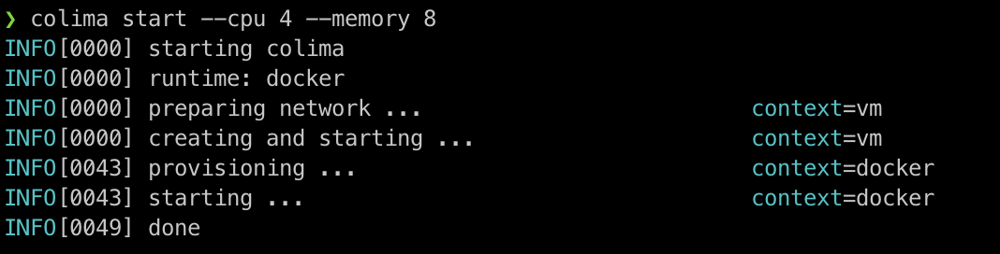
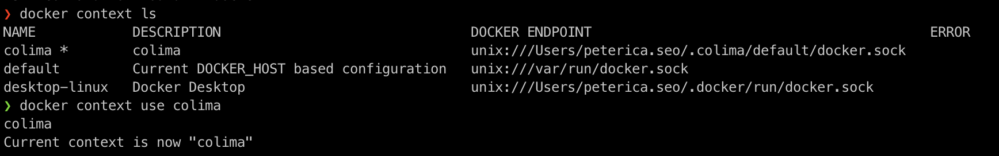
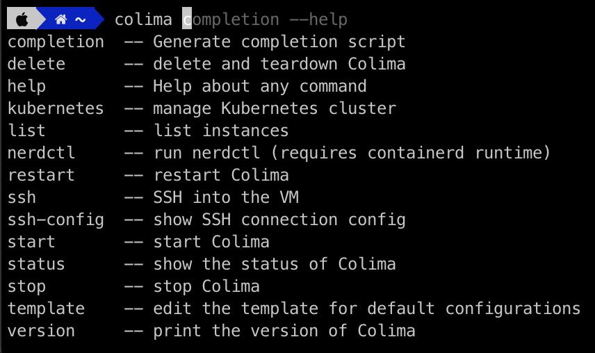

# colima 를 이용한 apple cpu (m1,m2) chip 에서 Docker 구동방법 (2023-12-20 기준)

tag: m1, m2, apple cpu, docker, colima

## reference
 - https://github.com/abiosoft/colima
 - https://peterica.tistory.com/420

## 개요
Docker desktop 에서 더이상 M1 (apple cpu)에 대해서 지원을 하지 않는다. M1 에서 가상의 VM 환경을 만들어줄 엔진이 필요하다.

## 대안
- [Colima](https://github.com/abiosoft/colima)
- (다른 플랫폼도 있으나 ...)


### Colima 설치
```sh
$ brew install colima
```

### Colima 실행
```sh
# VM을 4CPU 및 8GiB 메모리로 실행
$ colima start --cpu 4 --memory 8

# 1CPU, 2GiB 메모리 및 10GiB 스토리지를 갖춘 VM을 만듭니다.
$ colima start --cpu 1 --memory 2 --disk 10

# Rosetta 2 에뮬레이션으로 VM 설정
$ colima start --arch aarch64 --vm-type=vz --vz-rosetta
```



### Docker Desktop을 colima로 변경하기
```sh
# Docker client의 Endpoint 목록조회
$ docker context ls
NAME            DESCRIPTION                               DOCKER ENDPOINT                                          ERROR
colima *        colima                                    unix:///Users/peterica.seo/.colima/default/docker.sock
default         Current DOCKER_HOST based configuration   unix:///var/run/docker.sock
desktop-linux   Docker Desktop                            unix:///Users/peterica.seo/.docker/run/docker.sock

# colima로 Endpoint 변경
$ docker context use colima
colima
Current context is now "colima"
```



### Colima 자동완성
```sh
$ echo "autoload -U compinit; compinit" >> ~/.zshrc
```



### Colima 중지하기
```sh
 $ colima stop
 ```