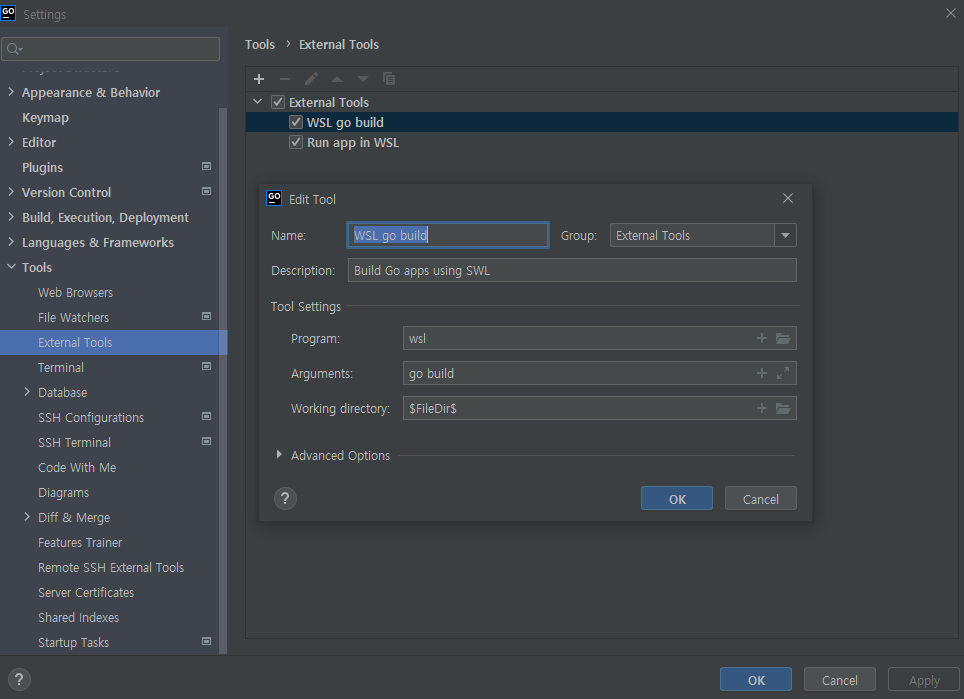
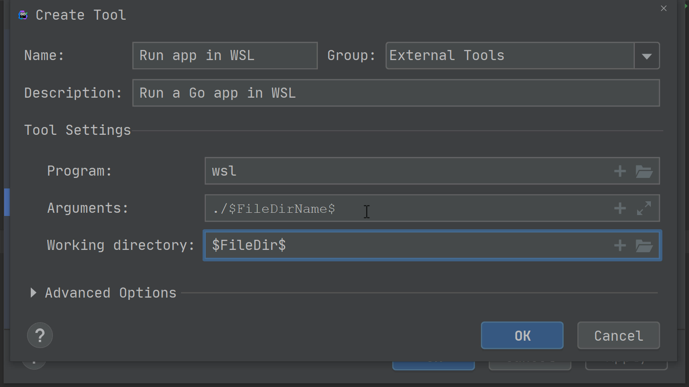
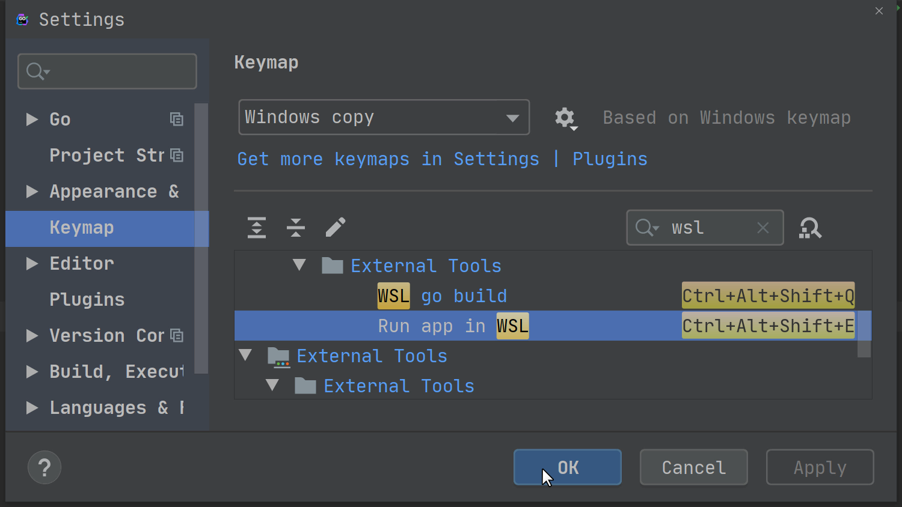
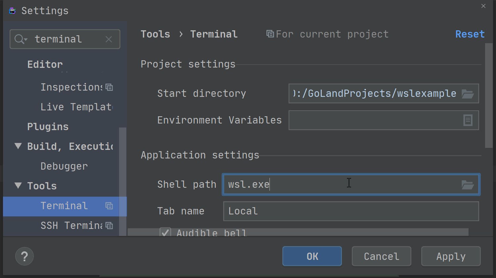

# Goland 개발환경 셋팅하기 on windows WSL

> WSL 이란?     
리눅스용 윈도우 하위 시스템(Windows Subsystem for Linux, WSL)은 윈도우 10에서 네이티브로 리눅스 실행 파일(ELF)을 실행하기 위한 호환성 계층이다. - wiki: https://ko.wikipedia.org/wiki/%EB%A6%AC%EB%88%85%EC%8A%A4%EC%9A%A9_%EC%9C%88%EB%8F%84%EC%9A%B0_%ED%95%98%EC%9C%84_%EC%8B%9C%EC%8A%A4%ED%85%9C

아주 기본적인 셋팅만 지원한다. (현 버전에선 WSL내에서 Debug 모드는 지원하지 않음) 개발 & 디버그는 windows 상에서 모두 진행해야 한다. 그리고 (구조상 시스템이 분리 되어있기 때문에) wsl 에 올라간 go version 과 Goland에 테스트 하는 go version 은 별개로 구성된다. 즉 wsl 에 맞게 go version을 바꿔가며 테스트를 진행되어야 한다.

참고자료: 
- https://blog.jetbrains.com/go/2020/05/21/working-windows-subsystem-for-linux-wsl-in-goland/ (기본설정)


## 1. Go 소스 WSL 내에서 실행 되도록 셋팅
총 2개의 외부빌드 툴을 등록 한다. 하나는 go 소스 빌드 툴이고 다른 하나는 빌드된 app을 실행하는 툴이다. 즉 bulid > run 을 실행하기 위한 외부툴이다.

- build go in wsl
- Run App in wsl

### 외부툴 환경셋팅 (File > Settings > Tools > External Tools) 에서 `+` 버튼 누르면 아래와 같은 창이 뜬다. 

#### 1. build go in wsl


`$GOROOT` 가 `/usr/local/go/` 로 설정 되어있다면 위 이미지 처럼 입력하면 되지만 `gvm` 을 이용한다면 `Arguments` 에 `go build` 만 적으면 된다. (아래이미지 참고)



#### 2. Run App in wsl



#### 3. (옵션) Keymap 설정
File > Settings > Keymap


#### 4. Default Terminal WSL 로 셋팅
File > Settings > Tools > Terminal

> Tip: 모든 새 프로젝트들을 wsl terminal로 수정하려면 `File > Project Settings > Settings for New Projects > Tools > Terminal` 에서 수정하면 된다.


# :bomb: Throwbleshooting
## 1. Debugging 시 오류 발생
```sh
go build math: C:\Users\TSA000\go\go1.16.3\pkg\tool\windows_amd64\compile.exe: exit status 3221226505
go build runtime: C:\Users\TSA000\go\go1.16.3\pkg\tool\windows_amd64\compile.exe: exit status 3221226505
```
windows에 gcc 설치가 필요한 것으로 보인다.