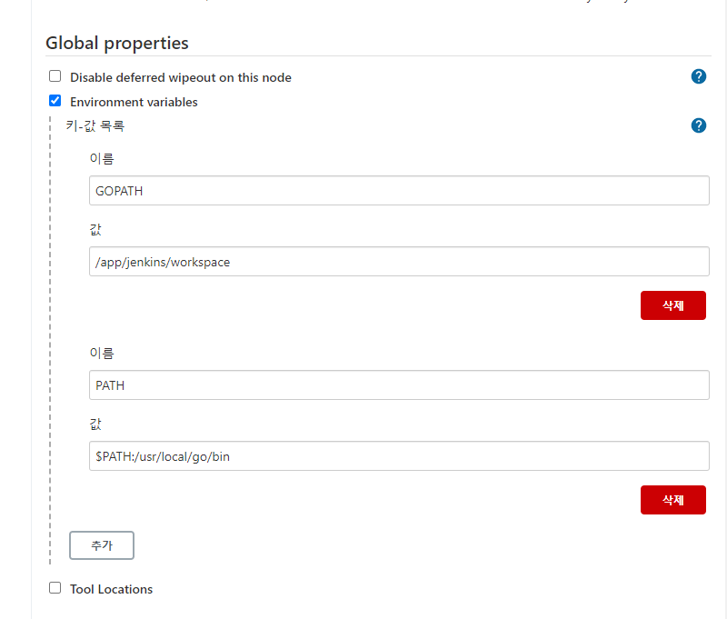
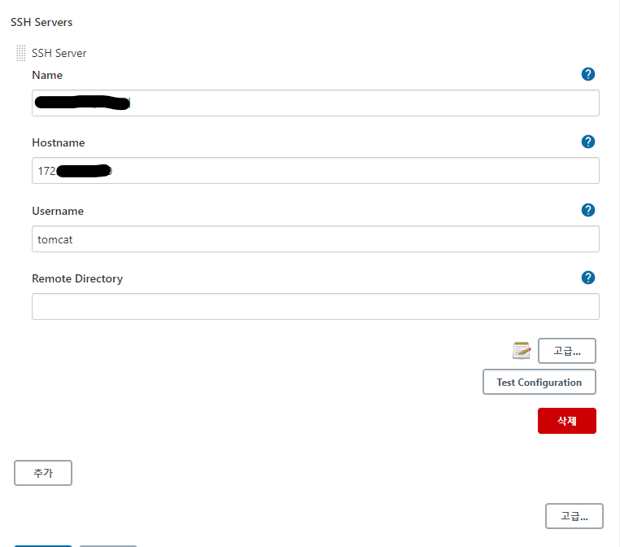
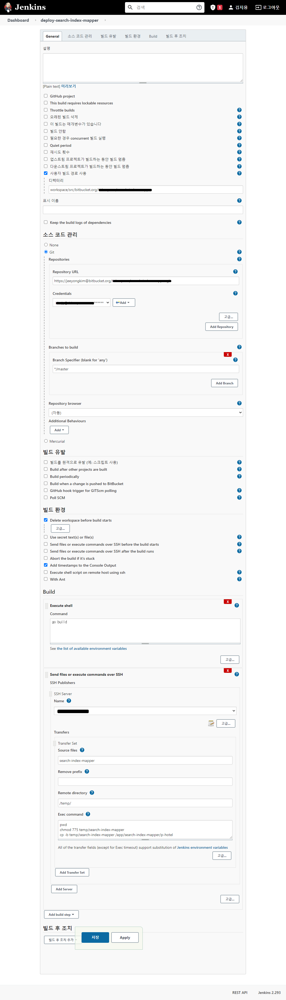

# 젠킨스에서 Go 빌드 및 특정 서버 배포하기
tag: jenkins, go, bitbucket, ssh, build, deploy, git

## 참조
- https://www.joinc.co.kr/w/man/12/jenkins (젠킨스 설정)
- https://dejavuqa.tistory.com/321 (centos go 설치)

## 배포 프로세스 설계
1. git(bitbucket) 에서 pull 해서 Go source를 가져온다.
1. 젠킨스 내에서 go build 를 진행한다. 
1. 빌드된 실행파일을 특정서버로 보낸다.
1. 특정서버는 원하는 위치로 실행파일을 file copy 한다.

## 젠킨스 셋팅
go lang을 빌드하고 ssh를 이용해 특정서버에 파일을 전송하거나 command를 날리기 위해서 몇가지 `시스템 설정`을 진행해야한다.

### 1. GOPATH 셋팅
linux 사용자 환경설정을 젠킨스 내에서 설정한다.

1. Jenkins 관리 > 시스템 설정 > Global properties > 체크 Environment variables
1. GOPATH 등록
    - name: GOPATH
    - value: go source가 올라갈 path. 예시) `/app/jenkins/workspace`
1. GO 실행 위치 등록
    - name: PATH
    - value: $PATH:/usr/local/go/bin

### 2. SSH Server 등록
1. Jenkins 관리 > 시스템 설정 > Global properties > SSH Servers (만약 SSH Servers 항목이 없다면 플러그인 설치 필요)

## 젠킨스 배포 item 셋팅
배포를 위한 젠킨스 셋팅이 끝났다면 본격적인 배포 item 설정

1. go build를 진행할 `사용자 빌드 경로 사용` 디렉터리 입력
1. git URL 등록 & Creadentials 입력
1. Execute shell > go build
1. Send files or execute commands over SSH > 실행파일 배포

