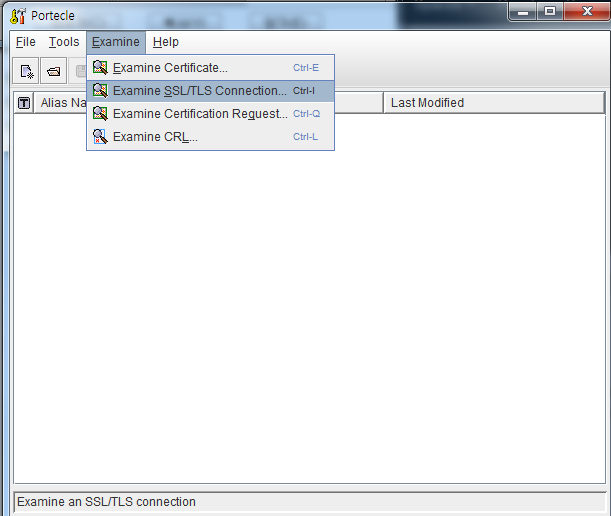
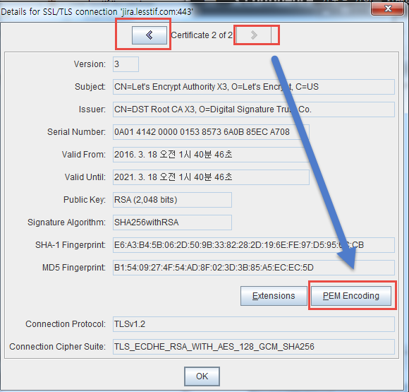
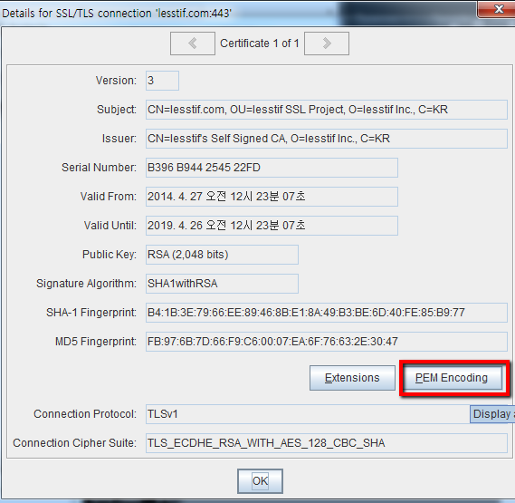
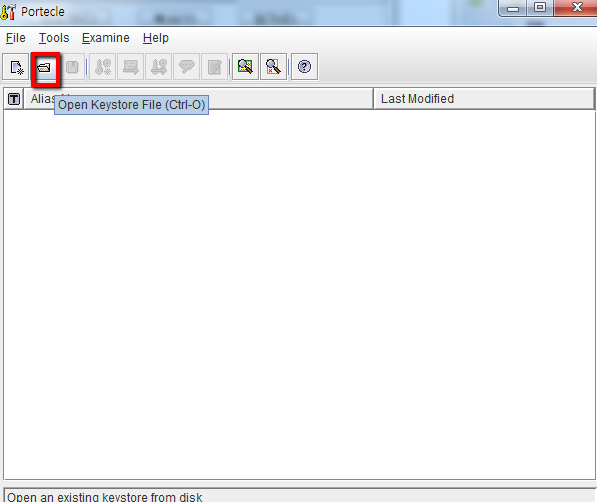
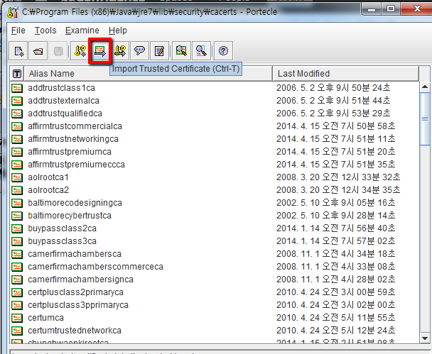

# Java httpclient 통신 중에 HTTPS 인증 관련 오류 발생시 해결방법
tags: java, PKIX, https, httpclient

## 참고 사이트 
- https://www.lesstif.com/system-admin/java-validatorexception-keystore-ssl-tls-import-12451848.html
- https://blog.geunho.dev/posts/pkix-path-building-failed/


## 발생할 수 있는 오류 메시지들
case1:
```sh
PKIX path building failed: sun.security.provider.certpath.SunCertPathBuilderException: unable to find valid certification path to requested
```
case2:
```sh
Servlet.service() for servlet [dispatcherServlet] in context with path [] threw exception [Request processing failed; nested exception is org.springframework.web.client.ResourceAccessException: I/O error on GET request for "https://tourvis.zendesk.com/api/v2/requests.json": java.lang.RuntimeException: Unexpected error: java.security.InvalidAlgorithmParameterException: the trustAnchors parameter must be non-empty; nested exception is javax.net.ssl.SSLException: java.lang.RuntimeException: Unexpected error: java.security.InvalidAlgorithmParameterException: the trustAnchors parameter must be non-empty] with root cause 
java.security.InvalidAlgorithmParameterException: the trustAnchors parameter must be non-empty 
```
case3:
```sh
Caused by: javax.naming.CommunicationException: simple bind failed: <server-name>

[Root exception is javax.net.ssl.SSLHandshakeException: sun.security.validator.ValidatorException: PKIX path building failed:

sun.security.provider.certpath.SunCertPathBuilderException: unable to find valid certification path to requested target\]
```
## 확인 방법
### 1. 웹 브라우저로 해당 사이트 접근
### 2. openssl 명령창으로 SSL 인증서 정보 확인
```sh
$ openssl s_client -connect localhost:443 -showcerts
```
### 3. curl 로 연결해서 정보 확인
```sh
$ curl -v -k -I https://mysite.example.com
```

## 원인
1. 클라이언트 *(여기선 자바를 뜻한다.)* 가 신뢰하는 CA 목록에 인증서가 발급된 CA가 없는 경우 발생하는 것이다.
2. 웹 브라우저에서 요청시 신뢰할 수 있는 인증서로 표기되는 서비스라면, 오류가 발생하는 자바 클라이언트가 가지고 있는 CA 목록이 오래되었다는 뜻이다.
3. OpenJDK 에서 많이 발생할 수 있다. (OpenJDK 에는 대부분 추가 되어있지 않다고 한다.)
4. 


## 인증서 확인 방법
인증서 위치: 
```
$JAVA_HOME/lib/security/cacerts
# 혹은
$JAVA_HOME/jre/lib/security/cacerts
```

인증서 확인:
```sh
keytool -list -v -keystore $JAVA_HOME/lib/security/cacerts
Enter keystore password: # 패스워드는 default 값으로 'changeit'

Owner: CN=DigiCert Assured ID Root CA, OU=www.digicert.com, O=DigiCert Inc, C=US
...
Owner: CN=DigiCert High Assurance EV Root CA, OU=www.digicert.com, O=DigiCert Inc, C=US
...
Owner: CN=DigiCert Global Root CA, OU=www.digicert.com, O=DigiCert Inc, C=US
...

```

## 해결방법
### 1. CMD에서 처리
아무 위치에서 해도 된다. 마지막 import될 cacerts 파일 위치만 잘 정해주면 됨.

인증서 위치: 
```
$JAVA_HOME/lib/security/cacerts
# 혹은
$JAVA_HOME/jre/lib/security/cacerts
```
#### 1.1. gist 에서 InstallCert.Java 를 다운로드

```sh
curl -O https://gist.githubusercontent.com/lesstif/cd26f57b7cfd2cd55241b20e05b5cd93/raw/InstallCert.java
```

#### 1.2. 컴파일
```sh
javac InstallCert.java
```

#### 1.3. InstallCert 구동
```sh
# localhost 에 SSL 인증서를 받아올 호스트명을 입력
java -cp ./ InstallCert tourvis.zendesk.com
```

#### 1.4. 다음과 같은 화면이 나오면 1을 눌러서 인증서 저장
```
Caused by: java.lang.UnsupportedOperationException
at InstallCert$SavingTrustManager.getAcceptedIssuers(InstallCert.java:183)
at sun.security.ssl.AbstractTrustManagerWrapper.checkAlgorithmConstraints(SSLContextImpl.java:926)
at sun.security.ssl.AbstractTrustManagerWrapper.checkAdditionalTrust(SSLContextImpl.java:872)
...

Server sent 2 certificate(s):

1 Subject CN=wiki.modernpug.org
Issuer CN=Let's Encrypt Authority X3, O=Let's Encrypt, C=US
sha1 47 0a 15 c4 5d ed 62 0a 4b 18 d5 d8 58 14 42 5d 36 e0 d5 8f
md5 3a 0d ab ce 27 be dd bd e5 c1 d5 e8 b6 25 aa eb

2 Subject CN=Let's Encrypt Authority X3, O=Let's Encrypt, C=US
Issuer CN=DST Root CA X3, O=Digital Signature Trust Co.
sha1 e6 a3 b4 5b 06 2d 50 9b 33 82 28 2d 19 6e fe 97 d5 95 6c cb
md5 b1 54 09 27 4f 54 ad 8f 02 3d 3b 85 a5 ec ec 5d

Enter certificate to add to trusted keystore or 'q' to quit: [1]
1
```
> `Subject CN= ... ` 값 보고 번호 선택하자

#### 1.5. 다음과 같은 메시지가 나오고 저장됨. keystore 명과 alias 명을 기억
```sh
Added certificate to keystore 'jssecacerts' using alias 'letsencrypt'
```

#### 1.6. keytool 로 keystore에서 인증서 추출 (KeyStore의 암호는 changeit 이라 가정!)
```sh
## alias 옵션뒤에 위의 alias명 입력
keytool -exportcert -keystore jssecacerts -storepass changeit -file output.cert -alias letsencrypt
```
> -alias 옵션 뒤에 파라미터는 5번에서 저장된 alias(letsencrypt) 를 입력

### 1.7. 현재 JDK 의 keystore에 cert import
```sh
## JAVA_HOME=/usr/java/jdk1.7.0_25
keytool -importcert -keystore ${JAVA_HOME}/jre/lib/security/cacerts -storepass changeit -file output.cert -alias letsencrypt
```

이미 존재할 경우 다음 명령어로 삭제
> keytool -delete  -alias letsencrypt -keystore ${JAVA_HOME}/jre/lib/security/cacerts -storepass changeit

### 2. Portecle GUI 사용
#### 2.1. http://sourceforge.net/projects/portecle/files/latest/download 를 다운로드후 압축 해제

#### 2.2. 실행
```sh
$java -jar portecle.jar

```

#### 2.3. Examine SSL/TLS Connection: 실행


#### 2.4. 저장할 인증서를 선택후 PEM Encoding 클릭



#### 2.5. SSL 인증서를 $JRE\lib\security 에 저장


#### 2.6. Open keystore File 선택후 ${JAVA_HOME}\jre\lib\security\cacerts 파일 선택



#### 2.7. keystore 암호 입력(기본값 changeit)

#### 2.8. Import Trusted Ceritificate 선택


#### 2.9. 저장한 인증서 선택

#### 2.10. Keystore 저장


### 3. CA 별 Intermediate 인증서 등록

#### 3.1. Comodo 
comodo 의 root ca 인증서는 JVM에 포함되어 있지만 CA의 DN이 (CN = COMODO RSA Domain Validation Secure Server CA) 인경우 미포함이므로 keystore 에 넣어 주거나 웹 서버에 SSL 경로 구성을 해야 함(https://lesstif.gitbook.io/web-service-hardening/ssl-tls-https#undefined-5 참고)

코모도의 전체 CA 인증서 목록은 https://ssl.comodo.com/support/which-is-root-which-is-intermediate.php 를 참고

1. CA 인증서 다운로드
```sh
$ curl -o comodo-domainca.crt https://gist.githubusercontent.com/lesstif/3fdfc2086b9834dbfbcd4461bfb68cd1/raw/76d3614bf86838a24343d0fddbb8ea39a9f1524c/comodo-domainca.crt
```

2. ROOT CA 인증서 다운로드
```sh
$ curl -o comodo-rootca.crt https://gist.githubusercontent.com/lesstif/3fdfc2086b9834dbfbcd4461bfb68cd1/raw/76d3614bf86838a24343d0fddbb8ea39a9f1524c/comodo-rootca.crt
```

3. keystore 에 import 하거나 웹 서버에 인증서 경로 구성
> portecle 이용할 경우"2.6. Open keystore File 선택후 ${JAVA_HOME}\jre\lib\security\cacerts 파일 선택" 부터 시작

console:
```sh
## JAVA_HOME=/usr/java/jdk1.7.0_25
keytool -importcert -keystore ${JAVA_HOME}/jre/lib/security/cacerts -storepass changeit -file comodo-domainca.crt -alias comododomainca 
```

#### 3.2. AlphaSSL 
저렴한 https://www.alphassl.com 의 경우 Java 의 Keystore 에 포함되지 않았으므로 수작업으로 인증서를 넣어줘야 한다.

1. Alpha SSL root 인증서 다운로드
```
$ curl -o root.cer https://www.alphassl.com/support/roots/root.pem
```

2. https://www.alphassl.com/support/install-root-certificate.html 에 연결하여 발급한 인증서의 ca 인증서를 ca.cer 로 저장 (Ex: SHA-256 - Orders March 31, 2014 and After)
```
-----BEGIN CERTIFICATE-----
MIIETTCCAzWgAwIBAgILBAAAAAABRE7wNjEwDQYJKoZIhvcNAQELBQAwVzELMAkG
A1UEBhMCQkUxGTAXBgNVBAoTEEdsb2JhbFNpZ24gbnYtc2ExEDAOBgNVBAsTB1Jv
b3QgQ0ExGzAZBgNVBAMTEkdsb2JhbFNpZ24gUm9vdCBDQTAeFw0xNDAyMjAxMDAw
MDBaFw0yNDAyMjAxMDAwMDBaMEwxCzAJBgNVBAYTAkJFMRkwFwYDVQQKExBHbG9i
YWxTaWduIG52LXNhMSIwIAYDVQQDExlBbHBoYVNTTCBDQSAtIFNIQTI1NiAtIEcy
MIIBIjANBgkqhkiG9w0BAQEFAAOCAQ8AMIIBCgKCAQEA2gHs5OxzYPt+j2q3xhfj
kmQy1KwA2aIPue3ua4qGypJn2XTXXUcCPI9A1p5tFM3D2ik5pw8FCmiiZhoexLKL
dljlq10dj0CzOYvvHoN9ItDjqQAu7FPPYhmFRChMwCfLew7sEGQAEKQFzKByvkFs
MVtI5LHsuSPrVU3QfWJKpbSlpFmFxSWRpv6mCZ8GEG2PgQxkQF5zAJrgLmWYVBAA
cJjI4e00X9icxw3A1iNZRfz+VXqG7pRgIvGu0eZVRvaZxRsIdF+ssGSEj4k4HKGn
kCFPAm694GFn1PhChw8K98kEbSqpL+9Cpd/do1PbmB6B+Zpye1reTz5/olig4het
ZwIDAQABo4IBIzCCAR8wDgYDVR0PAQH/BAQDAgEGMBIGA1UdEwEB/wQIMAYBAf8C
AQAwHQYDVR0OBBYEFPXN1TwIUPlqTzq3l9pWg+Zp0mj3MEUGA1UdIAQ+MDwwOgYE
VR0gADAyMDAGCCsGAQUFBwIBFiRodHRwczovL3d3dy5hbHBoYXNzbC5jb20vcmVw
b3NpdG9yeS8wMwYDVR0fBCwwKjAooCagJIYiaHR0cDovL2NybC5nbG9iYWxzaWdu
Lm5ldC9yb290LmNybDA9BggrBgEFBQcBAQQxMC8wLQYIKwYBBQUHMAGGIWh0dHA6
Ly9vY3NwLmdsb2JhbHNpZ24uY29tL3Jvb3RyMTAfBgNVHSMEGDAWgBRge2YaRQ2X
yolQL30EzTSo//z9SzANBgkqhkiG9w0BAQsFAAOCAQEAYEBoFkfnFo3bXKFWKsv0
XJuwHqJL9csCP/gLofKnQtS3TOvjZoDzJUN4LhsXVgdSGMvRqOzm+3M+pGKMgLTS
xRJzo9P6Aji+Yz2EuJnB8br3n8NA0VgYU8Fi3a8YQn80TsVD1XGwMADH45CuP1eG
l87qDBKOInDjZqdUfy4oy9RU0LMeYmcI+Sfhy+NmuCQbiWqJRGXy2UzSWByMTsCV
odTvZy84IOgu/5ZR8LrYPZJwR2UcnnNytGAMXOLRc3bgr07i5TelRS+KIz6HxzDm
MTh89N1SyvNTBCVXVmaU6Avu5gMUTu79bZRknl7OedSyps9AsUSoPocZXun4IRZZ
Uw==
-----END CERTIFICATE-----
```

3. Key store 에 import
```sh
$ keytool -import -trustcacerts -keystore $JAVA_HOME/jre/lib/security/cacerts -alias alpharoot -file root.cer -storepass changeit -noprompt
$ keytool -import -trustcacerts -keystore $JAVA_HOME/jre/lib/security/cacerts -alias alphaca -file ca.cer -storepass changeit -noprompt
```

#### 3.3. let's encrypt 인증서
무료 인증서 발급해 주는 https://letsencrypt.org 일 경우 

> 전체 인증서 체인은 https://letsencrypt.org/certificates/ 참고

1. root cert 다운로드
```sh
$ curl -o root.cer https://letsencrypt.org/certs/isrgrootx1.pem
```

2. 발급받은 인증서에 맞는 ca cert download(Ex: Let’s Encrypt Authority X3 (IdenTrust cross-signed) :)
```sh
$ curl -o ca.cer https://letsencrypt.org/certs/lets-encrypt-x3-cross-signed.pem
```

3. Key store 에 import
```sh 
$ keytool -import -trustcacerts -keystore $JAVA_HOME/jre/lib/security/cacerts -alias letsroot -file root.cer -storepass changeit -noprompt
$ keytool -import -trustcacerts -keystore $JAVA_HOME/jre/lib/security/cacerts -alias letsca -file ca.cer -storepass changeit -noprompt
```


