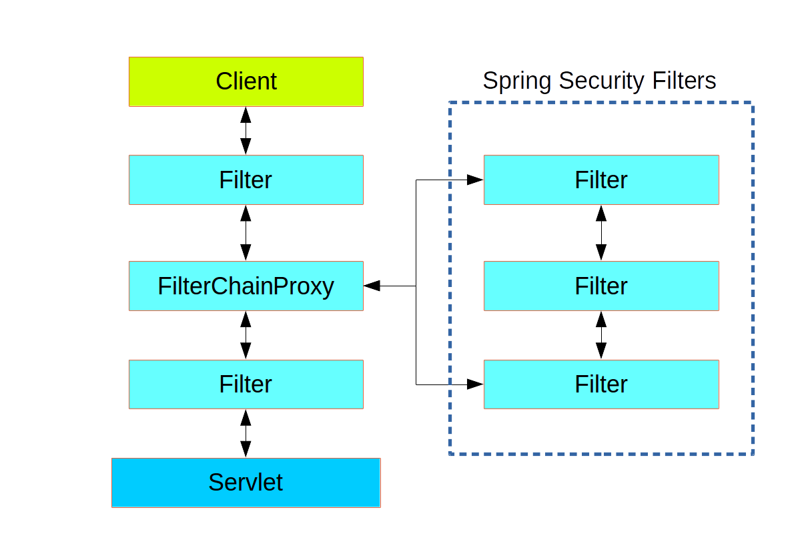

# Spring Boot 기반 Spring Security 회원가입 / 로그인 구현하기

스프링 부트 환경에서 BCryptPasswordEncoder를 이용한 회원가입 암호화 / Spring Security를 이용한 로그인 구현

## 시큐리티의 구조

웹에서 스프링 시큐리티는 기본적으로 아래와 같이 필터 기반으로 동작한다.

많은 필터들이 존재하며, DispatcherServlet 을 호출하기 전에 거치게 된다.

setOrder로 필터간의 순서나 우선순위를 정해서 커스터마이징 할 수도 있다.



## 프로젝트에 Spring Security 적용하기

Maven

```xml {.line-numbers}
<dependency>
  <groupId>org.springframework.boot</groupId>
  <artifactId>spring-boot-starter-security</artifactId>
</dependency>
```

Gradle

```gradle {.line-numbers}
compile("org.springframework.boot:spring-boot-starter-security")
```