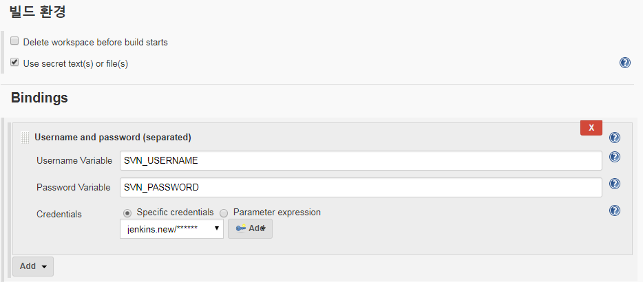
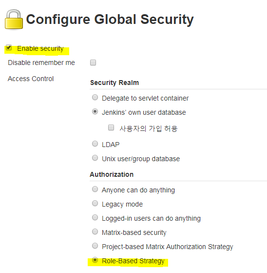
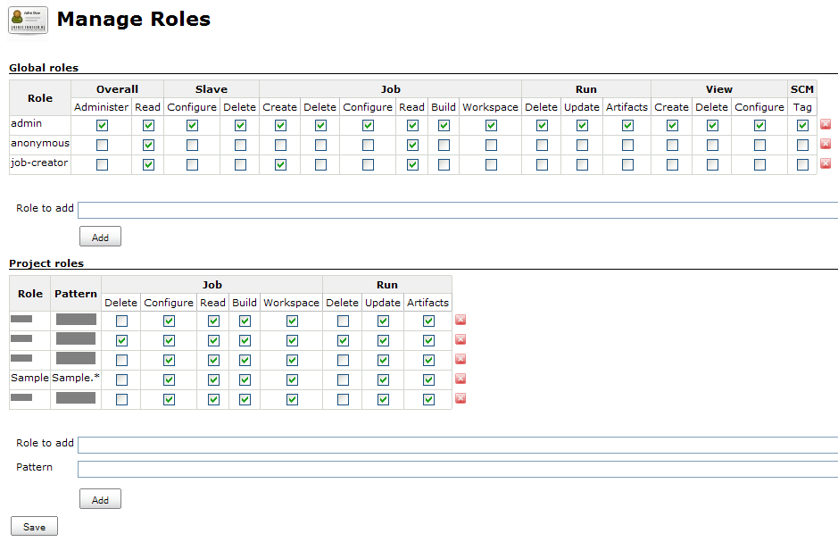

# Apache Jenkins

1. 프로젝트 빌드가 되는 workspace는 기본적으로 `~/.jenkins/workspace/` 폴더이나 이 위치를 수정하고 싶을 경우 `~/.jenkins/config.xml` 파일 안에 `<workspaceDir>` 태그에서 가능하다.
1. 톰켓으로 구동할때 톰켓 설정(server.xml)에서 `<context> > docBase > path` 값을 `/jenkins`로 설치할 경우, 젠킨스 시스템 설정 ( http://jenkinsip.com:8080/jenkins/configure/ ) 안에 `Jenkins Location > Jenkins URL` 값을 서버 Path에 맞게 설정이 꼭 필요하다.
1. 젠킨스 구조
    - 기본 셋팅 환경설정 ~/.jenkins/config.xml
    - 플러그인 파일 ~/.jenkins/plugins/
    - 자바,메이븐등 툴 자동설치 위치 ~/.jenkins/tools/
    - 프로젝트 빌드 Item 정보 ~/.jenkins/jobs/
    - 유저 정보 ~/.jenkins/users/
1.

## Job configure 에서 패스워드 환경변수 설정

job configure > 빌드 환경 > "Use secret text(s) or file(s)" 체크 > Bindings > Add

등록후 Build.xml 설정에서 아래
#### 참고
https://support.cloudbees.com/hc/en-us/articles/203802500-Injecting-Secrets-into-Jenkins-Build-Jobs

## 프로젝트별 권한 설정

플러그인 설치

https://wiki.jenkins.io/display/JENKINS/Role+Strategy+Plugin

1. Jenkins 관리 > Configure Global Securitry > Enable security checked. > Role-Based Strategy radio checked.

    

1. Jenkins 관리 > Manage and Assign Roles > Manage Roles

    1. Global roles 에 기본 권한("job-creator") 추가 > Overall > Read 체크 (이래야 메인화면이 제대로 노출)

    1. Project roles 에서 각 프로젝트별 role 설정을 한다. role은 "name" Pattern은 "job 이름 패턴" 이다.

        예) Sample.* 패턴을 가지면 Sample-common, Sample-mobile, Sample-front ... 등 "Sample" 로 시작하는 모든 job을 묶어준다.

     

1. Jenkins 관리 > Manage and Assign Roles > Assign Roles

    1. Global roles 에서 유저 설정

    1. Item roles 에서 앞서 생성한 "Project roles" 과 유저간의 룰 매칭

## :bomb: troubleshooting
1. /usr/lib/tomcat/temp/jenkins480174068218113004.sh: line 2: unexpected EOF while looking for matching `"'
    - Execute shell command 값에 잘못된 표현식이 있는지 확인

