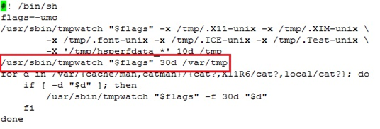
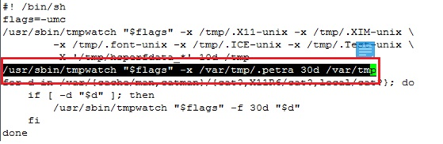
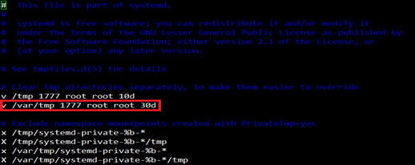

# [CentOS] tmpwatch 설정

Redhat 계열 TmpWatch 설정 가이드

## 장애 현상
암호화를 사용하는 DB 또는 WAS 서버에서 /var/tmp/.petra/petra_cipher_api.conf 파일이 지워지는 현상

## 장애 원인 (RHEL 6.X 이하)
/etc/cron.daily 에 tmpwatch가 실행 되고 있었으며 생성, 최종수정, 최종사용이 30일 뒤 /var/tmp 디렉터리 하위의 파일을 삭제하는 것으로 설정됨.
(해당 설정은 Oracle linux / CentOS 등 Redhat 계열만 해당하며, 우분투, 데비안, UNIX 등은 해당 안됨)

## 처리 방안
/var/tmp/.petra 디렉터리는 제외하도록 설정

## 장애 원인 (RHEL 7 이상)
/usr/bin/system-tmpfiles 데몬이 주기적으로 실행되며 이 데몬은 수행시 /usr/lib/tmpfiles.d/tmp.conf 파일을 참조하여 수행됨

OS 설치시 /usr/lib/tmpfiles.d/tmp.conf 내용, 생성, 최종수정, 최종사용이 30일 뒤인 /var/tmp 디렉터리 하위의 파일을 삭제하는 것으로 설정됨.

## 처리 방안
1. tmpwatch 설정 변경 : /var/tmp/.petra 디렉터리 제외처리

