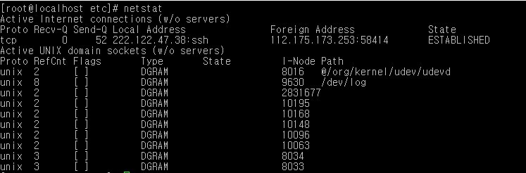

# Linux Process 관리

참고자료 
- https://www.aonenetworks.kr/official.php/home/info/1399

## ps 

리눅스 시스템에서 사용중인 프로세서의 실행상태를 파악하고 점검하는 명령어이다.

현재 사용자가 실행한 프로세스에 대해서만 출력한다.

 

 

* Process

프로세스(process)는컴퓨터에서 연속적으로 실행되고 있는 컴퓨터 프로그램이다.

즉, 컴퓨터안에 실행중인 프로그램을 프로세스라고 하며 실행중이지 않으면 프로그램이라 보면 된다.

ps [옵션]

[옵션]

-f : 자세하게 프로세스 상태 보기

-a : 다른 터미널의 프로세스 상태 보기

-u : 사용자 이름과 시작 시간 추가하여 보기

-e : 모든 프로세스의 환경 보기

-x : 진행중인 프로세스들과 다른 터미널의 프로세스 보기

 

 

[각 필드 설명]

UID : 사용자 아이디

PID : 프로세스 아이디

PPID : 부모 프로세스 아이디

C or CPU : CPU 사용률(%)

STIME or START : 프로세스 시작 시간 (시:분:초)

TTY : 터미널 번호 (?인 것은 백그라운드로 실행 상태)

TIME : 사용 시간 (시:분:초)

CMD : 명령어

## pstree 

명령어는 현재 실행중인 프로세스들을 트리구조로 보여주며, 프로세스의 상호관계를 파악하기 위한 명령어이다.

pstree [옵션]

[옵션]

-a : 모든 프로세스의 인자나 옵션을 함께 출력

-h : 현재 프로세스의 조상 프로세스와 부모 프로세스를 강조하여 출력

-p : pid값과 함께 출력

-u [사용자] : 특정 사용자의 프로세스 트리만 출력

## lsof 명령어는 

시스템에서 사용하고 있는 모든 자원들에 대한 목록을 출력할 수 있는 명령어로 시스템을 관리할 때 매우 유용하게 쓰인다.

lsof [옵션]

[옵션]

-p [PID] : 프로세스가 오픈한 파일 리스트 확인

-i [IP] : 호스트에 대한 접속 확인

-u [UID] : 사용자가 오픈한 프로세스 확인

-lsof [경로] : 파일이 사용하는 프로세스 확인

## top 명령어는

리눅스 시스템의 운영상황을 실시간으로 전반적인 상황을 모니터링하거나 프로세스 관리를 할 수 있는 유틸리티이다.
top 명령어로 확인하는 대표적인 것으로는 서버평균 부하율, CPU사용률, 메모리 사용 현황, 스왑 메모리 사용 현황, 모든 프로세스들의 자원사용 현황 등이다.

top는 기본으로 5초에 한번씩 실기간으로 refresh를 하여 시스템에 실행되고 있는 프로세스들의 상태 정보를 실시간으로 보여준다.
top의 도움말은 실행된 화면에서 h를 누르면 된다.  또한, 종료할 때에는 q또는 Ctrl+C 를 눌러 종료할 수 있다.

top [옵션]

[옵션]

spacebar : 스페이스바를 누르면 즉시 refresh 시행

f : 해당 필드 제거 또는 추가

o : 필드표시 순서 변경

F 또는 O : 필드정렬 선택 

< : 해당 컬럼을 왼쪽으로 이동

> : 해당 컬럼을 오른쪽으로 이동

h 또는 ? : 도움말 표시

H : thread를 감추거나 표시(toggle)

S : cumulative mode를 on(off) 한다

i : idle 프로세스를 감추거나 표시(toggle)

c : 명령행에 전체 명령(인자들 포함)들을 표시(toggle)

l : 첫번째행에 표시되는 시스템 부하율을 감추고 표시(toggle)

m : 네번째와 다섯번째행의 메모리 정보와 스왑정보를 감추거나 표시

t : 두번째와 세번째행의 정보인 cpu와 프로세스 정보를 감추거나 표시

k : 지정된 PID의 프로세스를 종료(kill -p PID)

r : renice값을 변경. 실행 우선순위 조정 가능

N : PID번호를 기준으로 오름차순 정렬

P : CPU사용률을 기준으로 정렬

M : 메모리의 사용량을 기준으로 정렬

-T : 실행시간이 오래된 프로세스 순으로 정렬

-x 또는 y : x는 필드정렬, y는 task 실행에 대한 하이라이트 표시(toggle)

-z 또는 b : z는 컬러/ 흑백, b는 bold체/ reverse체(toggle)

-u : 지정된 사용자의 소유로된 프로세스만 표시

-n 또는 # : 지정된 개수만큼의 프로세스를 화면에 표시

-d 또는 s : 지정된 초단위로 화면을 갱신

-W : 환경파일을 사용자의 홈 디렉토리에 .toprc라는 파일명으로 저장

-q : top의 실행에서 빠져나감

 

 

각 항목들에 대한 의미

PID : process ID 
USER : 해당 프로세서의 소유자 
PRI : 일의 우선 순위 (높을수록 우선 처리) 
NI : 일의 nice value 값. 마이너스(-)를 가지는 nice value는 우선 순위가 높음 

VIRT : 해당 프로세스가 사용한 가상메모리의 총량

RES : 해당 프로세스의 물리적인 메모리 사용량

RSS : 사용되어 지는 실제 메모리의 양(Kbyte 단위) 

SHARE : 프로세스에 의해 사용된 메모리를 나눈 메모리의 총합 

SIZE : 해당 프로세스의 크기 
STAT : 프로세스의 상태를 나타냄. 상태는 아래를 참조. 
%CPU : cpu의 사용량을 %로 표시 
%MEM : mem 의 사용량을 % 로 표시 
TIME : 프로세스가 시작되어 사용된 총 cpu 시간을 표시

COMMAND : 실행된 명령어

□ top - 10:43:41 up 27 days,1:02, 1 users,load average: 0.00, 0.

첫번째행은 시스템의 부하율을 알림

10:43:41  - 시스템의 현재 시간
up 27 days  - 시스템이 부팅된 후에 재부팅이나 종료 없이 현재까지 운영된 시간
1 users  - 현재 로그인 된 사용자의 수
load average  - 0.00, 0.00, 0.00 - 최근 1분, 5분 ,15분 각각의 시스템 평균 부하율 
 

 

□ Tasks : 140 total, 1 runnung, 135 sleeping,4 stopped, 0 zombie
두번째행은 프로세스들의 종합적인 상황을 알림

Tasks : 140 total  - 전체 실행된 프로세스 수
1 running  - 현재 실행되고 있는 프로세스 수
135 Sleeping  - 유휴상태에 있는 프로세스 수
4 stopped  - 종료된 프로세스 수
0 zombie  - 좀비 프로세스 수

 

 * 좀비 프로세스 : 대부분의 프로세스는 부모프로세스가 종료되면 자식프로세스는 자동 종료된다. 

부모프로세스가 종료되었음에도 자식프로세스가 아직 남아 있는 상태의 프로세스를 좀비프로세스라고 한다. 

이런 좀비프로세스가 많아지면 시스템이 느려지는 원인이 될 수도 있다. 대부분의 좀비프로세스는 init 프로세스에 의해

관리가 된다. 그리고 계속 살아있는 좀비프로세스가 있다면 kill 명령으로 강제종료 시켜도 무방하다.

하지만, 시스템을 재부팅하면 이런 좀비프로세스는 자동제거된다.

 

 

□ Cpu(s): 0.0%us, 0.0%sy, 0.0%ni, 99.8%id, 0.0%wa, 0.0%hi, 0.0%si, 0.0%st

세번째행은 CPU의 사용 및 실행 상태를 알림

 

0.0%us - 사용자가 실행시킨 프로세스의 CPU 사용률 (user mode)
0.0%sy - 시스템 자체에서 사용하는 CPU사용률 (systemmode)
0.0%ni - nice정책에 의해 사용되고 있는 CPU사용률 (low priority user mode)
99.8%id - 사용되지 않고 남은 CPU사용률 (idletask)
0.0%wa - 입출력 대기상태의 CPU사용률 (I/Owaiting)
0.0%hi -IRQs 에 사용된 CPU (servicing IRQs)
0.0%si - soft IRQs 에 사용된 CPU (servicing soft IRQs)
0.0%st - steal 값 (다른 instances 실행에 주어진 time 값)

 

즉, CPU의 사용자 사용률과 시스템 자체 사용

그리고  NICE 정책에 의한 사용율, 놀고 있는 CPU사용률 등을 각각 나타내고 있다.

 

 

 

□ Mem: 2953536k total, 580944k used, 2372592kfree, 217844 buffers
네번째행에서는 실제 메모리의 상태 파악 가능

 

2953536k total - 실제메모리의 전체용량
580944k used - 프로세스에 의해 사용되고 있는 메모리의 사용량
2372592k free - 사용되지 않고 남아있는 메모리양
217844k buffers - 버퍼링된 메모리양

 

 

 

□ Swap : 4193276k total, 0k used, 4193276k free, 213044k cached
다섯번째행에서는 스왑 메모리의 상태 파악 가능

 

4193276k total - 전체 스왑메모리량
0k used - 프로세스에 의해 사용된 스왑메모리량
4193276k free - 남아 있는 스왑메모리량
213044k cached - 캐싱 메모리양

## netstat 명령어는

현재 시스템에 연결된 네트워크 상태, 라우팅 테이블, 인터페이스 상태 등을 볼 수 있다.

netstat [옵션]

[옵션]

-n : 호스트명, 포트명을 lookup하지 않고 (도메인으로 보이지 않고) IP, Port 번호를 보여준다.

-a : 모든 네트워크상태를 보여준다.

-t : TCP 프로토콜만 보여준다.

-u : UDP 프로토콜만 보여준다.

-p : 해당 포트를 사용하는프로그램과 프로세스ID(PID)를 보여준다.

-r : 라우팅 테이블 출력

-s : 프로토콜 별(IP, ICMP, TCP, UDP 등)로 통계를 보여준다

-c : 연속적으로 상태를 보여준다.

-l : 대기중인 소켓 목록을보여준다.
