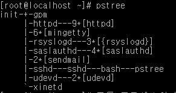

# Linux 시스템 모니터링

참고자료 
- https://www.aonenetworks.kr/official.php/home/info/1399
- https://www.whatap.io/ko/blog/10/index.html

## ps 

리눅스 시스템에서 사용중인 프로세서의 실행상태를 파악하고 점검하는 명령어이다.

현재 사용자가 실행한 프로세스에 대해서만 출력한다.


* Process

프로세스(process)는컴퓨터에서 연속적으로 실행되고 있는 컴퓨터 프로그램이다.

즉, 컴퓨터안에 실행중인 프로그램을 프로세스라고 하며 실행중이지 않으면 프로그램이라 보면 된다.

### ps [옵션]

- -f : 자세하게 프로세스 상태 보기
- -a : 다른 터미널의 프로세스 상태 보기
- -u : 사용자 이름과 시작 시간 추가하여 보기
- -e : 모든 프로세스의 환경 보기
- -x : 진행중인 프로세스들과 다른 터미널의 프로세스 보기

```bash
$ ps -ef
```

 


### [각 필드 설명]

UID : 사용자 아이디

PID : 프로세스 아이디

PPID : 부모 프로세스 아이디

C or CPU : CPU 사용률(%)

STIME or START : 프로세스 시작 시간 (시:분:초)

TTY : 터미널 번호 (?인 것은 백그라운드로 실행 상태)

TIME : 사용 시간 (시:분:초)

CMD : 명령어

## pstree 

명령어는 현재 실행중인 프로세스들을 트리구조로 보여주며, 프로세스의 상호관계를 파악하기 위한 명령어이다.



### pstree [옵션]
- -a : 모든 프로세스의 인자나 옵션을 함께 출력
- -h : 현재 프로세스의 조상 프로세스와 부모 프로세스를 강조하여 출력
- -p : pid값과 함께 출력
- -u [사용자] : 특정 사용자의 프로세스 트리만 출력

## lsof 명령어는 

시스템에서 사용하고 있는 모든 자원들에 대한 목록을 출력할 수 있는 명령어로 시스템을 관리할 때 매우 유용하게 쓰인다.


### lsof [옵션]
- -p [PID] : 프로세스가 오픈한 파일 리스트 확인
- -i [IP] : 호스트에 대한 접속 확인
- -u [UID] : 사용자가 오픈한 프로세스 확인
- -lsof [경로] : 파일이 사용하는 프로세스 확인

## top 명령어는

리눅스 시스템의 운영상황을 실시간으로 전반적인 상황을 모니터링하거나 프로세스 관리를 할 수 있는 유틸리티이다.
top 명령어로 확인하는 대표적인 것으로는 서버평균 부하율, CPU사용률, 메모리 사용 현황, 스왑 메모리 사용 현황, 모든 프로세스들의 자원사용 현황 등이다.

top는 기본으로 5초에 한번씩 실기간으로 refresh를 하여 시스템에 실행되고 있는 프로세스들의 상태 정보를 실시간으로 보여준다.
top의 도움말은 실행된 화면에서 h를 누르면 된다.  또한, 종료할 때에는 q또는 Ctrl+C 를 눌러 종료할 수 있다.

### top [단축키]
- spacebar : 스페이스바를 누르면 즉시 refresh 시행
- f : 해당 필드 제거 또는 추가
- o : 필드표시 순서 변경
- F 또는 O : 필드정렬 선택 
- < : 해당 컬럼을 왼쪽으로 이동
- \> : 해당 컬럼을 오른쪽으로 이동
- h 또는 ? : 도움말 표시
- H : thread를 감추거나 표시(toggle)
- S : cumulative mode를 on(off) 한다
- i : idle 프로세스를 감추거나 표시(toggle)
- c : 명령행에 전체 명령(인자들 포함)들을 표시(toggle)
- l : 첫번째행에 표시되는 시스템 부하율을 감추고 표시(toggle)
- m : 네번째와 다섯번째행의 메모리 정보와 스왑정보를 감추거나 표시
- t : 두번째와 세번째행의 정보인 cpu와 프로세스 정보를 감추거나 표시
- k : 지정된 PID의 프로세스를 종료(kill -p PID)
- r : renice값을 변경. 실행 우선순위 조정 가능
- N : PID번호를 기준으로 오름차순 정렬
- P : CPU사용률을 기준으로 정렬
- M : 메모리의 사용량을 기준으로 정렬
- T : 실행시간이 오래된 프로세스 순으로 정렬
- x 또는 y : x는 필드정렬, y는 task 실행에 대한 하이라이트 표시(toggle)
- z 또는 b : z는 컬러/ 흑백, b는 bold체/ reverse체(toggle)
- u : 지정된 사용자의 소유로된 프로세스만 표시
- n 또는 # : 지정된 개수만큼의 프로세스를 화면에 표시
- d 또는 s : 지정된 초단위로 화면을 갱신
- W : 환경파일을 사용자의 홈 디렉토리에 .toprc라는 파일명으로 저장
- q : top의 실행에서 빠져나감
- [SHIFT + M] : 메모리 사용률 정렬
- [SHIFT + N] : PID 기준 정렬
- [SHIFT + P] : CPU 사용률 정렬
- [SHIFT + T] : 실행시간 기준 정렬
- [SHIFT + R] : 정렬 기준변경 (오름차순인 경우 내림차순으로, 내림차순인 경우 오름차순으로 변경)


각 항목들에 대한 의미

- PID : process ID 
- USER : 해당 프로세서의 소유자, 프로세스를 실행시킨 사용자 ID
- PR : 프로세스의 우선순위 (높을수록 우선 처리) 
- NI : 프로세스의 nice 값. 마이너스(-)를 가지는 nice 값이 우선 순위가 높음 
- VIRT : 해당 프로세스가 사용한 가상메모리의 총량, 가상 메모리의 사용량(SWAP+RES)
- RES : 해당 프로세스의 물리적인 메모리 사용량, 현재 페이지가 상주하고 있는 크기
- SHR : 프로세스에 의해 사용된 메모리를 나눈 메모리의 총합, 가상 메모리 중 사용중인 메모리를 제외한 잔여 가상 메모리
- S : 프로세스의 상태, 상태는 아래를 참조.
- %CPU : cpu의 사용량을 %로 표시 
- %MEM : mem 의 사용량을 % 로 표시 
- TIME+ : 프로세스가 CPU를 사용한 시간
- COMMAND : 실행된 명령어
- RSS : 사용되어 지는 실제 메모리의 양(Kbyte 단위) 


#### top - 10:43:41 up 27 days,1:02, 1 users,load average: 0.00, 0.
첫번째행은 시스템의 부하율을 알림 

- 10:43:41  - 시스템의 현재 시간
- up 27 days  - 시스템이 부팅된 후에 재부팅이나 종료 없이 현재까지 운영된 시간
- 1 users  - 현재 로그인 된 사용자의 수
- load average  - 0.00, 0.00, 0.00 - 최근 1분, 5분 ,15분 각각의 시스템 평균 부하율 

#### Tasks : 140 total, 1 runnung, 135 sleeping,4 stopped, 0 zombie
두번째행은 프로세스들의 종합적인 상황을 알림

- Tasks : 140 total  - 전체 실행된 프로세스 수
- 1 running  - 현재 실행되고 있는 프로세스 수
- 135 Sleeping  - 유휴상태에 있는 프로세스 수
- 4 stopped  - 종료된 프로세스 수
- 0 zombie  - 좀비 프로세스 수

> * 좀비 프로세스 : 대부분의 프로세스는 부모프로세스가 종료되면 자식프로세스는 자동 종료된다. 

부모프로세스가 종료되었음에도 자식프로세스가 아직 남아 있는 상태의 프로세스를 좀비프로세스라고 한다. 
이런 좀비프로세스가 많아지면 시스템이 느려지는 원인이 될 수도 있다. 대부분의 좀비프로세스는 init 프로세스에 의해
관리가 된다. 그리고 계속 살아있는 좀비프로세스가 있다면 kill 명령으로 강제종료 시켜도 무방하다.
하지만, 시스템을 재부팅하면 이런 좀비프로세스는 자동제거된다.

#### Cpu(s): 0.0%us, 0.0%sy, 0.0%ni, 99.8%id, 0.0%wa, 0.0%hi, 0.0%si, 0.0%st
세번째행은 CPU의 사용 및 실행 상태를 알림

- 0.0%us - 사용자가 실행시킨 프로세스의 CPU 사용률 (user mode)
- 0.0%sy - 시스템 자체에서 사용하는 CPU사용률 (system mode)
- 0.0%ni - nice정책에 의해 사용되고 있는 CPU사용률, 프로세스 우선순위를 기반으로 사용되는 사용률(사용자 공간에서 사용됨) (low priority user mode) 
- 99.8%id - 사용되지 않고 남은 CPU사용률 (idle task)
- 0.0%wa - 입출력 대기상태의 CPU사용률, 입출력을 기다리는 프로세스 사용률 (I/O waiting)
- 0.0%hi -IRQs 에 사용된 CPU, 하드웨어 인터럽트 사용률 (servicing IRQs)
- 0.0%si - soft IRQs 에 사용된 CPU, 소프트웨어 인터럽트 사용률 (servicing soft IRQs)
- 0.0%st - steal 값, 가상화 환경에서 손실률 (다른 instances 실행에 주어진 time 값)

즉, CPU의 사용자 사용률과 시스템 자체 사용
그리고  NICE 정책에 의한 사용율, 놀고 있는 CPU사용률 등을 각각 나타내고 있다.

User값이 높다면, 사용자 코드를 수행하는데 시간이 오래 걸린다면 내부적으로 계산을 많이 하고 있다는 것입니다. System값이 높다면, 시스템에 의해 사용되고 있는 시간이 오래 걸린다면 프로세스들이 시스템 호출 또는 I/O가 많다고 할 수 있습니다. idle의 값이 항상 0이라면 CPU를 100% 사용하고 있다는 것을 의미합니다. CPU를 계속 사용하고 있는 프로세스를 찾아 적절하게 대응할 필요가 있습니다.

#### Mem: 2953536k total, 580944k used, 2372592kfree, 217844 buffers
네번째행에서는 실제 메모리의 상태 파악 가능

- 2953536k total - 실제메모리의 전체용량
- 580944k used - 프로세스에 의해 사용되고 있는 메모리의 사용량
- 2372592k free - 사용되지 않고 남아있는 메모리양
- 217844k buffers - 버퍼링된 메모리양

#### Swap : 4193276k total, 0k used, 4193276k free, 213044k cached
다섯번째행에서는 스왑 메모리의 상태 파악 가능

- 4193276k total - 전체 스왑메모리량
- 0k used - 프로세스에 의해 사용된 스왑메모리량
- 4193276k free - 남아 있는 스왑메모리량
- 213044k cached - 캐싱 메모리양

## netstat 명령어는

현재 시스템에 연결된 네트워크 상태, 라우팅 테이블, 인터페이스 상태 등을 볼 수 있다.


- [Active Internet connections] : TCP, UDP, raw로 연결된 목록만 보여집니다.
- [Active UNIX domain sockets] : 도메인 소켓으로 연결된 목록만 보여집니다.

### netstat [옵션]

- -n : 호스트명, 포트명을 lookup하지 않고 (도메인으로 보이지 않고) IP, Port 번호를 보여준다.
- -a : 모든 네트워크상태를 보여준다.
- -t : TCP 프로토콜만 보여준다.
- -u : UDP 프로토콜만 보여준다.
- -p : 해당 포트를 사용하는프로그램과 프로세스ID(PID)를 보여준다.
- -r : 라우팅 테이블 출력
- -s : 프로토콜 별(IP, ICMP, TCP, UDP 등)로 통계를 보여준다
- -c : 연속적으로 상태를 보여준다.
- -l : 대기중인 소켓 목록을보여준다.

State는 아래와 같이 표현됩니다.
- [공백] : 연결되어 있지 않음
- [FREE] : socket은 존재하지만 할당되어 있지 않다.
- [LISTENING] : 연결요청에 대한 응답준비가 되어 있는 상태
- [CONNECTING] : 연결이 막 이루어진 상태
- [DISCONNECTING] : 연결해제 되고 있는 상태
- [UNKNOWN] : 알 수 없는 연결, 알려지지 않은 연결 상태
- [LISTEN] : 연결 가능하도록 daemon이 떠있으며 연결이 가능한 상태
- [SYS-SENT] : 연결을 요청한 상태
- [SYN_RECEIVED] : 연결요구에 응답 후 확인 메시지 대기중인 상태
- [ESTABLISHED] : 연결이 완료된 상태
- [FIN-WAIT1] : 소켓이 닫히고 연결이 종료되고 있는 상태
- [FIN-WAIT2] : 로컬이 원격으로부터 연결 종료 요구를 기다리는 상태
- [CLOSE-WAIT] : 종료 대기 중
- [CLOSING] : 전송된 메세지가 유실되었음
- [TIME-WAIT] : 연결종료 후 한동안 유지되어 있음
- [CLOSED] : 연결이 완전히 종료

옵션에 따라 다른 정보를 확인 할 수 있습니다. 유용하게 쓰이는 옵션들은 알아 두어야 합니다.
```sh
$ netstat -r		# 서버의 라우팅 테이블 출력
$ netstat -na --ip	# tcp/udp의 세션 목록 표시
$ netstat -na | grep ESTABLISHED | wc -l		# 활성화된 세션 수 확인
$ netstat -nap | grep :80 | grep ESTABLISHED | wc -l	# 80포트 동시 접속자수
$ netstat -nltp 	# LISTEN 중인 포트 정보 표시
```


## uname: 시스템과 커널의 정보
Uname 명령어를 사용하면 시스템과 커널의 정보를 확인할 수 있습니다. -a 옵션을 사용하면 모든 정보를 확인할 수 있습니다.


각각의 의미는 다음과 같습니다.

- [Linux] : 커널 명
- [Localhost] : 호스트 명
- [3.13.0-24-generic] : 커널 릴리즈 정보
- [#47-Ubuntu SMP Fri May 2 23:30:00 UTC 2014] : 커널 버전
- [x86_64] : 머신 하드웨어 이름
- [x86_64] : 프로세서 종류
- [x86_64] : 하드웨어 플랫폼
- [GNU/Linux] : 운영체제

사용할 수 있는 옵션은 아래와 같습니다.

$ uname --help
- [-a, --all] : 전체 내용 출력
- [-s, --kernel-name] : 커널 명 출력
- [-n, --nodename] : 네트워크 노드의 호스트 명 출력
- [-r, --kernel-release] : 커널 릴리즈 정보 출력
- [-v, -kernel-version] : 커널 버전 출력
- [-m, --machine] : 머신 하드웨어 이름 출력
- [-p, --processor] : 프로세서 종류 또는 'unknown' 출력
- [-i,- -hardware-platform ] : 하드웨어 플랫폼 또는 'unknown' 출력
- [-o, --operating-system ] : 운영체제 'unknown' 출력


## ifconfig: 네트워크 기본 모니터링
시스템에 설정된 네트워크 인터페이스의 상태를 확인 및 변경할 수 있습니다.


- [eth0, eth1] : 흔히 랜 카드라고 불리는 유선 네트워크 인터페이스입니다. 위 예제는 랜 카드가 2개있는 경우입니다.
- [lo] : 루프 백 인터페이스로 자기자신과 통신하는데 사용하는 가상 장치입니다. IP가 127.0.0.1 입니다. IP주소는 서버에 하나씩 부여되는 것이 아니라 네트워크 인터페이스에 할당되기 때문에 각 네트워크 인터페이스마다 다른 IP주소를 가지고 있습니다.
- [HWaddr] : 네트워크 인터페이스의 하드웨어 주소(MAC Address)
- [inetaddr] : 네트워크 인터페이스에 할당된 IP 주소
- [Bcast] : 브로드캐스트 주소
- [Mask] : 넷마스크
- [MTU] : 네트워크 최대 전송 단위(Maxium Transfer Unit)
- [RX packets] : 받은 패킷 정보
- [TX packets] : 보낸 패킷 정보
- [collision] : 충돌된 패킷 수
- [Interrupt] : 네트워크 인터페이스가 사용하는 인터럽트 번호

Ifconfig 명령어로는 private ip밖에 확인되지 않습니다. 공인 아이피(Public IP)를 알고 싶다면 Curl을 설치 후에 확인하면 됩니다.

```sh
$ curl ifconfig.me
```

## free: 메모리 모니터링
메모리에 대한 정보를 확인할 수 있습니다. 저는 Memory와 Swap에 대한 값의 총 합을 확인하기 위하여 -t 옵션을 주었습니다.


- [MEM] : 실제 메모리
- [Swap] : 일종의 가상 메모리
- [Buffers] : 일부 프로세스에 의해 발생한 임시 메모리
- [Cached] : 기존에 실행된 프로그램들이 사용했던 메모리로 실행 중이거나 새로 시작될 프로그램들이 필요할 때 빠르게 재 사용할 수 있는 메모리 영역

Buffers와 Cached 둘 다 Free영역의 일부이므로 실제로는 2번째 줄에 보이는 364812가 실 여유 메모리를 말하며 즉, 사용자가 사용 가능한 메모리입니다.

실제 사용률은 1번째 줄에 보이는 used – (buffers + cached)인 2번째 줄에 보이는 used값 인 것이지요.

```sh
$ free -b  # show output in bytes
$ free -k  # show output in kilobytes
$ free -m  # show output in megabytes
$ free -g  # show output in gigabytes
```

## vmstat: 시스템 정보 모니터링
시스템 작업, 하드웨어 및 시스템 정보를 확인할 수 있습니다. 메모리, 페이징, 블록장치의 I/O, CPU상태 등을 볼 수 있습니다.


### procs
- [r] : CPU에서 대기중인 프로세스의 수를 의미한다. r의 개수가 CPU의 개수의 2배를 넘는다면 CPU의 성능을 올려주어야 합니다.
- [b] : 인터럽트가 불가능한 sleep 상태에 있는 프로세스의 수 (I/O 처리를 하는 동안 블록 처리된 프로세스)이다. b의 수치가 높은 경우라면 CPU가 계속 대기상태로 있다는 의미이므로 디스크 I/O를 확인해 볼 필요가 있습니다.

### Swap(KB/s)
- [si(swap in)] : 디스크 swap 공간에 있는 데이터를 메모리로 호출하는 양을 의미합니다. 사용되고 있는 swap 디스크가 해제되는 양(per sec)입니다.
- [so(swap out)] : 메모리에서 디스크로 보내는 데이터의 양을 의미합니다. 물리적 메모리가 부족할 경우 디스크로부터 사용되는 메모리 양(per sec)입니다. swap out이 지속적으로 발생한다면 메모리 부족을 의심해 볼 수 있습니다. swap out값이 증가하면 메모리가 부족하다는 의미이므로 메모리를 늘려야 합니다. Swap out값은 0에 가까워야 좋고 초당 10블럭 이하가 좋습니다. swap필드의 값이 높다고 해도 free 메모리에 여유가 있다면 메모리가 부족한 것은 아닙니다.


-s 옵션을 주면 메모리 통계 항목들을 확인할 수 있습니다.


vmstat [delay [count]]를 사용하면 실시간으로 메모리 상태를 확인할 수 있습니다.
```sh
$ vmstat 3 5 # 3초 간격으로 모니터링 정보를 5번 출력
```


## iostat: CPU, 디스크 입출력 상태 모니터링
평균 CPU부하 와 디스크 I/O의 세부적인 내용을 확인 할 수 있습니다.


### Device
- [tps] : 디바이스에 초당 전송 요청 건수
- [kB_read/s] : 디바이스에서 초당 읽은 데이터 블록 단위
- [kB_wrtn/s] : 디바이스에서 초당 쓴 데이터 블록 단위
- [kB_read] : 디바이스에서 지정한 간격 동안 읽은 블록 수
- [kB_wrtn] : 디바이스에서 지정한 간격 동안 쓴 전체 블록 수

-x 옵션을 사용하면 더 자세한 내역을 볼 수 있습니다.


iostat [delay [count]]를 사용하면 실시간으로 디스크의 상태를 확인할 수 있습니다.
```sh
$ iostat 3 5  # 3초 간격으로 모니터링 정보를 5번 출력하게 됩니다.
```

## df: 디스크 모니터링
현재 디스크의 전체 용량 및 남은 용량을 확인할 수 있습니다.


옵션은 아래와 같습니다.

- [-h] : 용량을 읽기 쉽게 단위를 계산하여 출력
- [-T] : 파일 시스템 종류와 함께 디스크 정보 출력