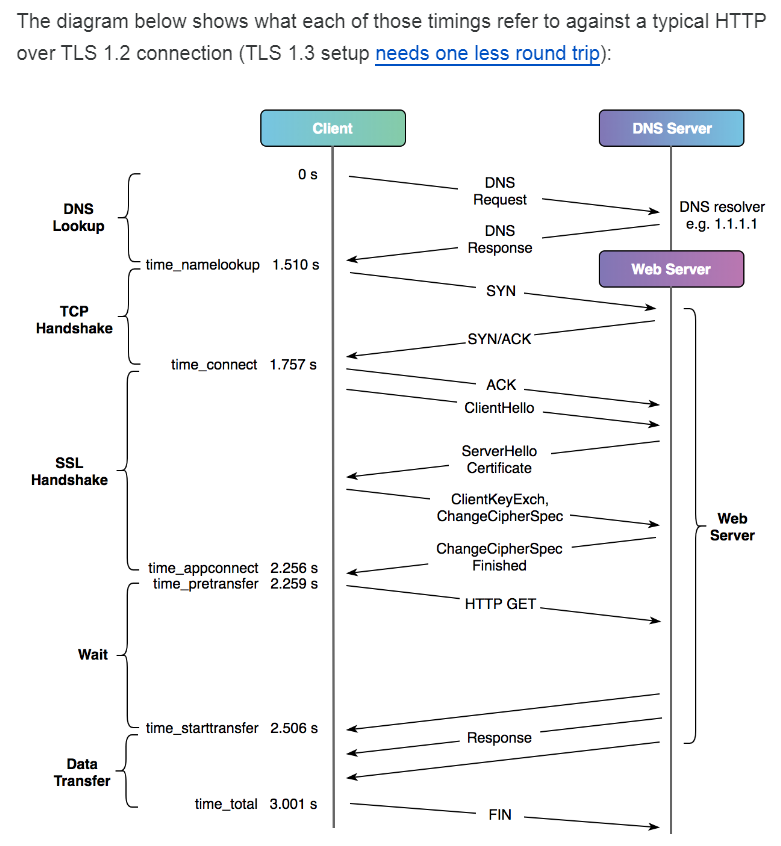
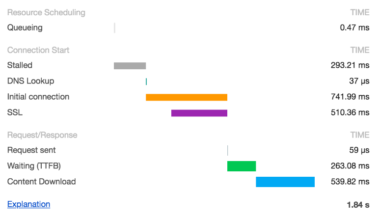
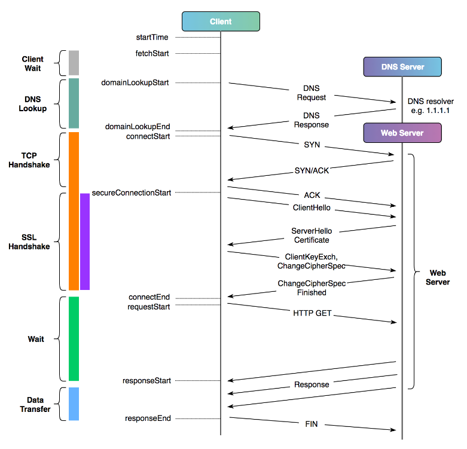

# curl를 이용한 응답시간 체크
https://ploz.tistory.com/entry/Curl-Chrome%ED%81%AC%EB%A1%AC-%EC%9D%84-%EC%9D%B4%EC%9A%A9%ED%95%9C-%EC%9D%91%EB%8B%B5%EC%8B%9C%EA%B0%84-%EC%B8%A1%EC%A0%95%ED%95%98%EA%B8%B0

> -w 옵션을 이용해서 여러 응답시간 체크가능하다.

- `%{time_namelookup}` : it took from the start until the name resolving was completed.
    - namelookup이 완료될때 까지 소요된 시간(초)
    - 목적지 도메인의 dns 조회가 완료된 시간
- `%{time_connect}` : it took from the start until the TCP connect to the remote host (or proxy) was completed.
    - 원격 호스트에 대한 TCP 연결이 완료 될 때까지 소요된 시간(초)
    - 목적지와 TCP connect(Handshake)가 완료된 시간
- `%{time_appconnect}` : it took from the start until the SSL/SSH/etc connect/handshake to the remote host was - completed.
    - SSL/SSH/기타 연결/핸드 셰이크가 원격 호스트에 완료 될 때까지 걸린 시간 (초)
    - 목적지와 SSL/SSH 등등 connect(handshake)가 완료된 시간
- `%{time_redirect}` : it took for all redirection steps including name lookup, connect, pre-transfer and transfer before the final transaction was started. time_redirect shows the complete execution time for multiple redirections.
    - 여러 리디렉션의 전체 실행 시간을 보여줍니다.
    - namelookup부터 time_total 내 모든 과정중 redirect가 발생한 총 시간
- `%{time_pretransfer}` : it took from the start until the file transfer was just about to begin. This includes all pre-transfer commands and negotiations that are specific to the particular protocol(s) involved.
    - 목적지와 파일 전송 시작 시간.  request 보내는 시점
- `%{time_starttransfer}` : shows the time, in seconds, it took from the start until the first byte was just about to be transferred. This includes time_pretransfer and also the time the server needed to calculate the result.
    - 파일 전송시간
    - TTFB(Time To First Byte). response 의 첫 byte를 read한 시간
- `%{time_total}` : shows the total time, in seconds, that the full operation lasted. The time will be displayed with millisecond resolution.
    - 전체 소요 시간
    - response가 완료되어 목적지와 finish connect 한 시간. 총 시간

예시)
```sh
curl -v -s -w 'time_total:%{time_total} time_namelookup:%{time_namelookup} time_connect:%{time_connect} time_appconnect:%{time_appconnect} time_pretransfer:%{time_pretransfer} time_redirect:%{time_redirect} time_starttransfer:%{time_starttransfer}' "https://tistory.com"
```





## 부록 Chrome Timing
> Chrome 브라우져에서 진행되는 Queueing, Stalled 과정을 제외하면 DNS Lookup ~ Content Download 까지가 실제 통신 과정이다.




### Timeing을 도식화
- DNS Lookup  =  DNS Lookup
- TCP Handshake  =  Initial connection
- SSL Handshake  =  SSL
- Wait(requestStart)  =  Request sent
- Wait(responseStart)  =  Waiting(TTFB)
- Data Transfer  = Content Download


### TTFB
- Time To First Byte 로 response의 첫 byte가 도달한 시간을 말한다. 
- 사용하는 어플리케이션의 주요 성능 지표로 사용되며 클라이언트의 요청 + 서버의 처리시간 + 서버의 응답 등을 포함한다.
- TTFB = responseStart - connectEnd 
    - curl의 경우 TTFB = time_starttransfer - time_appconnect



Curl Time Format과 Chrome Timing의 대응 속성값

|Curl Time Format|설명|Chrome Timing|
|---|---|---|
|time_namelookup    |목적지 도메인의 dns 조회가 완료된 시간                             |DNS Lookup|
|time_connect	    |목적지와 TCP connect(Handshake)가 완료된 시간	                   |Initial connection|
|time_appconnect	|목적지와 SSL/SSH 등등 connect(handshake)가 완료된 시간	           |SSL|
|time_pretransfer	|목적지와 파일 전송 시작 시간.  request 보내는 시점                 |Request sent|
|time_starttransfer	|TTFB(Time To First Byte). response 의 첫 byte를 read한 시간	   |Waiting(TTFB)|
|time_total	        |response가 완료되어 목적지와 finish connect 한 시간. 총 시간   	|Content Download|
|time_redirect	    |namelookup부터 time_total 내 모든 과정중 redirect가 발생한 총 시간	| |
