# 리눅스 네트워크 관리에 필요한 ifconfig 사용법 11가지

참고자료 
- https://www.whatap.io/ko/blog/11/index.html


## 1. 네트워크 인터페이스 구성 확인하기 ifconfig

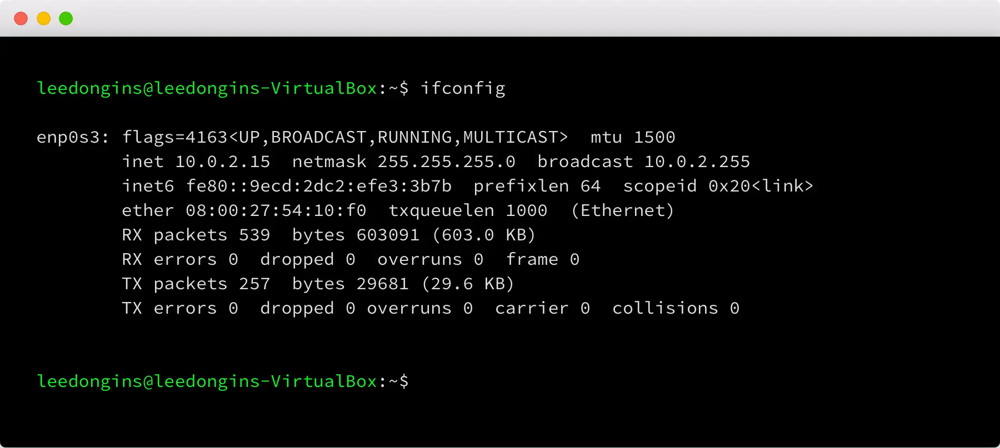

- [enp0s3] : 네트워크 인터페이스
- [flags] : 네트워크 카드의 상태 표시
- [mtu] : 네트워크 인터페이스의 최대 전송 단위(Maximum Transfer Unit)
- [inet] : 네트워크 인터페이스에 할당된 IP 주소
- [netmask] : 네트워크 인터페이스에 할당된 넷마스크 주소
- [broadcast] : 네트워크 인터페이스에 할당된 브로드캐스트 주소
- [inet6] : 네트워크 인터페이스에 할당된 IPv6 주소
- [prefixlen] : IP 주소에서 서브 넷 마스크로 사용될 비트 수
- [scopeid] : IPv6의 범위. LOOPBACK / LINKLOCAL / SITELOCAL / COMPATv4 / GLOBAL
- [ether] : 네트워크 인터페이스의 하드웨어 주소
- [RX packets] : 받은 패킷 정보
- [TX packets] : 보낸 패킷 정보
- [collision] : 충돌된 패킷 수
- [Interrupt] : 네트워크 인터페이스가 사용하는 인터럽트 번호


## 2. 모든 네트워크 인터페이스 구성 확인하기 ifconfig -a

-a 옵션이 들어가게 되면 비활성화된 네트워크 인터페이스를 볼 수 있게 됩니다. 비활성화된 네트워크 카드가 없다면 -a 옵션이 있을 때와 없을 때가 같아 보입니다. 아리 lo는 루프 백 인터페이스로 내부 통신용 네트워크 인터페이스를 비활성화 시킨 상태입니다.

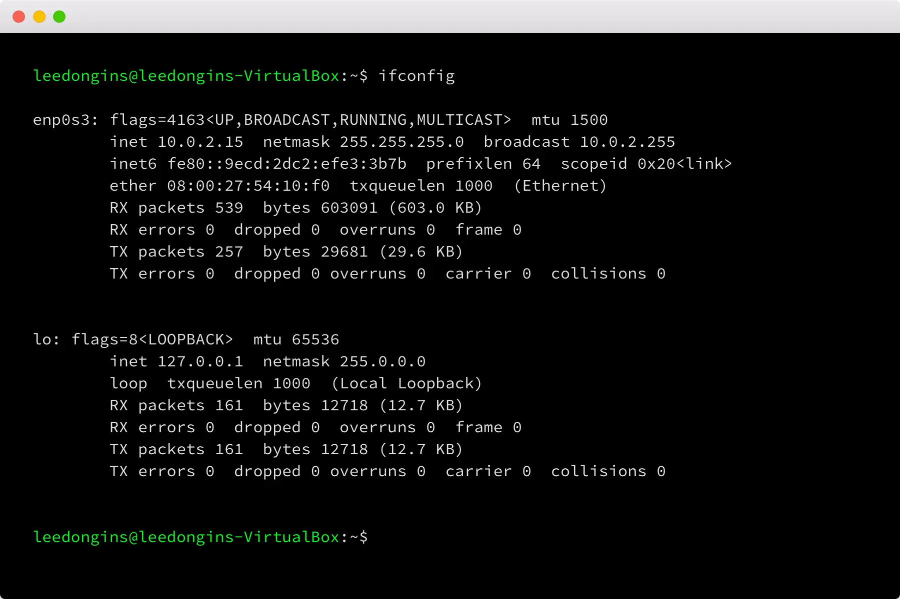

## 3. 해당 인터페이스 정보만 보기 ifconfig [interface]
인터페이스가 너무 많은 경우에는 원하는 인터페이스만 보는 것도 가능합니다.

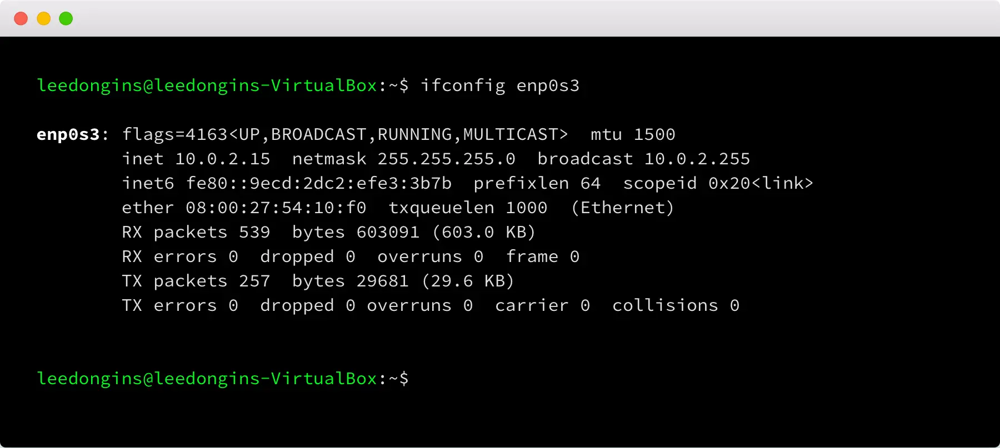

## 4. 해당 인터페이스 비활성화 하기 ifconfig [interface] down
인터페이스에 down 옵션을 사용하면 네트워크 인터페이스 카드가 활성화됩니다. Ifconfig enp0s3으로 확인했을 때, Flags가 달라진 것을 알 수 있습니다.

flags=4098<BROADCAST,MULTICAST>

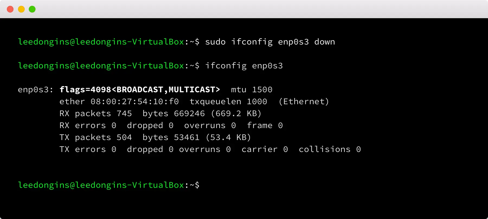


## 5. 해당 인터페이스 활성화하기 ifconfig [interface] up
인터페이스에 up 옵션을 사용하면 네트워크 인터페이스 카드가 활성화됩니다. ifconfig [interface]으로 확인했을 때, flags가 달라진 것을 확인할 수 있습니다.

flags=4163<UP,BROADCAST,RUNNING,MULTICAST>

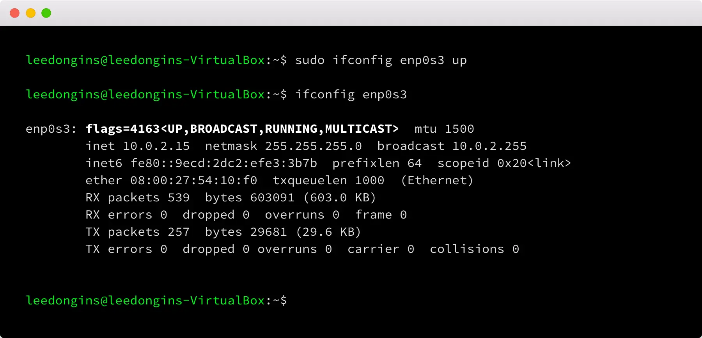


## 6. 해당 인터페이스에 IP 변경하기 ifconfig [interface] [IP]
네트워크 인터페이스에 아이피 설정을 바꾸는 방법은 인터페이스 정보와 ip 정보를 입력하는 것으로 가능합니다.

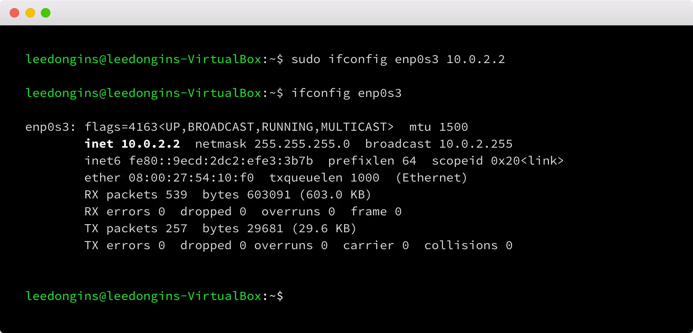


## 7. 해당 인터페이스에 넷마스크 변경하기 ifconfig [interface] netmask [IP]
네트워크 인터페이스에 넷마스크 설정을 바꾸는 방법은 인터페이스 정보와 netmask 옵션 그리고 마스크 정보를 입력하는 것으로 가능하다.

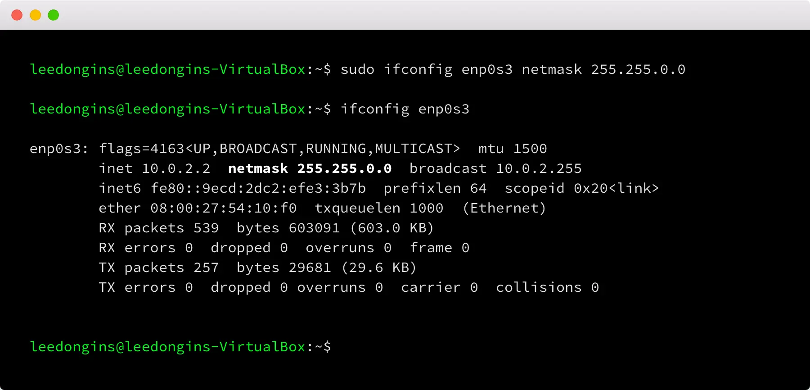


## 8. 해당 인터페이스에 브로드캐스트 주소 변경하기 ifconfig [interface] broadcast [IP]
네트워크 인터페이스에 브로드캐스트 설정을 바꾸는 방법은 인터페이스 정보와 broadcast 옵션 그리고 마스크 정보를 입력하는 것으로 가능하다.

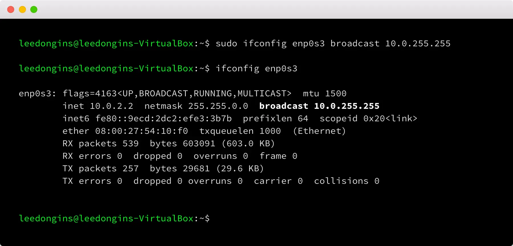


## 9. 해당 인터페이스에 IP / 넷마스크 / 브로드캐스트 주소 한꺼번에 변경하기 ifconfig [interface] [ip] netmask [ip] broadcast [IP]
인터페이스에 관련된 정보를 한꺼번에 바꾸는 것이 편한 경우가 있습니다. 그렇다면 한번에 옵션을 다 넣으면 됩니다.

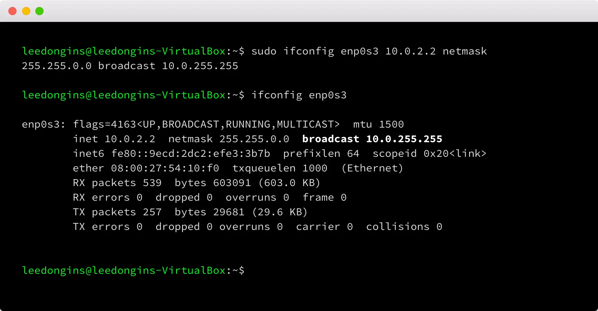


## 10. 해당 인터페이스에 맥 어드레스(Mac Address) 할당하기 ifconfig [interface] hw ether [mac address]
네트워크 인터페이스에 맥 어드레스 설정을 바꾸는 방법은 인터페이스 정보와 hw ether 그리고 변경할 맥 어드레스 정보를 입력하는 것으로 가능합니다.

```sh
$ ifconfig enp0s3 down
$ ifconfig enp0s3 hw ehter 08:00:27:54:10:f1
$ ifconfig enp0s3
$ ifconfig enp0s3 up

# 부팅시 변경된 맥 어드레스로 자동 변경
$ sudo vi /etc/sysconfig/network-scripts/ifcfg-enp0s3

MACADDRESS=08:00:27:54:10:f1
```
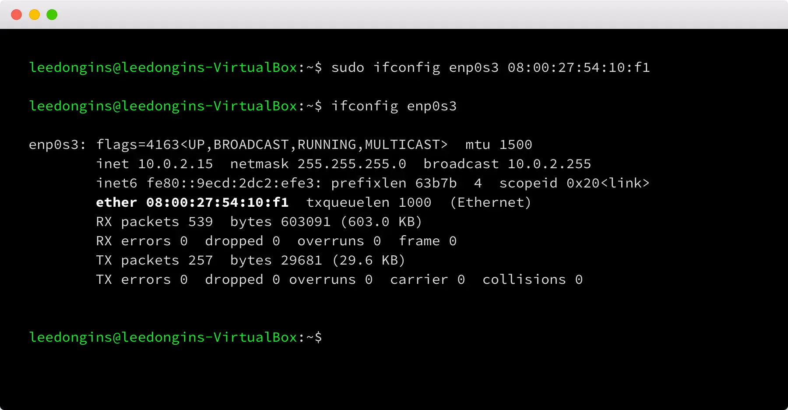


## 11. 인터페이스에 별칭 추가해서 가상 인터페이스 만들기 ifconfig [interface]:0 [ip]
별칭을 사용하여 네트워크 인터페이스에 여러 개의 IP를 설정할 수 있습니다. 명령을 실행한 후에 ifconfig로 확인해 보면 새로운 네트워크 인터페이스가 추가된 것을 확인할 수 있습니다.

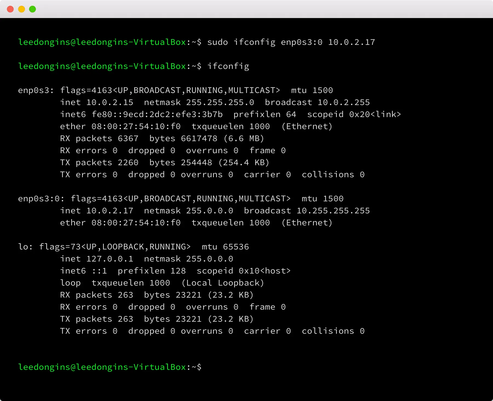

