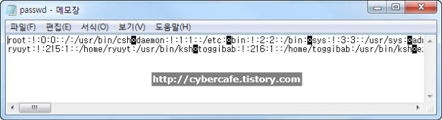
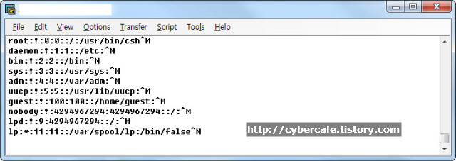
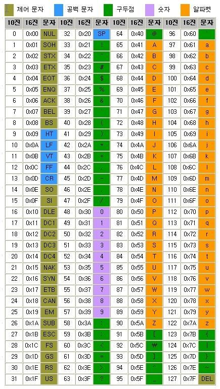

# Windows, Linux 줄바꿈 (LF: ^L, CR: ^M) 차이

tags: windows, linux, line feed, carriage return, 줄바꿈, sh, ^M, ^L

> SVN 으로 쉘(sh) 스크립트를 배포할때 실행이 안되던 문제 발생, 원인은 두가지 였는데 하나는 svn으로 파일 배포시
> 실행 권한이 빠진 상태로 배포되는 것과 windows의 CR(Carrige return) 코드 때문에 sh 스크립트 실행이 안되는 문제였다.

## 두 종류의 차이 설명

참고자료: https://jink1982.tistory.com/122

- LF (Line Feed: 라인피드) => 현재 위치에서 바로 아래로 이동
- CR (Carriage return: 캐리지리턴) => 커서의 위치를 앞으로 이동

사용법:
```java
printf("Line Feed \n");

printf("Carriage Retrun \r");
```

Carriage Return 예제:
```java
...
int main(void){
    printf("test\r");

    printf("1004");
}
```

결과: 
```bash
1004
```
위 결과 에서 알수 있듯이 "test" 글자를 쓰고 CR(`\r`)을 통해 다시 행 제일 앞으로 커서를 옴기고 다시 "1004"를 입력해서 "test"라는 
글자는 보이지 않는다.
 

Line Feed 예제:
```java
...
int main(void){
    printf("test\n");

    printf("1004");
}
```

결과:
```bash
test
1004
```
"test"라는 글자를 쓰고 LF(`\n`)을 통해 다음행으로 커서를 옮기고 "1004"를 쓰고있다.


### 운영체제 마다 줄바꿈 정의가 다르다.
- windows/dos : CRLF 조합으로 줄바꿈을 정의
- Unix/Linux/C : LF 만으로 줄바꿈을 정의

이래서 윈도우에서 작성된 것을 Unix/Linux 계열로 올리면 vi로 편집했을 때 ^M이 붙는 것을 확인할 수 있다.

FTP(또는 SVN)로 올릴 때 텍스트(ASCII)/2진(Binary) 중 어떤 모드로 선택해서 올리느냐에 따라 달라질 수 있다.<br>
텍스트(ASCII)로 올릴경우 데이터 변환이 생겨 /r/n -> /n 으로 자동변환해서 올라간다.
2진(Binary)로 올릴 경우 변환되지 않고 그대로 올라간다. (이때 문제가 되는것이 쉘스크립트의 경우 동작하지 않는다.) 


## vi 에디터에서 ^M 문자 한번에 모두 지우기 ( ^M, ^L을 이해하자)

참고자료: https://blogger.pe.kr/170

Unix/Linux의 /etc/passwd 파일을 FTP를 통해 윈도PC로 다운로드 받을 때 Binary 모드로 다운로드를 받게 되면 다음과 같이 
텍스트파일이 깨져(?) 보인다.

*binary 모드로 linux에서 windows로 FTP 파일 복사:<br>*


하지만 이것은 파일이 깨진것이 아니다. ASCII 모드로 passwd파일을 다운로드 받으면 정상적으로 보인다.

이 문제(?)는 윈도와 Unix/Linux의 텍스트파일, 엄밀하게 말하면 ASCII 파일의 포맷차이로 인해 발생하는 문제이다. 그 포맷의 차이란
바로 줄바꿈의 표기방법의 차이로 인한 것이다.

*binary 모드로 windows에서 linux로 FTP 파일 복사:<br>*
> vi 에디터로 open 할 경우 옵션 `-b`를 붙여줘야 아래 이미지와 같이 보인다.
```bash
$ vi -b /etc/passwd
```


윈도에서는 인식되어 줄바꿈 표시의 일부로 인식되던 `^M (캐리지리턴문자)`가 줄바꿈으로 인식되지 않고 화면에 표시되어 버린다.

만약 위외 같이 패스워드파일을 쉽게 편집하기 위해 FTP를 이용해 다운로드 받은 뒤 수정하고 바이너리모드로 잘못 업로드하게 되면 대형사고가 발생하게 된다.
아무도 텔넷, FTP, rlogin 등으로 접속하지 못하는 상태가 되어버린다. 왜냐하면 패스워드 파일의 맨 끝의 쉘을 지정하는 부분이 제대로 
인식되지 못하여 no shell 메시지가 발생하면서 쉘을 실행하지 못하기 때문이다.


### ^M 한번에 모두 지우기(vi이용)
*vi에디터에서 ^M(캐리지리턴문자) 한번에 지우는 표현식:<br>*


다만 키보드에서 ^M 을 그냥 ^ 키와 M을 입력해서는 인식되지 않는다.
**ASCII 코드의 13번 문자인 CR은 키보드의 Control키를 누른상태에서 v와 m을 차례대로 입력해야 입력할 수 있다.**

```
%s/^M$//g
```


## ASCII코드표


