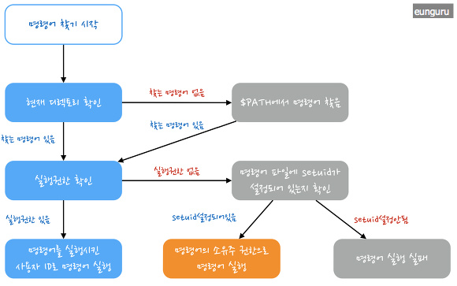
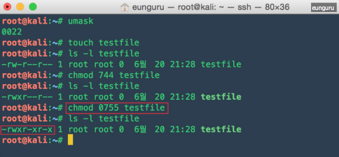
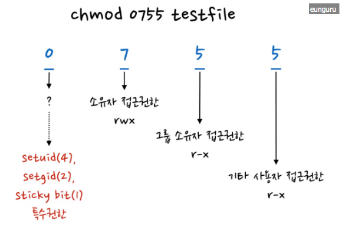
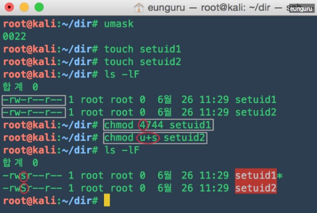
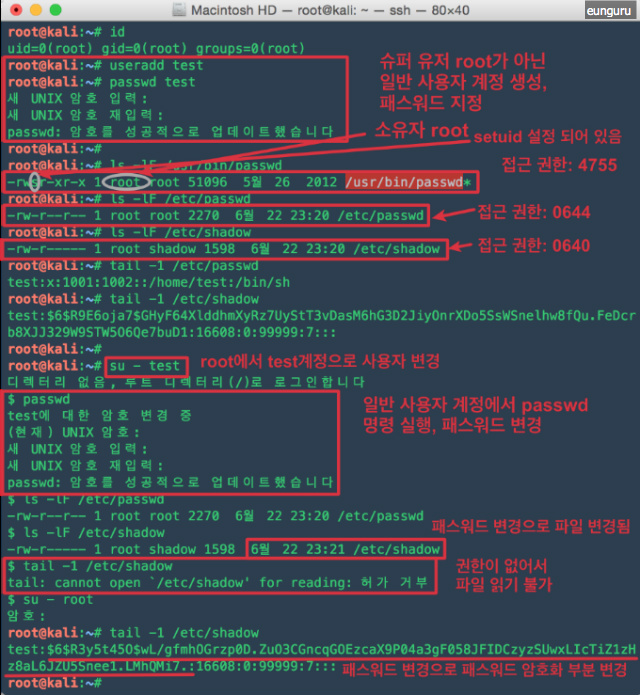

# 특수 권한(setuid, setgid, sticky bit)
tags: RGID, RUID, setgid 비드, setuid 비트, sticky bit, sticky 비트, 특수권한, linux 특수권한, unix 특수권한, 유효 사용자 ID
, 유효 사용자 그룹ID, 소유주 권한

참고 자료: https://eunguru.tistory.com/115

## 프로세스 번호
UNIX 시스템에서 프로세스에 다섯 가지 번호 부여

### 1) 프로세스에 부여되는 번호들
- 프로세스 식별자(PID)
- 실제 사용자 ID(RUID)
- 유효 사용자 ID(EUID)
- 실제 사용자 그룹 ID(RGID)
- 유효 사용자 그룹 ID(EGID)

### 2) 사용용도
- 계정 관리: RUID, RGID
- 접근 권한 결정에 사용: EUID, EGID(보안에 주의)
- 일반적으로 실제사용자(그룹), 유효사용자(그룹) ID 값은 동일하다

## 시스템에서 사용자가 명령 실행시 명령어를 찾는 경로와 절차

## 접근권한

- 접근 권한은 8진수 또는 r(읽기권한,4), w(쓰기권한,2), x(실행권한,1) 문자로 표현 가능
- 8진수로 표현할 때는 권한의 합으로 표시함 (예: 읽기+쓰기 6, 읽기+실행 5 등)
- 8진수 3자리(3bit)로 수유자, 그룹 소유자, 기타 사용자를 위한 파일 모드 설정

접근권한 예:
> 접근 권한을 755로 표현하는 것과 0755로 표현하는 것은 동일한 표현, 네 자리가 되지 않으면 앞에 0이 생략된다.

## 특수권한
- UNIX 시스템은 파일에 대한 접근 권한 및 파일 종류를 나타내기 위해 16bit를 사용한다.
- 각 3bit씩 총 9bit는 소유자 접근권한(user), 그룹 소유자 접근권한(group), 기타 사용자 접근권한(other)을 기술하는데 사용
- 4bit는 파일의 종류 표현에 사용
- 3bit는 특수권한에 사용

각 비트에 대한 설명:  

<table cellspacing="0" cellpadding="0" border="0">
<thead>
<tr><td colspan="4">
<b> 파일종류</b>
</td>
<td colspan="4">
<b>특수권한</b>
</td>
<td colspan="3">
<b>소유자접근권한</b>
</td>
<td colspan="3">
<b>그룹 소유자 접근권한</b>
</td>
<td colspan="3">
<b>기타 사용자 접근 권한</b>
</td>
</tr>
</thead>
<tbody>
<tr><td colspan="4" rowspan="2">
-,d,c,b,s,l,p
</td>
<td>
4
</td>
<td>
2
</td>
<td colspan="2">
1
</td>
<td>
4
</td>
<td>
2
</td>
<td>
1
</td>
<td>
4
</td>
<td>
2
</td>
<td>
1
</td>
<td>
4
</td>
<td>
2
</td>
<td>
1
</td>
</tr>
<tr>
<td>
setuid
</td>
<td>
setgid
</td>
<td colspan="2">
sticky bit
</td>
<td>
r
</td>
<td>
w
</td>
<td>
x
</td>
<td>
r
</td>
<td>
w
</td>
<td>
x
</td>
<td>
r
</td>
<td>
w
</td>
<td>
x
</td>
</tr>
</tbody>
</table>

### setuid 비트
- setuid 비트: 8진수 4000
- setuid 비트를 실행 파일에 적용하면 실 사용자(프로그램을 실제 실행 중인 사용자)에서 프로그램 소유자의 ID로 유효사용자(EUID)가 변경됨

#### setuid 비트를 설정하여 사용하는 경우
- 슈퍼유저 root만 접근할 수 있는 파일이나 명령에 대해, 일반 사용자로 접근하는 것이 기능상 필요한 경우 
(setuid 비트가 설정된 파일은 실행순간만 그 파일의 소유자 권한으로 실행, 실행 순간만 권한을 빌려온다라고 이해하면 쉬움)
- 매번 슈퍼유저 root가 어떤 행위를 해주지 않아도 되고, 일반 사용자에게 root권한을 주지 않아도 되기때문에 setuid 비트를 적용하는
것이 시스템 운영면에서 효율적
- 대부분 슈퍼유저가 소유한 소수 프로그램들에만 주어짐, 일반 사용자가 그 프로그램을 실행하면 setuid root가 되고, 슈퍼유저의 유효한 특권들을
가지고 실행되기 때문에 일반 사용자의 접근이 금지된 파일과 디렉토리들에 접근이 가능해진다.

#### setuid 비트 설정 방법
- 8진수(4000)나 기호(u+s)를 이용하여 setuid 비트를 설정할 수 있음(setuid 비트 설정 제거 u-s)
- 권한 변경을 위해 `chmod` 명령어를 이용함
- setuid 비트가 설정되어 있으면 사용자 접근권한의 실행 권한 자리에 실행 권한이 있으면 소문자 s로 실행권한이 없으면 대문자 S로 표시됨

 
#### setuid 비트 설정의 활용
    1) 패스워드 설정, 변경시 사용
    - 패스우더 지정, 변경에 사용하는 /usr/bin/passwd 명령의 경우 setuid 비트가 설정 되어 있음(접근권한: 4755)
    - passwd 명령어(파일)로 패스워드 지정, 변경 시 /etc/passwd, /etc/shadow 파일이 변경됨
    - /etc/passwd 의 접근권한: 0644 (슈퍼유저 root만 수정 가능)
    - /etc/shadow 의 접근권한: 0640 (슈퍼유저 root만 수정 가능)
    - /usr/bin/passwd 명령어(파일)는 setuid 비트가 설정되어 있으므로 실행 시 소유자인 root의 권한으로 실행됨
    - 일반 사용자 계정에서 passwd 명령어 실행 시에 소유자 root 권한으로 실행되기 때문에 슈퍼유저 root만 수정가능한 
    /etc/passwd, /etc/shadow 파일의 수정이 가능해 짐
    
    
    
    2) 일반 사용자가 읽을 수 없는 파일 읽기
