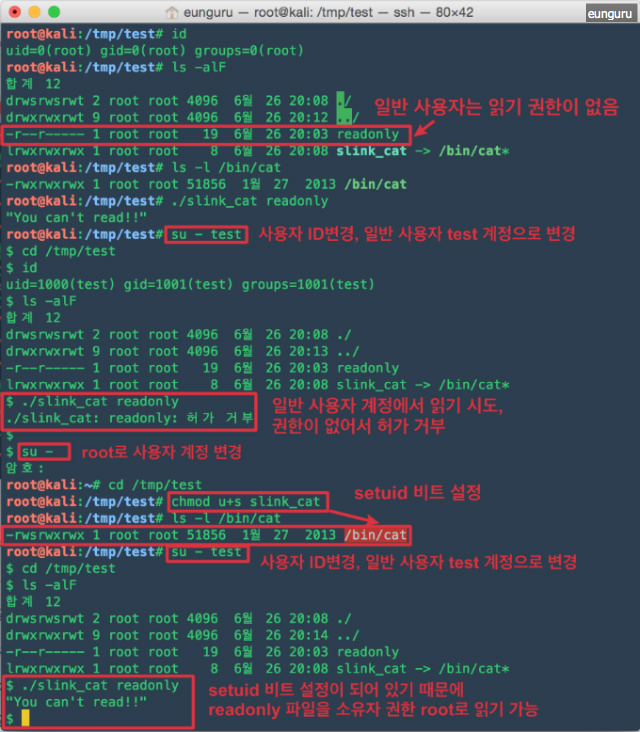
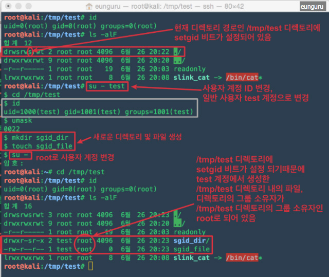
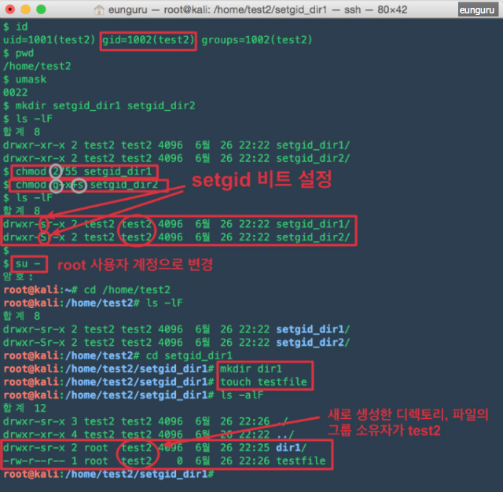
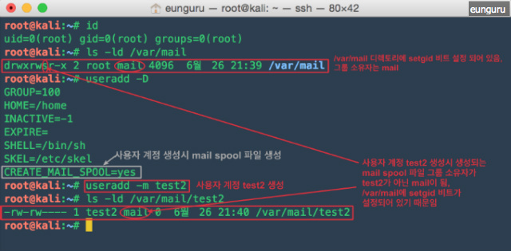
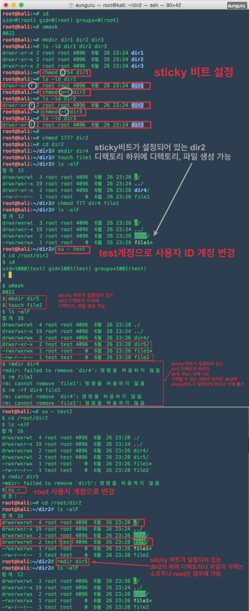
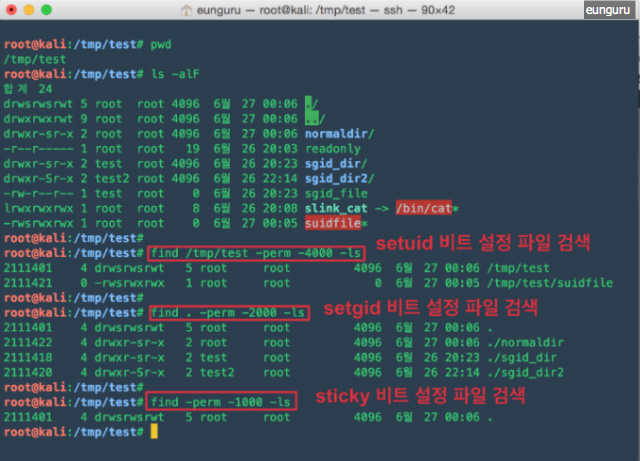

# 특수 권한(setuid, setgid, sticky bit)
tags: RGID, RUID, setgid 비드, setuid 비트, sticky bit, sticky 비트, 특수권한, linux 특수권한, unix 특수권한, 유효 사용자 ID
, 유효 사용자 그룹ID, 소유주 권한

참고 자료: https://eunguru.tistory.com/115

## 프로세스 번호
UNIX 시스템에서 프로세스에 다섯 가지 번호 부여

### 1) 프로세스에 부여되는 번호들
- 프로세스 식별자(PID)
- 실제 사용자 ID(RUID)
- 유효 사용자 ID(EUID)
- 실제 사용자 그룹 ID(RGID)
- 유효 사용자 그룹 ID(EGID)


### 2) 사용용도
- 계정 관리: RUID, RGID
- 접근 권한 결정에 사용: EUID, EGID(보안에 주의)
- 일반적으로 실제사용자(그룹), 유효사용자(그룹) ID 값은 동일하다


## 시스템에서 사용자가 명령 실행시 명령어를 찾는 경로와 절차


## 접근권한

- 접근 권한은 8진수 또는 r(읽기권한,4), w(쓰기권한,2), x(실행권한,1) 문자로 표현 가능
- 8진수로 표현할 때는 권한의 합으로 표시함 (예: 읽기+쓰기 6, 읽기+실행 5 등)
- 8진수 3자리(3bit)로 수유자, 그룹 소유자, 기타 사용자를 위한 파일 모드 설정

접근권한 예:
> 접근 권한을 755로 표현하는 것과 0755로 표현하는 것은 동일한 표현, 네 자리가 되지 않으면 앞에 0이 생략된다.


## 특수권한
- UNIX 시스템은 파일에 대한 접근 권한 및 파일 종류를 나타내기 위해 16bit를 사용한다.
- 각 3bit씩 총 9bit는 소유자 접근권한(user), 그룹 소유자 접근권한(group), 기타 사용자 접근권한(other)을 기술하는데 사용
- 4bit는 파일의 종류 표현에 사용
- 3bit는 특수권한에 사용

각 비트에 대한 설명: <br>


<table cellspacing="0" cellpadding="0" border="0">
<thead>
<tr><td colspan="4"><p><b> 파일종류</b></p></td>
<td colspan="4"><p style="text-align: center;"><b><span style="color: rgb(255, 94, 0);">특수권한</span></b></p></td>
<td colspan="3"><p style="text-align: center;"><b>소유자접근권한</b></p></td>
<td colspan="3"><p style="text-align: center;"><b>그룹 소유자 접근권한</b></p></td>
<td colspan="3"><p style="text-align: center;"><b>기타 사용자 접근 권한</b></p></td>
</tr>
</thead>
<tbody>
<tr><td colspan="4" rowspan="2"><p style="text-align: center;">-,d,c,b,s,l,p</p></td>
<td><p style="text-align: center;"><span style="color: rgb(255, 94, 0);">4</span></p></td>
<td><p style="text-align: center;"><span style="color: rgb(255, 94, 0);">2</span></p></td>
<td colspan="2"><p style="text-align: center;"><span style="color: rgb(255, 94, 0);">1</span></p></td>
<td><p style="text-align: center;">4</p></td>
<td><p style="text-align: center;">2</p></td>
<td><p style="text-align: center;">1</p></td>
<td><p style="text-align: center;">4</p></td>
<td><p style="text-align: center;">2</p></td>
<td><p style="text-align: center;">1</p></td>
<td><p style="text-align: center;">4</p></td>
<td><p style="text-align: center;">2</p></td>
<td><p style="text-align: center;">1</p></td>
</tr>
<tr>
<td><p style="text-align: center;"><span style="color: rgb(255, 94, 0);">setuid</span></p></td>
<td><p style="text-align: center;"><span style="color: rgb(255, 94, 0);">setgid</span></p></td>
<td colspan="2"><p style="text-align: center;"><span style="color: rgb(255, 94, 0);">sticky bit</span></p></td>
<td><p style="text-align: center;">r</p></td>
<td><p style="text-align: center;">w</p></td>
<td><p style="text-align: center;">x</p></td>
<td><p style="text-align: center;">r</p></td>
<td><p style="text-align: center;">w</p></td>
<td><p style="text-align: center;">x</p></td>
<td><p style="text-align: center;">r</p></td>
<td><p style="text-align: center;">w</p></td>
<td><p style="text-align: center;">x</p></td>
</tr>
</tbody>
</table>


### setuid 비트
- setuid 비트: 8진수 4000
- setuid 비트를 실행 파일에 적용하면 실 사용자(프로그램을 실제 실행 중인 사용자)에서 프로그램 소유자의 ID로 유효사용자(EUID)가 변경됨


#### setuid 비트를 설정하여 사용하는 경우
- 슈퍼유저 root만 접근할 수 있는 파일이나 명령에 대해, 일반 사용자로 접근하는 것이 기능상 필요한 경우<br>
(setuid 비트가 설정된 파일은 실행순간만 그 파일의 소유자 권한으로 실행, 실행 순간만 권한을 빌려온다라고 이해하면 쉬움)
- 매번 슈퍼유저 root가 어떤 행위를 해주지 않아도 되고, 일반 사용자에게 root권한을 주지 않아도 되기때문에 setuid 비트를 적용하는
것이 시스템 운영면에서 효율적
- 대부분 슈퍼유저가 소유한 소수 프로그램들에만 주어짐, 일반 사용자가 그 프로그램을 실행하면 setuid root가 되고, 슈퍼유저의 유효한 특권들을
가지고 실행되기 때문에 일반 사용자의 접근이 금지된 파일과 디렉토리들에 접근이 가능해진다.


#### setuid 비트 설정 방법
- 8진수(4000)나 기호(u+s)를 이용하여 setuid 비트를 설정할 수 있음(setuid 비트 설정 제거 u-s)
- 권한 변경을 위해 `chmod` 명령어를 이용함
- setuid 비트가 설정되어 있으면 사용자 접근권한의 실행 권한 자리에 소문자 s로 실행권한이 없으면 대문자 S로 표시


 
#### setuid 비트 설정의 활용
1) 패스워드 설정, 변경시 사용
    - 패스우더 지정, 변경에 사용하는 /usr/bin/passwd 명령의 경우 setuid 비트가 설정 되어 있음(접근권한: 4755)
    - passwd 명령어(파일)로 패스워드 지정, 변경 시 /etc/passwd, /etc/shadow 파일이 변경됨
    - /etc/passwd 의 접근권한: 0644 (슈퍼유저 root만 수정 가능)
    - /etc/shadow 의 접근권한: 0640 (슈퍼유저 root만 수정 가능)
    - /usr/bin/passwd 명령어(파일)는 setuid 비트가 설정되어 있으므로 실행 시 소유자인 root의 권한으로 실행됨
    - 일반 사용자 계정에서 passwd 명령어 실행 시에 소유자 root 권한으로 실행되기 때문에 슈퍼유저 root만 수정가능한 
    /etc/passwd, /etc/shadow 파일의 수정이 가능해 짐


2) 일반 사용자가 읽을 수 없는 파일 읽기
    - 설명을 위해 예제를 만든 것이기 때문에 조금 억지스러운 부분이 있을 수 있음
    - /bin/cat 파일에 직접 setuid 비트를 설정하지 않고 심볼릭 링크를 만들어 심볼릭링크 파일에 setuid 비트 설정, 
    해재시에도 심볼릭링크 파일에 해제




### setgid 비트
- setgid 비트: 8진수 2000
- setuid 비트처럼 유효 그룹ID(EGID)를 사용자의 실제 그룹 ID에서 파일 소유자의 그룹ID로 변경함
- setgid 비트가 디렉토리에 설정되어 있으면, 이 디렉토리에 새로 설정된 파일들은 디렉토리 그룹 소유권 보다 파일 생성자의
그룹 소유권을 얻게 될 것
- 일반 파일 그룹의 멤버가 파일 소유자의 그룹과 상관없이 디렉토리 내의 모든 파일에 접근이 필요한 공유 디렉토리에 유용



#### setgid 비트 설정 방법
- 8진수(2xxx)나 기호(g+s)를 이용하여 setuid 비트를 설정할 수 있음(setgid 비트 설정 제거 g-s)
- 권한 변경을 위해 chmod 명령어를 이용함
- setgid 비트가 설정되어 있으면 그룹 소유자 접근 권한의 실행 권한 자리에 소문자 s로 실행권한이 없으면 대문자 S로 표시




#### setgid 비트 설정의 활용
1) 사용자 계정 생성시 mail spool 파일 생성
    - 사용자 계정 생성시 옵션에 따라 /var/mail 디렉토리 하위에 생성하는 사용자 계정명과 동일명으로 mail spool 파일 생성
    - /var/mail 디렉토리에 setgid 비트가 설정되어 있음, 하위에 생성되는 mail spool 파일의 그룹 소유주가 mail이 됨




### sticky 비트
- sticky 비트: 8진수 1000
- 리눅스는 파일의 sticky bit 무시
- sticky 비트는 특정 디렉토리를 누구나 자유롭게 사용 할 수 있게 하기 위함(공용 디렉토리에 사용)
- 단, sticky 비트가 디렉토리에 적용되면 디렉토리 소유자나 파일 소유자 또는 슈퍼유저가 아닌 사용자들은 파일을 삭제하거나
이름을 변경하지 못하도록 막음, 파일 또는 디렉토리 생성은 누구나 할 수 있음
- sticky 비트는 공유모드라고도 함

#### sticky 비트 설정방법 및 활용
- 8진수(1xxx)나 기호(o+t)를 이용하여 sticky 비트를 설정할 수 있음(sticky 비트 설정 제거 o-t)
- 리눅스의 경우 o+t, 유닉스(솔라리스)의 경우 u+t로 설정
- 권한 변경을 위해 chmod 명령어를 이용함
- sticky 비트가 설정되어 있으면 기타 사용자 접근 권한의 실행 권한 자리에 소문자 t로 실행권한이 없으면 대문자 T로 표시
- /tmp 디렉토리 처럼 공용 디렉토리 접근에 활용




### 특수권한 파일 검색
- 특수권한 비트가 설정되어 있을때 접근권한을 이용한 `find`명령으로 파일을 검색을 할 수 있음

```bash
# find [파일을 검색할 디렉토리 경로] -perm [접근권한] [-ls]
# 파일을 검색할 디렉토리 경로는 생략 가능
# - 절대경로로 지정하면 결과도 절대경로로 출력, 상대경로로 지정시 상대경로로 출력
# - 생략 시 현재 디렉토리 기준
# [-ls] 는 생략 가능, -ls 시 검색 결과를 대상으로 ls명령을 수행한 결과로 보여줌
```

특수권한 파일 검색 예제:<br>



