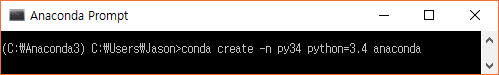
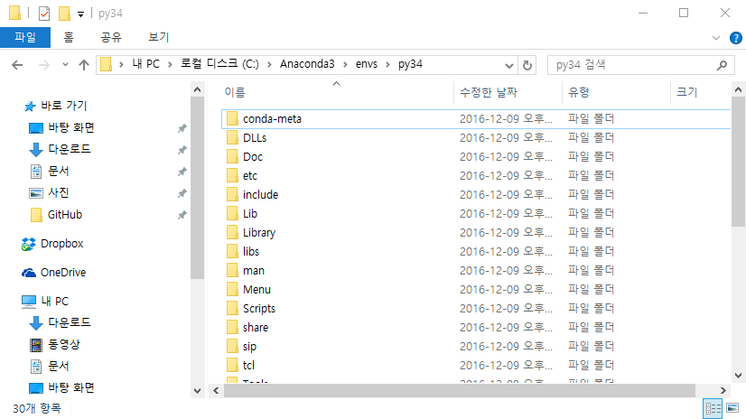
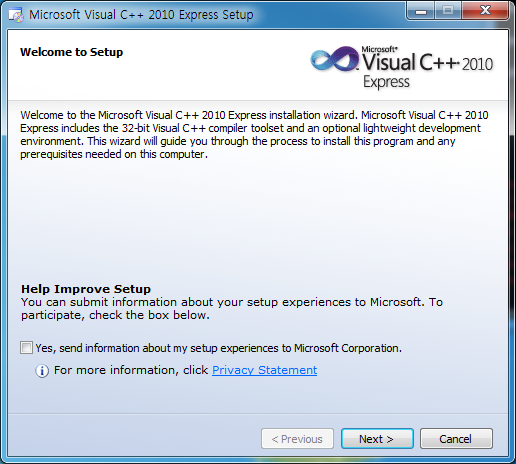
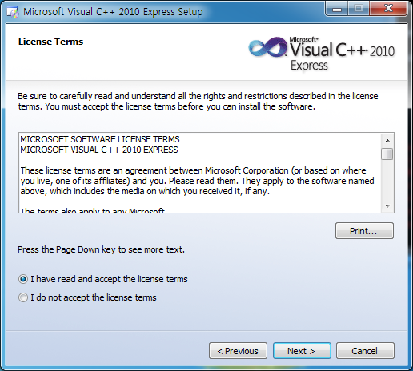
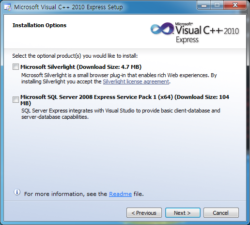
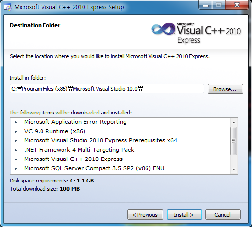

# Python

### 공부할 문서
- https://wikidocs.net/2 점프 투 파이썬
- https://sjquant.github.io/%ED%8C%8C%EC%9D%B4%EC%8D%AC%EC%9C%BC%EB%A1%9C-%EB%A7%8C%EB%93%9C%EB%8A%94-%EC%BB%A4%EB%A7%A8%EB%93%9C%EB%9D%BC%EC%9D%B8-%ED%94%84%EB%A1%9C%EA%B7%B8%EB%9E%A8-2/ 커맨드 프로그램 & 네이버사전 크롤링
- https://wikidocs.net/2878 실전 파이썬 개발 연습

## anaconda를 이용한 멀티 python 개발환경 구성

### 1. conda create를 이용한 개발 환경 생성

conda create 명령어를 통해 파이썬 개발 환경을 추가로 생성하면 아나콘다의 설치 디렉터리인 C:\Anaconda3\envs에 -n 옵션을 통해 지정한 이름(py34)으로 디렉터리가 생성되고 해당 디렉터리 안에 그림 14.6과 같이 지정한 버전의 파이썬(파이썬 3.4)과 패키지가 설치됩니다.

### 2. Visual C++ 2010이라는 개발 툴을 설치

> Visual C++ 컴파일러를 설치할 때 주의할 점은 파이썬 버전에 따라 특정 버전의 컴파일러를 설치해야 한다는 점입니다.
> 파이썬 2.6부터 3.2까지는 Visual C++ 9.0 컴파일러, 파이썬 3.3과 3.4는 Visual C++ 10.0 컴파일러, 파이썬 3.5는 Visual C++ 14.0 컴파일러를 설치

> 파이썬 버전에 맞는 Visual C++ 설치가 안되어 있을 경우 package 설치시 `Command "python setup.py egg_info" failed with error code 1` 와 같은 오류 발생

http://microsoft-visual-cpp-express.soft32.com/

1. Visual C++ 2010 Express 설치 1

    

1. Visual C++ 2010 Express 설치 2

    

1. Visual C++ 2010 Express 설치 3

    

1. Visual C++ 2010 Express 설치 4

    

