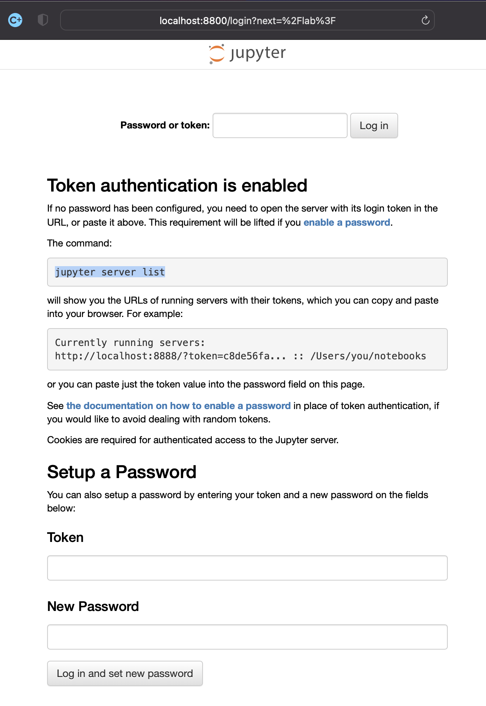

# python jupyter notebook 

## 설치법
참고: 
- [기본 설치](https://wooono.tistory.com/320)
- [python2 설치](https://bio-info.tistory.com/12)
- [python2 pip 설치 방법](https://domdom.tistory.com/170)

1. Docker 설치 (생략)
1. pull image jupyter notebook 
    ```sh
    $ docker pull jupyter/datascience-notebook
    ```

1. Jupyter notebook Container 생성
    ```sh
    $ docker run \
    --restart=unless-stopped \
    --name jupyter-notebook-container \
    -e GRANT_SUDO=yes \
    --user root \
    -p 8800:8888 \
    -d \
    -it \
    jupyter/datascience-notebook

    # 생성 확인
    $ docker ps -a

    CONTAINER ID   IMAGE                          COMMAND                  CREATED         STATUS                       PORTS                               NAMES
    6be0d32a959e   jupyter/datascience-notebook   "tini -g -- start-no…"   6 seconds ago   Up 5 seconds                 0.0.0.0:8800->8888/tcp              jupyter-notebook-container
    ```

1. http://localhost:8800 접속 확인


1. Jupyter notebook Container bash 접속 & Jupyter notebook 비밀번호 설정
    ```sh
    # Container 접속
    $ docker exec -it jupyter-notebook-container bash
    (base) root@6be0d32a959e:~#

    # 비밀번호 생성
    (base) root@6be0d32a959e:~# ipython
    Python 3.9.7 | packaged by conda-forge | (default, Sep 29 2021, 19:20:46)
    Type 'copyright', 'credits' or 'license' for more information
    IPython 8.0.1 -- An enhanced Interactive Python. Type '?' for help.

    In [1]: from notebook.auth import passwd

    In [2]: passwd()
    Enter password:
    Verify password:
    Out[2]: '(생성된 암호)'

    In [3]: exit
    (base) root@6be0d32a959e:~#

    # Jupyter notebook 비밀번호 설정
    (base) root@6be0d32a959e:~# sudo apt-get update
    (base) root@6be0d32a959e:~# sudo apt-get install vim -y
    (base) root@6be0d32a959e:~# sudo vim ~/.jupyter/jupyter_notebook_config.py
    ```

1. 암호 입력
~/.jupyter/jupyter_notebook_config.py:
    ```sh
    # c.NotebookApp.password_required 을 True 로 수정한 뒤, 주석을 제거한다.
    c.NotebookApp.password_required = True

    # c.NotebookApp.password 의 '' 부분에, 위에서 생성한 passwd 를 입력한 뒤, 주석을 제거한다.
    c.NotebookApp.password = '(생성된 암호)'
    ```

1. Exit Container & 재실행
    ```sh
    (base) root@6be0d32a959e:~# exit

    $ docker restart jupyter-notebook-container
    ```

1. http://locahost:8800 접속후 패스워드 입력 후 사용

### [부록] python2 kernel 설치
1. Jupyter notebook Container bash 접속
    ```sh
    # container 접속
    $ docker exec -it jupyter-notebook-container bash

    # 현재 설치된 커널 확인
    (base) root@6be0d32a959e:~# jupyter kernelspec list
    Available kernels:
    ir           /opt/conda/share/jupyter/kernels/ir
    julia-1.7    /opt/conda/share/jupyter/kernels/julia-1.7
    python3      /opt/conda/share/jupyter/kernels/python3
    (base) root@6be0d32a959e:~# 
    ```

1. python2 & python2 pip 설치
참고:
    - [python2 pip 설치 방법](https://domdom.tistory.com/170)

    ```sh
    (base) root@6be0d32a959e:~# sudo apt-get install python2
    Reading package lists... Done
    Building dependency tree
    Reading state information... Done
    python2 is already the newest version (2.7.17-2ubuntu4).
    python2 set to manually installed.
    0 upgraded, 0 newly installed, 0 to remove and 0 not upgraded.


    (base) root@6be0d32a959e:~# 

    # pip2.7 다운로드
    (base) root@6be0d32a959e:~# wget https://bootstrap.pypa.io/pip/2.7/get-pip.py
    # pip2.7 설치
    (base) root@6be0d32a959e:~# sudo python2.7 get-pip.py
    # 아래 명령을 통해서 어디에 설치되었는지 확인 할 수 있음
    (base) root@6be0d32a959e:~# which pip2.7
    /usr/local/bin/pip2.7
    (base) root@6be0d32a959e:~# which pip2
    /usr/local/bin/pip2

    ```

1. 파이썬 2에서 ipykernel 설치
    ```sh
    (base) root@6be0d32a959e:~# python2 -m pip install ipykernel
    ```

1. 파이썬 2의 ipykernel을 주피터 노트북에 추가
    ```sh
    (base) root@6be0d32a959e:~# python2 -m ipykernel install --user

    # python2 커널 추가 확인
    (base) root@6be0d32a959e:~# jupyter kernelspec list
    Available kernels:
    python2      /home/jovyan/.local/share/jupyter/kernels/python2
    ir           /opt/conda/share/jupyter/kernels/ir
    julia-1.7    /opt/conda/share/jupyter/kernels/julia-1.7
    python3      /opt/conda/share/jupyter/kernels/python3
    ```

1. 재기동 필요없이 페이지 새로고침 하면 python2 선택 가능
