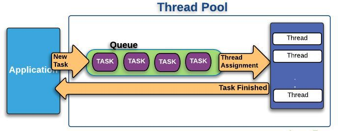

# WAS Thread Pool 에 대한 고찰
처음 시작은 JDBC connection 에서 timeout으로 인한 오류 조사였다. JDBC connection pool 설정 중에 `validationSQL`을 설정하다.
`testWhileIdle` 값을 설정하다가 connection pool 동작 방식에 대해 읽다가 Server(WAS) 에서도 `Thread pool` 이있다는 것을 알게
되었고 이에 관한 글이다. 

결론은 WAS의 Thread(`maxThread`)는 Connection Pool(`maxActive`)의 갯수보다 여유있게 설정하는 것이 좋다.
 
## 참고자료
- https://waspro.tistory.com/355 (Jboss) -> [삭제되면 여기](./Jboss/jboss-threadpool-configuration.md)
- https://12bme.tistory.com/458 (Tomcat) 

## 먼저 Thread Pool은 왜 사용해야할까요? 

Thread pool이라는것은 일정 갯수의 Thread를 두고, 만약 작업할 일이 생긴다면 대기상태인 Thread가 있는지 보고, 있다면 
그 쓰레드로 작업을 처리한 후 다시 대기상태로 전환할수 있도록 만들어놓은 영역이라고 생각하면 됩니다.

JAVA에서 Thread pool을 사용하는 이유는, 아래와 같습니다.

- 성능저하를 방지하기 위해 : 매번 발생되는 작업을 동시에 병렬적으로 처리하기 위해서는 Thread를 생성하고 / 수거해야하는데 
이 작업은 프로그램의 전체적인 퍼포먼스를 저하시킵니다. 따라서 Thread를 재활용할 수 있다는 게 Thread pool을 사용하는 가장 큰 목적입니다.
- 다수의 사용자 요청을 처리하기 위해 : 서비스 측면에서 바라볼때, 다수의 사용자의 요청을 빠르게 수용하고 
처리하여 대응하기 위한 준비라고 할수 있습니다 .

그럼 Thread pool의 단점은 무엇일까요?

- 메모리 낭비를 초래할 수 있습니다 : 만약 많은 병렬 처리를 위해서 1억개의 Thread를 만들어 놓은 상태에서, 
100개의 요청이 들어왔다면, 나머지 Thread는 아무일도 하지않고 메모리만 차지하는 경우가 발생될 수 있습니다.
