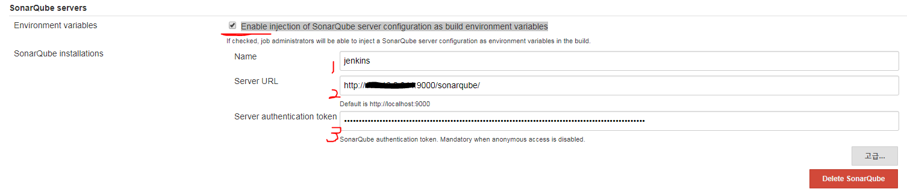

# Install SonarQube With Jenkins

Jenkins + SonarQube + SVN


### 참조
- https://docs.sonarqube.org/display/SCAN/Analyzing+with+SonarQube+Scanner+for+Jenkins
- https://stackoverflow.com/questions/31470594/svn-authentication-failure-when-running-a-sonar-analysis-in-jenkins-1-620-sonarq
- https://medium.com/@joypinkgom/%EC%86%8C%EC%8A%A4-%EC%A0%95%EC%A0%81-%EB%B6%84%EC%84%9D%EB%8F%84%EA%B5%AC-sonarqube-%EB%A6%AC%EC%84%9C%EC%B9%AD-9d48fc62b01f
- https://www.popit.kr/%EB%82%B4%EC%BD%94%EB%93%9C%EB%A5%BC-%EC%9E%90%EB%8F%99%EC%9C%BC%EB%A1%9C-%EB%A6%AC%EB%B7%B0%ED%95%B4%EC%A4%80%EB%8B%A4%EB%A9%B4-by-sonarqube/
- https://okky.kr/article/439198


## 1. 메이븐 설치
[메이븐 설치](/OS/Linux/install-maven-with-centos.md)

## 2. SonarQube 설치

```bash
root:/usr/lib$ wget https://binaries.sonarsource.com/Distribution/sonarqube/sonarqube-6.7.6.zip
....
...
root:/usr/lib$ unzip sonarqube-6.7.6.zip
root:/usr/lib$ cd sonarqube-6.7.6
```

```bash
root:/usr/lib/sonarqube-6.7.6$ vi ./conf/sonar.conf

# in conf/sonar.conf
# 소나큐브 웹서비스 기본포트 9000
# 소나큐브 엘라스틱서치 9001
sonar.web.port=9000
sonar.web.context=/sonarqube

root:/usr/lib$ cd sonarqube-6.7.6/bin/linux-x86-64
root:/usr/lib/sonarqube-6.7.6/bin/linux-x86-64$ ./sonar.sh start
Starting SonarQube...
Started SonarQube.
```


### SonarQube setting for SVN
Administration (http://sonarqube:9000/sonarqube/admin/settings?category=scm) -> SCM -> SVN

#### 해당 프로젝트에 접근 가능한 svn 계정 셋팅
1. 글로벌 셋팅 방법

    

1. 프로젝트별 셋팅

    ```bash
    # sonar-project.properties
    ...
    ...
    sonar.svn.username=SVN계정
    sonar.svn.password.secured=SVN패스워드
    ```

### 젠킨스 SonarQube 셋팅

1. SonarQube login Tokens 생성

    최초어드민 로그인(admin/admin)

    어드민 아이콘(1) 을 클릭(http://sonaqube:9000/sonarqube/account/security/) -> security (2) -> new Token name(3) 입력후 Generate(4)  -> 생성후 나오는 token 값 복사 (5)

    

1. 젠킨스 SonarQube 셋팅

    jenkins 관리 ->  시스템설정(http://jenkins:8080/jenkins/configure) ->  SonarQube servers 세션 -> name 입력(sonarqube에서 생성한 login token name) -> 	Server authentication token 입력(sonarqube에서 생성한 login token)

    

## 3. SonarQube Scanner 설치

jenkins 관리 -> Global Tool Configuration (http://jenkins:8080/jenkins/configureTools/) -> SonarQube Scanner 세션


## 4. 프로젝트 POM.XML 셋팅

해당 프로젝트 POM.xml -> build 태그 -> sonar-maven-plugin 플러그인 추가

```xml
<project>
 ...

    <build>

        ...
        <pluginManagement>
            <plugins>
                <plugin>
                    <groupId>org.sonarsource.scanner.maven</groupId>
                    <artifactId>sonar-maven-plugin</artifactId>
                    <version>3.5.0.1254</version>
                </plugin>
            </plugins>
        </pluginManagement>
     </build>
</project>
```
## 5. 젠킨스 job에 SonarQube 셋팅

메이븐을 이용한 sonar-scanner 일 경우 mvn 명령어에 값을 통해 properties 셋팅 해야함(sonar-project.properties 를 읽게하는 방법을 못찾았음)

1. 빌드 환경 -> Prepare SonarQube Scanner environment 체크

    

1. Build -> Goals and options

    ```bash
    # sonarqube admin 에서 프로젝트 생성하지 않아도 알아서 생성됨
    clean install $SONAR_MAVEN_GOAL -Dsonar.host.url=$SONAR_HOST_URL -Dsonar.projectKey=Sonarqube_프로젝트_KEY -Dsonar.projectName=Sonarqube_프로젝트_이름
    ```

    


## 6. 직접 sonar-scanner를 이용할 경우(MAVEN 사용시 생략가능)
해당 프로젝트 최상위 디렉토리에 sonar-project.properties 생성

```bash
# sonar-project.properties
# Analysis Parameters https://docs.sonarqube.org/latest/analysis/analysis-parameters/
# must be unique in a given SonarQube instance
sonar.projectKey=소나큐브에서 생성된 프로젝트 KEY
# this is the name and version displayed in the SonarQube UI. Was mandatory prior to SonarQube 6.1.
sonar.projectName=소나큐브에서 생성된 프로젝트 NAME
sonar.projectVersion=1.0

# Path is relative to the sonar-project.properties file. Replace "\" by "/" on Windows.
# This property is optional if sonar.modules is set.
sonar.language=java
sonar.sources=src/main/java
sonar.java.binaries=target/classes

# Encoding of the source code. Default is default system encoding
#sonar.sourceEncoding=UTF-8

#sonar.svn.username=SVN계정
#sonar.svn.password.secured=SVN패스워드

```

## 7. SonarQube Database setting

> 기본으로 제공되는 Embadded Database 실운영에 사용하지 않을 것을 권고함

[사용가능한 Database 목록](https://docs.sonarqube.org/7.4/requirements/requirements/)

### 참고
- https://www.lesstif.com/pages/viewpage.action?pageId=39126262

```sql
# sql sonar DB Schema 생성 및 유저 생성
CREATE DATABASE sonar CHARACTER SET utf8 COLLATE utf8_bin;
GRANT ALL PRIVILEGES ON sonar.* TO 'sonar'@'localhost' IDENTIFIED BY 'sonarPwd';
```

```bash
# vi conf/sonar.properties
sonar.jdbc.username=sonar
sonar.jdbc.password=sonarPwd
sonar.jdbc.url=jdbc:mysql://localhost:3306/sonar?useUnicode=true&characterEncoding=utf8&rewriteBatchedStatements=true&useConfigs=maxPerformance

root:/usr/lib/sonarqube-6.7.6/bin/linux-x86-64$ ./sonar.sh stop
root:/usr/lib/sonarqube-6.7.6/bin/linux-x86-64$ ./sonar.sh start
```


## :bomb: troubleshooting
1. [ERROR] Failed to execute goal org.codehaus.mojo:sonar-maven-plugin:2.6:sonar (default-cli) on project privia-payment: Can not execute SonarQube analysis: Plugin org.codehaus.sonar:sonar-maven3-plugin:6.7.6.38781 or one of its dependencies could not be resolved: Could not find artifact org.codehaus.sonar:sonar-maven3-plugin:jar:6.7.6.38781 in central (http://repo.maven.apache.org/maven2) -> [Help 1]

   > 메이븐 POM.XML 설정에 sonar-maven-plugin 플러그인 셋팅이 되어있는지 확인

1. jobs -> 빌드환경 -> Prepare SonarQube Scanner environment 가 안보일경우

   > jenkins 관리 -> 시스템설정(http://jenkins:8080/jenkins/configure) -> SonarQube servers 세션 ->  	Environment variables -> Enable injection of SonarQube server configuration as build environment variables 체크확인