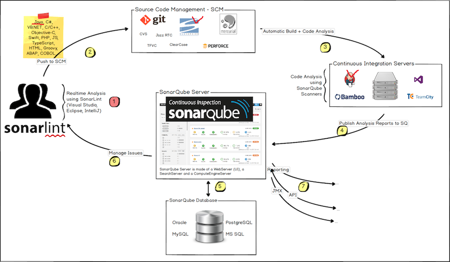

# SonarQube (정적소스분석 도구)사용자 가이드

사용자(개발자) 에게 필요한 내용만 설명합니다. 좀더 내용을 확인 해보고 싶으신 분들은 아래 주소를 통해 확인하시면 됩니다.

https://docs.sonarqube.org/latest/

## SonarQube Architecture 의 이해

SonarQube 크게 3개의 서비스가 돌아간다고 생각하면 됩니다.

1. 소스를 분석하는 SonarQube Scanner
1. 분석된 소스를 관장하고 관리하는 SonarQube Server
1. 분석된 내용 및 SonarQube Server에서 관리 용도의 메타 데이터를 기록하는 SonarQube Database

위 3가지가 꼭 구성되어있어야 합니다. (*기본으로 설정되어있는 H2 Database를 이용할 경우 서버내에 maven 설치 되어있어야함)

## 통합구조

일반적인 개발 순서, 개발 소스 커밋(푸쉬) → 테스트계 서버 배포 → 확인 → 운영계 배포 flow에 맞춰 설명합니다.

1. 사용자는 개발툴(Eclipse) 를 통해 개발합니다.
1. 개발된 소스는 SVN 에 push 하게 되고 Jenkins에서 테스트계 서버로 Deploy를 하게 합니다.
   이 Deploy 과정에서 SonarQube Scanner 가 동작하게 되고 커밋된 전체적인 소스 분석이 진행 됩니다.
   정상 배포 및 검사가 진행되면 Jenkins build overview 페이지 SonarQube Quality Gate 에 OK, SUCCESS Sign이 떨어집니다.
1. 왼쪽 메뉴 > SonarQube 를 클릭하게 되면 바로 해당 프로젝트의 분석된 Overview 를 확인 가능합니다.
1. Issue tab을 클릭하면 개발된 소스에서 문제가 될만한 부분을 다양한 Severity 타입으로 분류해 리스트업해 줍니다.
1. Issue 하나를 클릭해보면 해당 소스를 확인해 볼 수 있습니다.
1. Issue 소스를 수정하고 다시 SVN에 푸쉬하고 테스트계 서버에 배포를 진행합니다. 해당 issue가 없어질 때까지 반복합니다.(위 작업을 단축시키기 위해 SonarQube 에서는 Eclipse on plugin을 지원합니다. Sonarlint for Eclipse참조)

## Sonarlint for Eclipse

Jenkins 를 통한 배포시 검증은 전체 소스기반으로 점검에 들어가기 때문에 시간이 걸립니다.

Sonarlint 를 이용하면 개발하면서 동시에 점검이 가능하기 때문에 설치해서 개발하는 것을 추천합니다.

https://www.sonarlint.org/

설치방법은 위 사이트를 통해 확인 할 수 있습니다.
