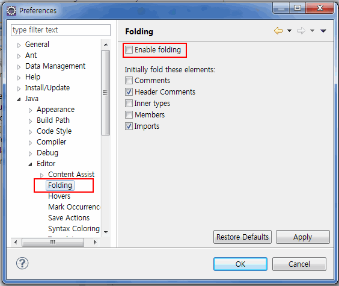

# Eclipse 속도 최적화

출처: https://epthffh.tistory.com/entry/%EC%9D%B4%ED%81%B4%EB%A6%BD%EC%8A%A4-%EC%86%8D%EB%8F%84%EA%B0%9C%EC%84%A0-%EB%B0%A9%EB%B2%95

## 목차
1. ‘eclipse.ini’ 설정파일 변경
2. 소스 자동 폴딩 해제
3. 코드 자동완성기능 해제(CTRL + SPACE 로 사용가능)
4. 불필요한 Builder 설정 해제
5. JavaScript Library를 전역화하지 않는다.
6. Spelling 체크 설정 해제
7. 불필요한 Validation (컴파일시 유효성체크) 설정 해제
8. 작업중이지 않은 프로젝트 닫기
9. 불필요한 Plug-In 삭제
10. Eclipse 처음 실행속도 개선
11. 자동업데이트 끄기
12. Eclipse Heap Memory 관리
13. 자동빌드기능을 사용하지않는다.


## 1. ‘eclipse.ini’ 설정파일 변경

eclipse.ini: => 각자 시스템에 맞게 변경.
```properties
-vmargs
-Dosgi.requiredJavaVersion=1.6
-Xverify:none
-XX:+UseParalleGC
-XX:-UseConcMarkSweepGC
-XX:+AggressiveOpts
-XX:PermSize=128M
-XX:MaxPermSize=128M
-XX:MaxNewSize=128M
-XX:NewSize=128M
-Xms1024m
-Xmx1024m

----- 설명 ------

-Dosgi.requiredJavaVersion=1.6  // JDK 1.6 이상을 설치 했을 경우 1.6으로 설정하면 속도 향상됨
-Xverify:none // 클래스의 유효성 검사를 생략 (시작 시간 감소)
-XX:+UseParallelGC // 병렬 가비지 컬렉션 사용 (병렬 처리 속도 향상)
-XX:+AggressiveOpts // 컴파일러의 소수점 최적화 기능 작동
-XX:-UseConcMarkSweepGC // 병행 mask-seep GC 를 수행하여 이클립스의 GUI 응답 속도 향상
-XX:PermSize=128M // Permanent Generation (영구 영역) 크기 (Out of memory 오류 발생 시 size 조절)
-XX:MaxPermSize=128M // 최대 Permanent Generation size
-XX:MaxNewSize=128M // New Generation(새 영역) size
-XX:NewSize=128M // New Gerneration의 최대 크기
-Xms1024m // 이클립스가 사용하는 최소 heap 메모리
-Xmx1024m // 이클립스가 사용하는 최대 heap 메모리 (최소와 최대를 같은 값으로 하면 속도 향상)

```

## 2. 소스 자동 폴딩 해제
- Preferences > Java > Editor > Folding
- Preferences > JavaScript > Editor > Folding




## 3. 코드 자동완성기능 해제(CTRL + SPACE 로 사용가능)
- Preferences > Java > Editor > Content Assist : ‘Auto Activation’ 체크해제
- Preferences > JavaScript > Editor > Content Assist : ‘Auto Activation’ 체크해제
- Preferences > web > HTML Files > Editor > Content Assist : ‘Auto Activation’ 체크해제
- Preferences > XML > XML Files > Editor > Content Assist : ‘Auto Activation’ 체크해제


## 4. 불필요한 Builder 설정 해제
- Project 우클릭 > Properties > Builders > 필요한 Builder만 체크
-  “JavaScript Validator”는 되도록 체크해제


## ~~5. JavaScript Library를 전역화하지 않는다.~~ (최신버전에선 사용하지 않는듯.))
- Preferences > JavaScript > Include Path > Source > Excluded : Library경로 제외


## 6. Spelling 체크 설정 해제
- Preferences > General > Editors > Text Editors > Spelling : ‘Enable spell checking’ 체크해제


## 7. 불필요한 Validation (컴파일시 유효성체크) 설정 해제
- Preferences > Validation


## 8. 작업중이지 않은 프로젝트 닫기
-  Project > Close Project


## 9. 불필요한 Plug-In 삭제
- Preferences > Install/Update > Uninstall or update : 불필요한 Plug-In Uninstall


## 10. Eclipse 처음 실행속도 개선
- Preferences > General > Startup and Shutdown : 불필요한 항목 체크해제
    - RSE(Remote System Explorer) UI 체크해제


## 11. 자동업데이트 끄기
- Preferences > Install/Update > Automatic Updates : 체크해제


## 12. Eclipse Heap Memory 관리
- Preferences > General : Show Heap status


## 13. 자동빌드기능을 사용하지않는다.
- Preferences > General > Workspace > Build > Build automatically : 체크해제


