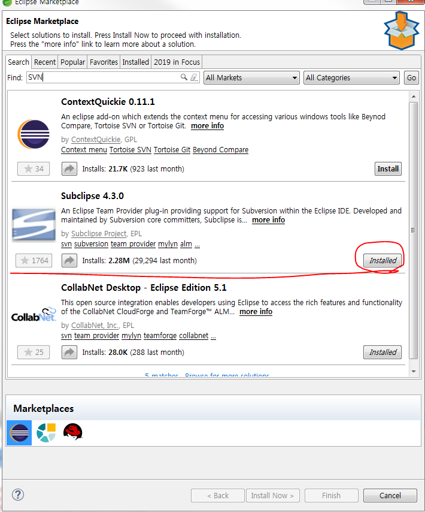
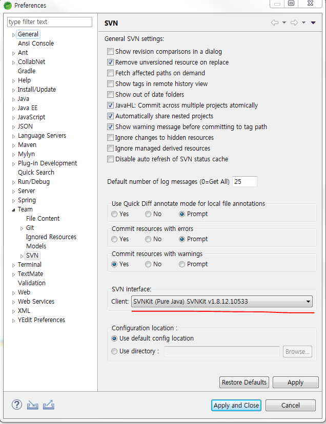

# STS 4.0 이상 SVN 설치방법

## SVN plugin 설치
STS4.0버전을 깔고 SVN plugin을 설치하고


 
`svn://172.16.0.21:8888/sampleProject` 프로젝트를 연결하려고하면

```
    Can't create session
svn: Unable to connect to a repository at URL 'svn://172.16.0.21:8888/sampleProject'
Cannot negotiate authentication mechanism
```

이와같은 에러가 발생해서 연결이 안되는 경우가 있다. 이럴경우 svn 인터페이스를 한번 살펴보자

eclipse > window > preferences > Team > SVN :



## Maven 설정

`window > preferences > Maven > user settings` Global Settings에 Maven settings.xml 위치 등록하자

(이 설정이 안되어 있어서 ojdbc6.jar 라이브러리를 못 불러오는 경우가 있었다.)  


## sta4 (eclipse 설정)
1. Java 12버전 사용하자 
    `-vm C:\java\zulu12.2.3-ca-jdk12.0.1-win_x64\bin\javaw.exe)`
2. Java12 버전에 맞는 최신 GC를 사용하자 `-XX:+UnlockExperimentalVMOptions -XX:+UseShenandoahGC`

SpringToolSuite4.ini: 
```bash
-startup
plugins/org.eclipse.equinox.launcher_1.5.400.v20190515-0925.jar
--launcher.library
plugins/org.eclipse.equinox.launcher.win32.win32.x86_64_1.1.1000.v20190125-2016
-product
org.springframework.boot.ide.branding.sts4
--launcher.defaultAction
openFile
-vmargs
-Dosgi.requiredJavaVersion=1.8
-Xms2048m
-Xmx2048m
-XX:+UnlockExperimentalVMOptions    # 숨겨진 옵션 unlock
-XX:+UseShenandoahGC                # java12에서 지원하는 gc
-XX:+UseStringDeduplication
--add-modules=ALL-SYSTEM
-javaagent:C:\HCC_PRIVIA\sts-4.3.0.RELEASE\lombok.jar
-vm
C:\java\zulu12.2.3-ca-jdk12.0.1-win_x64\bin\javaw.exe
```

