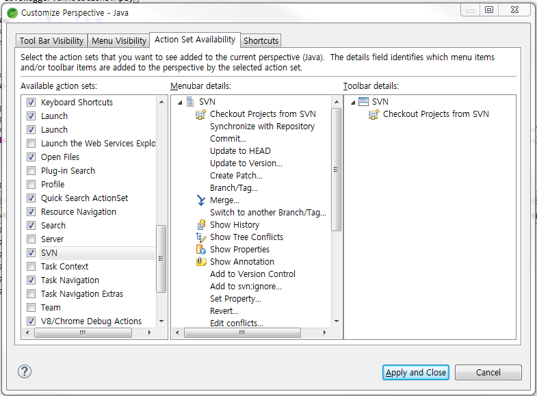

# STS 4.0 이상 SVN 설치방법

## SVN plugin 설치
STS4.0버전을 깔고 SVN plugin을 설치하고


 
`svn://172.16.0.21:8888/sampleProject` 프로젝트를 연결하려고하면

```
    Can't create session
svn: Unable to connect to a repository at URL 'svn://172.16.0.21:8888/sampleProject'
Cannot negotiate authentication mechanism
```

이와같은 에러가 발생해서 연결이 안되는 경우가 있다. 이럴경우 svn 인터페이스를 한번 살펴보자

eclipse > window > preferences > Team > SVN :


### SVN 단축키가 먹지 않을때
SVN 작업시 아래 단축키들을 자주 사용하는데 keys 셋팅을 해도 먹통인 경우가 있다. 
```
Ctrl + alt + C, Ctrl + alt + U, Ctrl + alt + U
```

이럴경우, `window > perspective > Customize perspective` 메뉴를 들어가서 `Action Set Availability` 탭에 들어가서
`SVN` 항목을 체크 하도록 한다. 그리고 저장(Apply and close) 버튼을 누르고 단축키를 테스트 해보자  



## Maven 설정

`window > preferences > Maven > user settings` Global Settings에 Maven settings.xml 위치 등록하자

(이 설정이 안되어 있어서 ojdbc6.jar 라이브러리를 못 불러오는 경우가 있었다.)  
