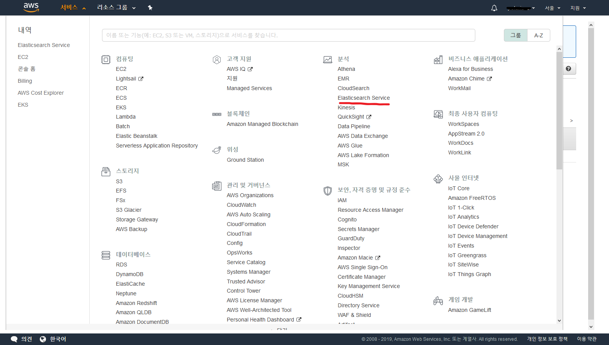
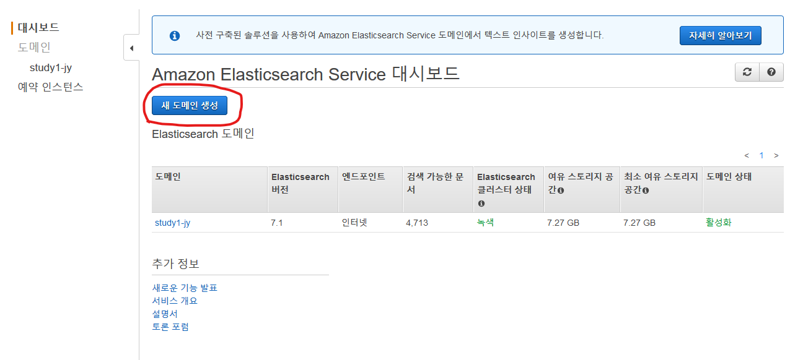
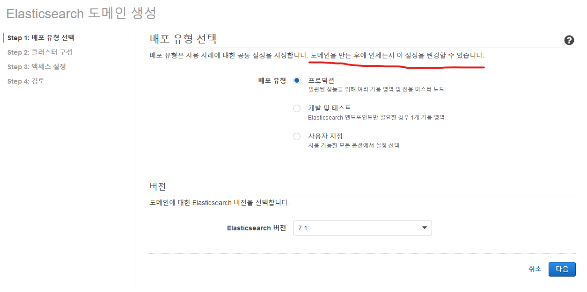
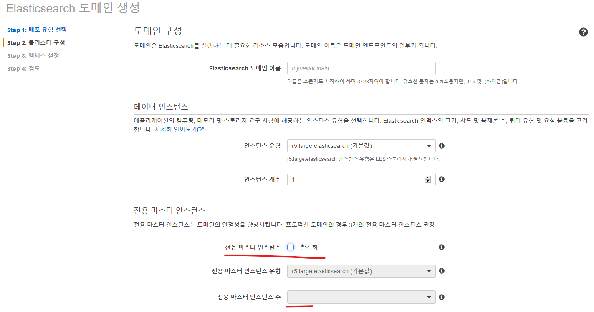
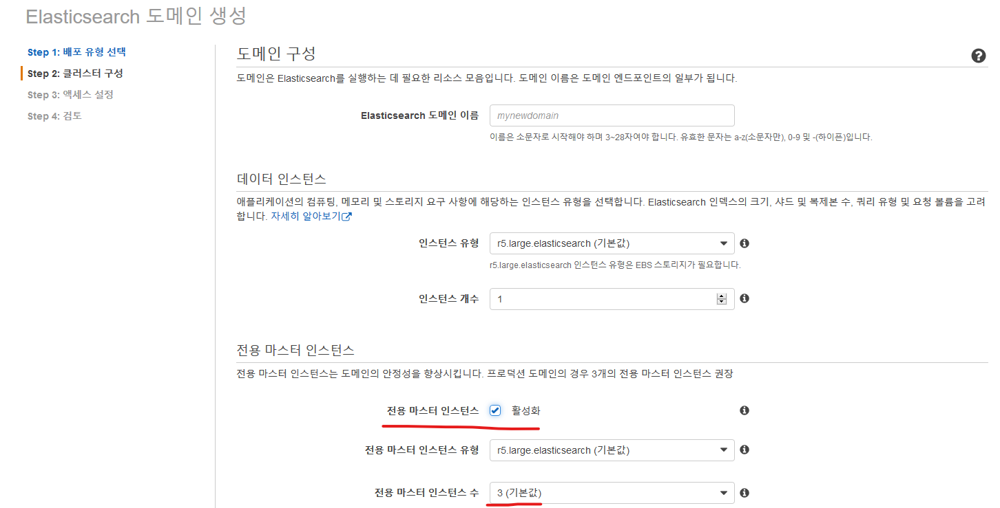
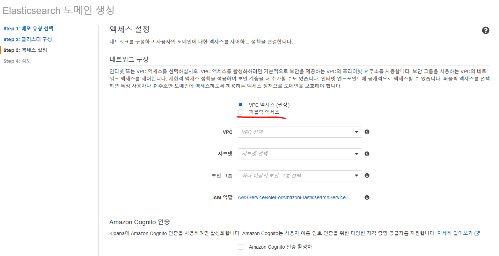
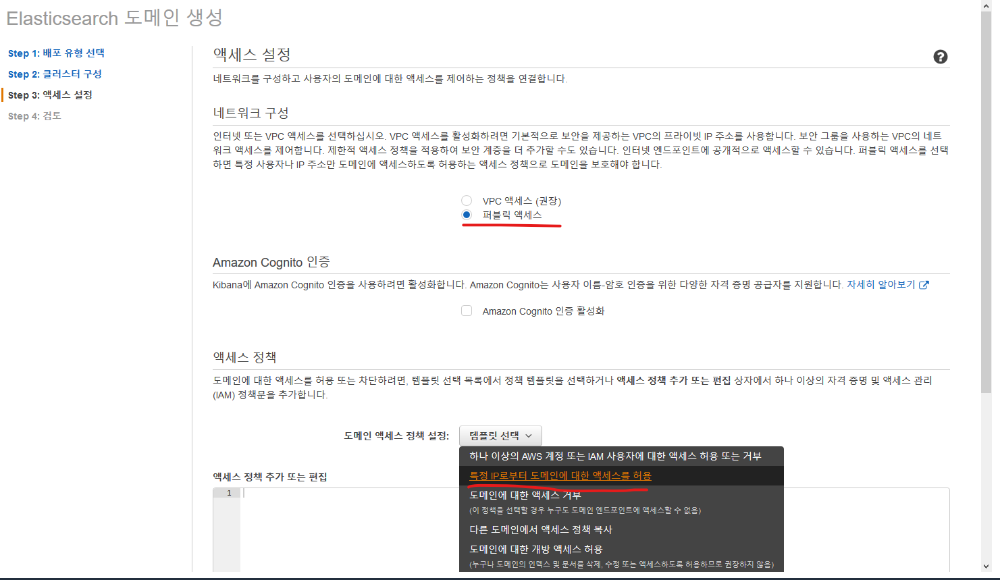

# AWS Elasticsearch Service 이용하기
tag: Elasticsearch, 엘라스틱서치, Open Distro for Elasticsearch


## 참고자료
- https://aws.amazon.com/ko/blogs/korea/new-amazon-elasticsearch-service/ (설치 매뉴얼)
- https://opendistro.github.io/for-elasticsearch/ (엘라스틱 오픈소스)
- https://docs.aws.amazon.com/ko_kr/elasticsearch-service/latest/developerguide/what-is-amazon-elasticsearch-service.html (사용설명서)


## 설치방법

### 1. AWS 엘라스틱 서치 서비스 선택하기

> "Elasticsearch" 로 검색하면 쉽게 찾음



### 2. 새 도메인 생성

대시보드에서 "새 도메인 생성" 버튼 클릭



### 3. 배포 유형 선택

언제든지 설정을 변경할 수 있다고 하니 *개발 및 테스트* 환경으로 선택했다가 *프로덕션* 환경으로 변경해도 된다.



### 4. 클러스터 구성

1. Elasticsearch 도메인 이름 설정

2. 데이터 인스턴스 설정
    - 데이터 노드(인스턴스) 설정

3. 전용 마스터 인스턴스
    - 마스터 노드(인스턴스) 설정

4. 스토리지
    - 데이터 노드의 스토리지 유형을 선택, 







### 5. 액세스 설정

vpn 안에서 private 한 설정으로 접근을 원할 경우 


퍼플릭 액세스를 통해 공개할 경우 **특정 IP로부터 도메인에 대한 액세스를 허용** 하도록 정책을 설정하자



액세스 정책 추가 또는 편집:
```json
{
  "Version": "2012-10-17",
  "Statement": [
    {
      "Effect": "Allow",
      "Principal": {
        "AWS": "*"
      },
      "Action": [
        "es:*"
      ],
      "Condition": {
        "IpAddress": {
          "aws:SourceIp": [
            "192.168.8.170"
          ]
        }
      },
      "Resource": "arn:aws:es:ap-northeast-2:168819640257:domain/mynewelasticsearch/*"
    }
  ]
}
```

### 6. 검토 및 확인

설정된 내용 확인후 "확인" 버튼 클릭


### 7. 한국어 분석을 위한 '은전한닢' 플러그인 설치 (필요없음 이미 플러그인 설치되어 배포되었음.)

- https://aws.amazon.com/ko/blogs/korea/amazon-elasticsearch-service-now-supports-korean-language-plugin/ (구버전 설치방법)

1. '은전한닢' 플러그인 설치
```bash
$ curl -XPOST 'https://search-korean-text-xxxxx.ap-northeast-2.es.amazonaws.com/mytext/' -d ' {
    "index":{
        "analysis":{
            "tokenizer" : {
                "seonjeon" : {
                    "type" : "seonjeon_tokenizer"
                }
            },
            "analyzer" : {
                "analyzer" : {
                    "type" : "custom",
                    "tokenizer" : "seonjeon"
                }
            }
        }
    }
}'

$ curl -XPUT 'https://search-study1-jy-qnxatzkuz7utki4ds4frleejoy.ap-northeast-2.es.amazonaws.com/movie/' -H "Content-Type:application/json" -d '{
    "index":{
        "analysis":{
            "tokenizer" : {
                "seonjeon" : {
                    "type" : "seonjeon_tokenizer"
                }
            },
            "analyzer" : {
                "analyzer" : {
                    "type" : "custom",
                    "tokenizer" : "seonjeon"
                }
            }
        }
    }
}'

## return
{"acknowledged":true}
```

2. 간단한 인덱스 추가 및 테스트
```bash
$ curl -XPUT 'https://search-study1-jy-qnxatzkuz7utki4ds4frleejoy.ap-northeast-2.es.amazonaws.com//mytext/_doc/1' -H "Content-Type:application/json" -d  '
  {
    "title" : "검색 제목",
    "text"  : "검색 결과를 테스트 합니다"
}'

## return
{"_index":"mytext","_type":"data","_id":"AVAmDgheeFCp6h-hHJoZ","_version":1,"created":true}
```

```bash
$ curl -XGET 'https://search-korean-text-xxxxx.ap-northeast-2.es.amazonaws.com/mytext/data/_search' -d '
  {
  "query":{"match":{"text":"검색"}}
  }'

## return
{
    "took": 8,
    "timed_out": false,
    "_shards": {
        "total": 5,
        "successful": 5,
        "failed": 0
    },
    "hits": {
        "total": 2,
        "max_score": 0.32180142,
        "hits": [
            {
                "_index": "mytext",
                "_type": "data",
                "_id": "AVAmDbFReFCp6h-hHJoY",
                "_score": 0.32180142,
                "_source": {
                          "title" : "검색 제목",
                          "text"  : "검색 결과를 테스트 합니다"
                }
            },

    ...

```

## :bomb: troubleshooting

### 한글 형태소 플러그인 설치시 에러 {"error":{"root_cause":[{"type":"parse_exception","reason":"unknown key [index] for create index"}],"type":"parse_exception","reason":"unknown key [index] for create index"},"status":400}  


## 별첨 (Open Distro for Elasticsearch)
아마존에서 개발하고 OpenSource로 배포중인 Elasticsearch(이하 AWS ES) 이다.(엘라스틱서치 회사와는 별개 프로젝트) 그래서 Elasticsearch 에서 제공하는 유료 플러그인 등이 AWS ES를 이용하게 되면 추가 금액없이 사용 가능하다.

Elasticsearch Cloud를 서비스하고 있는 엘라스틱서치 회사 입장에서는 그다지 탐탁하지 않은 상황(엘라스틱 입장 https://www.elastic.co/kr/blog/on-open-distros-open-source-and-building-a-company), 일부 유저도 대기업의 행포라고.. (http://kangmyounghun.blogspot.com/2019/03/open-distro-for-elasticsearch.html)

- https://grip.news/archives/1669 (Open Distro for Elasticsearch 설치방법)

- https://aws.amazon.com/ko/blogs/korea/keeping-open-source-open-open-distro-for-elasticsearch/ (Open Distro for Elasticsearch 아마존 서비스 발표 )


