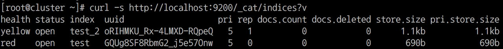
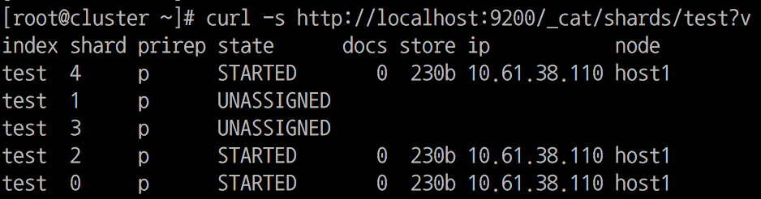

# 엘라스틱 서치 실무가이드(book)

- 출판사 : 위키북스
- 출판일 : 2019년 4월 18일


## 목차
1. 검색 시스템 이해하기
    
    설치 및 검색 시스템에 대한 내용
    
    - 설치방법
        1. [서버에 엘라스틱 설치](./AWS-elasticsearch-설치.md)
        1. [AWS elasticsearch service 이용하기](./AWS-elasticsearch-service-start.md)

1. [엘라스틱서치 살펴보기](./BOOK-02-elasticsearch-살펴보기.md)


## :bomb: troubleshooting

### 1. 클러스터 상태(status)

참고링크: 
- https://brunch.co.kr/@alden/43 (status 상태 보고 좀더 디테일하게 원인 찾기)
- https://www.elastic.co/guide/en/elasticsearch/reference/current/cat-health.html (상태보는법)
```
$ curl -s http://localhost:9200/_cat/health?v
or
$ curl -XGET https://localhost:9200/_cluster/health?pretty=true
```

#### status
- <span style="color: green;">green</span>: 모든 샤드가 정상적으로 동작하고 있는 상태, 모든 인덱스에 쓰기/읽기가 정사적으로 동작한다.

- <span style="color: #d6db42;">yellow</span> : 일부 혹은 모든 인덱스의 replicas 샤드가 정상적으로 동작하고 있지 않은 상태, 모든 인덱스에 쓰기/읽기가 정상적으로 동작하지만, 일부 인덱스의 경우 replicas가 없어서 primary 샤드에 문제가 생기면 데이터 유실이 발생할 가능성이 있다.

- <span style="color: red;">red</span> : 일부 혹은 모든 인덱스의 primary와 replicas 샤드가 정상적으로 동작하고 있지 않은 상태, 일부 혹은 모든 인덱스에 쓰기/읽기가 정상적으로 동작하지 않으며, 데이터의 유실이 발생할 가능성이 있다.

클러스터가 red 라고 해도 모든 **index**가 장애가 있는 상태는 아니다. 문제가 되는 *index*를 찾아보자.

indices API:
```bash
$ curl -s http://localhost:9200/_cat/indices?v
```


"test" 라는 **index** 만 red 인 것을 알 수 있다. "test_2" **index**는 yellow 상태이기 때문에 문서 쓰기/읽기의 기능적인 문제는 전혀 영향이 없다. 단지 replica가 없어 failover 시 데이터 손실에 위험만 있다. 

"test" 라는 **index**의 상태를 살펴보자.

shard api:
```bash
$ curl -s http://localhost:9200/_cat/shards/test?v
```


1번 3번 샤드들이 *unassigned* 상태이다. 이 두 개의 primary shard가 어떤 노드에도 배치되지 않아서 클러스터가 red인 상태이다. 이런 상태일 경우 5개의 샤드중에 3개만 동작하기 때문에 60% 정도의 쓰기 작업은 성공할 것 이며, 읽기 시에도 장애 발생 전에 들어있던 데이터들의 60% 정도만 조회가 된다.


