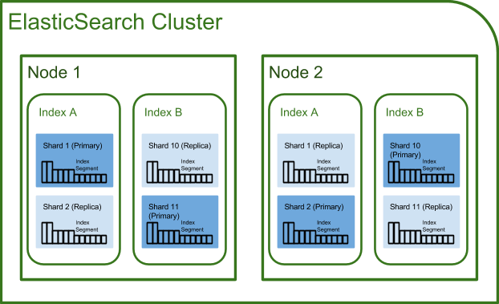

# 2 엘라스틱 설펴보기
tag: elasticsearch, 

## 이번 장에서 다룰 내용
1. 엘라스틱서치를 구성하는 개념
1. 엘라스틱서치에서 제공하는 주요 API

## 2.1. 엘라스틱서치를 구성하는 개념
- index
- type
- document
- field

### 2.1.1. 기본 용어 

### Index(인덱스)

**index 이름은 모두 소문자로 해야한다.**

index(인덱스)는 데이터 저장 공간이다. 하나의 인덱스는 하나의 type(타입)만 가지며 하나의 물리적인 노드에 여러 개의 논리적인 인덱스를 생성할 수 있다.

검색 시 index 이름으로 문서 데이터를 검색하며, 여러 개의 인덱스를 동시에 검색하는 것도 가능하다.

분산 환경으로 구성하면 하나의 인덱스가 여러 노드(물리적인 서버들)에 분산 저장되어 관리된다.
index 생성시 기본적으로 5개의 primary shard(프라이머리 샤드)와 1개의 replica(리플리카) 샤드 셋트를 생성한다.

> Shard(샤드) <br>
색인된 문서는 하나의 인덱스에 담긴다. 인덱스 내부에 색인된 데이터는 물리적인 공간에 여러 개의 파티션으로 나뉘어 구성되는데, 이 파티션을 엘라스틱서치에서는 shard라고 부른다. 엘라스틱서치는 다수의 shard로 문서를 분산 저장하고 있어 데이터 손실 위험을 최소화할 수 있다.

### Type(타입)
**인덱스의 논리적 구조를 의미한다.**

인텍스 속서에 따라 분류 되기도 한다. 엘라스틱 6.0버전 이하에서는 하나의 인덱스에 여러 타입을 설정 가능 했지만 6.1버전부터는 인덱스당 하나의 type만 사용 할 수 있다.

> 엘라스틱서치 6.0이하 버전에서는 특정 카테고리를 분류하는 목적으로 타입이 많이 사용됐다. 예를 들어 music 이라는 index가 존재하면, 장르별(Rock, K-pop, Classic)로 분리해 사용했다. 하지만 현재는 타입을 사용하는 것을 권장하지 않기 때문에 장르별로 별도의 인덱스를 각각 생성해서 사용해야한다.

### Document(문서)
**엘라스틱서치에서 데이터가 저장되는 최소 단위다.(Database로 따지면 Row)**

하나의 Document에는 다수의 Field로 구성돼 있는데 각 필드는 데이터의 형태에 따라 용도에 맞는 데이터 타입(Data Type)을 정의해야 한다. 또한 문서는 중첩 구조를 지원하기 때문에 이를 이용해 문서 안에 문서를 지정하는 것도 가능하다.

### Feild(필드)
**일반적으로 database의 column과 비슷하다.** 

Database의 column은 Data type을 하나만 명확히 지정해야하지만 엘라스틱서치의 Feild는 다수의 Data Type을 지정해서 영화 제목을 검색할 때 매칭 검색을 하거나 초성을 이용한 검색이 모두 지원되도록 제목 필드는 2개의 데이터 타입을 가져야한다.

Feild(필드)는 문서를 구성하기 위한 속성이라고 할 수 있다.

> mapping(매핑)<br>
mapping은 document의 feild와 feild 속성을 정의하고 그에 따른 색인 방법을 정의하는 프로세스이다. 인덱스의 매핑 정보에는 여러가지 데이터 타입을 지정할 수 있지만 필드명은 중복해서 사용할 수 없다.


### 2.1.2 노드의 종류

AWS ES 에서는 **마스터 노드**와 **데이터 노드** 두개만 설정하고 두 노드들만 관리하면 되는 것으로 보인다. 밑에서는 엘라스틱 서치가 어떻게 작동하는지 구체적으로 알고 싶은 사람들을 위해 각 노드 종류와 역활에 대해 기록했다.

클러스터는 물리적인 **노드** 인스턴스들의 모임. 클러스터는 모든 노드의 검색과 색인 작업을 관장하는 논리적인 개념이다. 관계형 데이터 베이스의 경우 모든 요청을 서버하나에서 처리해서 결과를 제공하지만 엘라스틱서치의 경우에는 다수의 (물리적인)서버로 분산해서 처리하는 것이 가능하기 때문에 대용량 데이터를 처리할 수 있다.

- 마스터 노드(Master Node)
    - 클러스터를 관리한다.
    - 노드 추가와 제거 같은 클러스터의 전반적인 관리를 담당한다.
    - 인덱스 생성, 삭제 등 클러스터와 관련된 전반적인 작업을 담당한다.
    - 네트워크 속도가 빠르고 지연이 없는 노드를 마스터 노드로 선정(가장 성능이 좋은 서버)
    - 다수의 노드를 마스터 노드로 설정할 수 있지만 결과적으로 **하나의 노드만이** 마스터 노드로 선출된다.

- 데이터 노드(Data Node)
    - 실질적인 데이터를 저장한다. 실질적인 색인 작업을 한다.
    - 데이터가 실제로 분산 저장되는 물리적 공간인 **샤드(shard)** 가 배치되는 노드이다.
    - 검색과 통계 같은 데이터 관련 작업을 수행한다.
    - 색인 작업은 CPU, 메모리, 스토리지 같은 컴퓨팅 리소스를 많이 소모한다.
    - 데이터 노드는 가능한 한 마스터 노드와 분리

- 코디네이팅 노드(Coordinating Node)
    - 단순히 들어온 사용자의 요청을 **라운드로빈** 방식으로 분산시켜 주는 노드이다.
    - 클러스터 관련 요청은 마스터 노드에 전달하고 데이터 관련 요청은 데이터 노드에 전달한다.

- 인제스트 노드(Ingest Node)
    - 문서의 전처리 작업을 담당한다. 
    - 색인 전, 문서의 형식을 다양하게 변경할 수 있다.
    - 데이터의 포멧을 변겨하기 위해 스크립트로 전처리 파이프라인을 구성하고 실행할 수 있다.

> 설정에 따라 각 노드(서버)는 한가지 유형으로 동작할 수도 있고 여러 개의 유형을 겸해서 동작할 수도 있다.

#### 마스터 노드 설정방법
elasticsearch.yml:
```yml
node.master: true
node.data: false
node.ingest: false
search.remote.connect: false
```

#### 데이터 노드 설정방법
elasticsearch.yml:
```yml
node.master: false
node.data: true
node.ingest: false
search.remote.connect: false
```

#### 코디네이팅 노드 설정방법
elasticsearch.yml:
```yml
node.master: false
node.data: false
node.ingest: false
search.remote.connect: false
```

#### 인제스트 노드 설정방법
elasticsearch.yml:
```yml
node.master: false
node.data: false
node.ingest: true
search.remote.connect: false
```

### 2.1.3. 클러스터, (데이터)노드, 샤드(Primary, Replica)



하나의 클러스터에 다수의 노드(Node1, Node2, Node3, ...) 가 존재한다. (위 이미지는 두개만 표현) 엘라스틱은 문서를 조회할 때 **마스터 노드** 를 통해 모든 노드(위는 2개의 노드)를 모두 조회해서 각 데이터를 하나로 취합한 후 제공한다.

하나의 노드안에는 다수의 **index** 가 파편화(shard) 되어 들어가 있다. 본체 샤드는 **Primary shard**고 복제된 샤드는 **Replica shard** 이다.

장애극복(Failover) 상황에 대한 동작방식은 여타 서비스들과 비슷하기 때문에 생략한다. 

여러 개의 클러스터를 연결해서 구성할 수도 있으며, 이때는 클러스터의 이름으로 각각을 구분한다. 클러스터에 있는 노드는 실시간으로 추가, 제거가 가능하기 때문에 가용성이나 확장성 측면에서 매우 유연하다.


## 2.2. 엘라스틱서치 주요 API

### API의 종류
- 인덱스 관리 API(Indices API) : 인덱스 관리
- 문서 관리 API(Document API) : 문서의 추가/수정/삭제
- 검색 API(Search API) : 문서 조회
- 집계 API(Aggregation API) : 문서 통계


> **스키마리스를 명시적으로 false로 바꾸는 방법**
> 1. 노드 설정 파일에서 action.auto_create_index 를 false 로 설정
> 2. 인덱스별로 제공되는 index.mapper.dynamic 설정을 false로 설정하면 특정 컬럼의 자동 매핑 생성이 비활성화 된다. (엘라스틱서치 6.0 미만에서만 가능)


### 2.2.1. 인덱스 관리 API
```
# delete index
DELETE movie

# create index
PUT movie
{
  "settings": {
    "number_of_shards": 3,
    "number_of_replicas": 2
  },
  "mappings": {
    
    "properties": {
      "movieCd": {
        "type": "keyword"
      },
      "movieNm": {
        "type": "text",
        "analyzer": "standard"
      },
      "movieNmEn": {
        "type": "text",
        "analyzer": "standard"
      },
      "prdtYear": {
        "type": "integer"
      },
      "openDt": {
        "type": "integer"
      },
      "typeNm": {
        "type": "keyword"
      },
      "prdtStatNm": {
        "type": "keyword"
      },
      "nationAlt": {
        "type": "keyword"
      },
      "genreAlt": {
        "type": "keyword"
      },
      "repNationNm": {
        "type": "keyword"
      },
      "repGenreNm": {
        "type": "keyword"
      },
      "companies": {
        "properties": {
          "companyCd": {
            "type": "keyword"
          },
          "companyNm": {
            "type": "keyword"
          }
        }
      },
      "directors": {
        "properties": {
          "peopleNm": {
            "type": "keyword"
          }
        }
      }
    }
  }
}

# get index
GET movie_search
```

### 2.2.2. 문서 관리 API

```
# input document
PUT movie_search/_doc/1
{
  "movieCd": "20173732",
  "movieNm": "살아남은 아이",
  "movieNmEn": "Last Child",
  "prdtYear": "2017",
  "openDt": "",
  "typeNm": "장편",
  "prdtStatNm": "기타",
  "nationAlt": "한국",
  "genreAlt": "드라마,가족",
  "repNationNm": "한국",
  "repGenreNm": "드라마",
  "directors": [
    {
      "peopleNm": "신동석"
    }
  ],
  "companies": []
}

# get document
GET movie_search/_doc/1

# delete document
DELETE movie_search/_doc/1
```

### 2.2.3. 검색 API
```
# search1
GET movie_search/_search?q=prdtYear:2017

# search2
GET movie_search/_search?q=prdtYear:2017
{
    "sort":{
        "movieCd": {
            "order" : "asc"
        }
    }
}

# search3
GET movie_search/_search?q=movieNmEn:Last

# search4
GET movie_search/_search?q=Last

# search5
GET movie_search/_search
{
    "query" :{
        "term":{
            "typeNm":"장편"
        }
    }
}
```

JSON 포멧:
```
{
    size:   # 몇 개의 결과를 반환할지 결정한다. (기본값 10),
    from:   # 어느 위치부터 반환할지를 결정한다.
            # 0부터 시작하면 상위 0~10건의 데이터를 반환한다.(기본값은 0)
    _source:    # 특정 필드만 결과로 반환하고 싶을 때 사용한다.
    sort:   # 특정 필드를 기준으로 정렬한다.
            # asc, desc 로 오름차순, 내림차순 정렬을 지정할 수도 있다.
    query: {
        # 검색될 조건을 정의한다.
    }

    filter: {
        # 검색 결과 중 특정한 값을 다시 보여준다.
        # 결과 내에서 재검색할 때 사용하는 기능 중 하나다.
        # 다만 필터를 사용하게 되면 자동으로 score 값이 정렬되지 않는다.
    }

}
```


### 2.2.4. 집계 API  :star:


