# HTTPS 와 SSL 인증서

tags: SSL, HTTPS, 인증서

### 참고
 - https://opentutorials.org/course/228/4894#public


## HTTPS vs HTTP

HTTP는 Hypertext Transfer Protocol의 약자다. 즉 Hypertext 인 HTML을 전송하기 위한 통신규약을 의미한다. 
HTTPS에서 마지막의 S는 Over Secure Socket Layer의 약자로 Secure라는 말을 통해서 알 수 있듯이 보안이 강화된 HTTP라는 것을 짐작할 수 있다.
HTTP는 암호화되지 않은 방법으로 데이터를 전송하기 때문에 서버와 클라이언트가 주고 받는 메시지를 감청하는 것이 매우 쉽다. 
예를들어 로그인을 위해서 서버로 비밀번호를 전송하거나, 또는 중요한 기밀 문서를 열람하는 과정에서 악의적인 감청이나 데이터의 변조등이 일어날 수 있다는 것이다.
이를 보안한 것이 HTTPS다.


## HTTPS 와 SSL

HTTPS와 SSL를 같은 의미로 이해하고 있는 경우가 많다. 이것은 맞기도 틀리기도 하다. 
그것은 마치 인터넷과 웹을 같은 의미로 이해하는 것과 같다. 
결론적으로 말하면 웹이 인터넷 위에서 돌아가는 서비스 중의 하나인 것처럼 HTTPS도 SSL 프로토콜 위에서 돌아가는 프로토콜이다.


## SSL 과 TLS

같은 말이다. 네스케이프에 의해서 SSL이 발명되었고, 이것이 점차 폭넓게 사용되다가 표준화 기구인 IETF의 관리로 변경되면서 TLS라는 이름으로 바뀌었다. 
TLS 1.0은 SSL 3.0을 계승한다. 하지만 TLS라는 이름보다 SSL이라는 이름이 훨씬 많이 사용되고 있다.


## SSL 디지털 인증서

SSL 인증서는 클라이언트와 서버간의 통신을 제3자가 보증해주는 전자화된 문서다.
클라이언트가 서버에 접속한 직후에 서버는 클라이언트에게 이 인증서 정보를 전달한다.
클라이언트는 이 인증서 정보가 신뢰할 수 있는 것인지를 검증 한 후에 다음 절차를 수행하게 된다.
SSL과 SSL 디지털 인증서를 이용했을 때의 이점은 아래와 같다.

- 통신 내용이 공격자에게 노출되는 것을 막을 수 있다. 
- 클라이언트가 접속하려는 서버가 신뢰 할 수 있는 서버인지를 판단할 수 있다.
- 통신 내용의 악의적인 변경을 방지할 수 있다. 


## SSL에서 사용하는 암호화의 종류

SSL의 핵심은 암호화다. SSL은 보안과 성능상의 이유로 두가지 암호화 기법을 혼용해서 사용하고 있는데 SSL 동작방법을 이해하기 위해서는 이 암호화 기법들에 대한 이해가 필요하다.
이 방법을 모르면 SSL의 동작방법이 추상적으로 느껴질 것이다. SSL에 대한 구체적인 이해를 할 수 있도록 SSL에서 사용하는 암호화 기법들을 소개하겠다.
이것은 비단 SSL의 이해 뿐 아니라 IT 담당자의 기본 소양에 해당하기 때문에 도전해보자.

### 대칭키

*암호를 만드는 행위인 **암호화***를 할 때 사용하는 일종의 비밀번호를 키(key)라고 한다.
이 키에 따라서 암호화된 결과가 달라지기 때문에 키를 모르면 암호를 푸는 행위인 복호화를 할 수 없다.
대칭키는 동일한 키로 암호화와 복호화를 같이 할 수 있는 방식의 암호화 기법을 의미한다. 
즉 암호화를 할 때 1234라는 값을 사용했다면 복호화를 할 때 1234라는 값을 입력해야 한다는 것이다.
이해를 돕기 위해서 openssl을 이용해서 대칭키 방식으로 암호화하는 방법을 살펴보자. 
아래 명령을 실행하면 plaintext.txt 파일이 생성된다. 그리고 비밀번호를 요구 받을 것이다. 
이 때 입력한 비밀번호가 대칭키가 되는 것이다. 

```bash
$ echo 'this is the plain text' > plaintext.txt;
$ openssl enc -e -des3 -salt -in plaintext.txt -out ciphertext.bin;
```
위 명령의 의미는 아래와 같다.
- enc -e -des3 : des3 방식으로 암호화 함
- -in plaintext.txt -out ciphertext.bin : plaintext.txt 파일을 암호화 한 결과를 ciphertext.bin 파일에 저장함

```bash
$ openssl enc -d -des3 -in ciphertext.bin -out plaintext2.txt;
```
위의 명령은 enc -d 옵션으로 인해서 ciphertext.bin 파일을 plaintext2.txt 파일로 복호화하겠다는 의미다.


### 공개키

대칭키 방식은 단점이 있다. 암호를 주고 받는 사람들 사이에 대칭키를 전달하는 것이 어렵다는 점이다. 
대칭키가 유출되면 키를 획득한 공격자는 암호의 내용을 복호화 할 수 있기 때문에 암호가 무용지물이 되기 때문이다. 
이런 배경에서 나온 암호화 방식이 공개키방식이다.

공개키 방식은 두개의 키를 갖게 되는데 *A키로 암호화를 하면 B키로 복호화 할 수 있고, B키로 암호화하면 A키로 복호화 할 수 있는 방식이다.* 
이 방식에 착안해서 두개의 키 중 하나를 비공개키(private key, 개인키, 비밀키라고도 부른다)로하고, 나머지를 공개키(public key)로 지정한다. 
비공개키는 자신만이 가지고 있고, 공개키를 타인에게 제공한다. 공개키를 제공 받은 타인은 공개키를 이용해서 정보를 암호화한다. 
암호화한 정보를 비공개키를 가지고 있는 사람에게 전송한다. 비공개키의 소유자는 이 키를 이용해서 암호화된 정보를 복호화 한다. 
이 과정에서 공개키가 유출된다고해도 비공개키를 모르면 정보를 복호화 할 수 없기 때문에 안전하다. 
공개키로는 암호화는 할 수 있지만 복호화는 할 수 없기 때문이다.

이 방식은 이렇게 응용할 수도 있다. 비공개키의 소유자는 비공개키를 이용해서 정보를 암호화 한 후에 공개키와 함께 암호화된 정보를 전송한다. 
정보와 공개키를 획득한 사람은 공개키를 이용해서 암호화된 정보를 복호화 한다. 이 과정에서 공개키가 유출된다면 의도하지 않은 공격자에 의해서 데이터가 복호화 될 위험이 있다. 
이런 위험에도 불구하고 비공개키를 이용해서 암호화를 하는 이유는 무엇일까? 그것은 이것이 데이터를 보호하는 것이 목적이 아니기 때문이다. 
암호화된 데이터를 공개키를 가지고 복호화 할 수 있다는 것은 그 데이터가 공개키와 쌍을 이루는 비공개키에 의해서 암호화 되었다는 것을 의미한다. 
즉 공개키가 데이터를 제공한 사람의 신원을 보장해주게 되는 것이다. 이러한 것을 전자 서명이라고 부른다.

그럼 이해를 돕기 위해서 공개키를 이용해서 RSA라는 방식의 공개키를 사용해보자. 아래 명령은 private.pem이라는 이름의 키를 생성한다. 
이 키는 1024bit 길이을 갖는다. 이 숫자가 높을수록 안전하다.

```bash
$ openssl genrsa -out private.pem 1024;
```

다음 명령은 private.pem이라는 이름의 비공개키에 대한 public.pem이라는 이름의 공개키를 생성한다. 이 공개키를 자신에게 정보를 제공할 사람에게 전송하면 된다.

```bash
$ openssl rsa -in private.pem -out public.pem -outform PEM -pubout;
```

공개키를 가진 사람이 어떤 정보를 비공개키를 가지고 있는 사람에게 전송하는 상황을 상정해보자. 
아래는 coding everybody라는 이름의 문자를 담고 있는 file.txt를 만든다. 이 데이터를 비공개키 소유자에게 전송하기 위해서는 암호화가 필요하다.

```bash
$ echo 'coding everybody' > file.txt
```

file.txt를 암호화 해보자. 아래의 예제는 file.txt의 내용을 RSA방식으로 암호화한 file.ssl이라는 이름의 파일을 생성한다. 
이 때 사용된 공개키가 public.pem이다. 이제 안심하고 file.txt를 암호화한 결과인 file.ssl을 비공개키의 소유자에게 전송할 수 있다.

```bash
$ openssl rsautl -encrypt -inkey public.pem -pubin -in file.txt -out file.ssl;
```

그럼 file.ssl을 수신받은 비공개키 소유자가 어떻게 이 정보를 복호화 할 수 있는지 알아보자. 
아래 예제는 file.ssl을 복호화한 결과를 decrypted.txt로 만들어내는 방법을 보여준다. 이 과정에서 비공개키인 private.pem을 사용했다.

```bash
openssl rsautl -decrypt -inkey private.pem -in file.ssl -out decrypted.txt
```


## SSL인증서

SSL 인증서의 역할은 다소 복잡하기 때문에 인증서의 메커니즘을 이해하기 위한 몇가지 지식들을 알고 있어야 한다. 
인증서의 기능은 크게 두가지다. 이 두가지를 이해하는 것이 인증서를 이해하는 핵심이다.

1. 클라이언트가 접속한 서버가 신뢰 할 수 있는 서버임을 보장한다.
1. SSL 통신에 사용할 공개키를 클라이언트에게 제공한다.

> 우선 단편적인 지식들을 하나씩 파악하면서 뒤에서 전체적인 메커니즘을 이해하자. SSL에 대한 전체적인 이해에는 상당히 많은 개념들이 유기적으로 상호작용하기 때문에 한번에 이해하기 난해하다. 여러번 읽어가면서 그 관계들을 파악해야 한다.


### CA

인증서의 역할은 클라이언트가 접속한 서버가 클라이언트가 의도한 서버가 맞는지를 보장하는 역할을 한다. 
이 역할을 하는 민간기업들이 있는데 이런 기업들을 CA(Certificate authority) 혹은 Root Certificate 라고 부른다. 
CA는 아무 기업이나 할 수 있는 것이 아니고 신뢰성이 엄격하게 공인된 기업들만이 참여할 수 있다. 
그 중에 대표적인 기업들은 아래와 같다. 수치는 현시점의 시장점유율이다. [위키피디아 참조](https://en.wikipedia.org/wiki/Certificate_authority)

- Symantec (VeriSign, Thawte, Geotrust) with 42.9% market share
- Comodo with 26%
- GoDaddy with 14%
- GlobalSign with 7.7%

SSL을 통해서 암호화된 통신을 제공하려는 서비스는 CA를 통해서 인증서를 구입해야 한다. CA는 서비스의 신뢰성을 다양한 방법으로 평가하게 된다.


### 사설 인증기관

개발이나 사적인 목적을 위해서 SSL의 암호화 기능을 이용하려한다면 자신이 직접 CA의 역활을 할 수도 있다. 물론 이것은 공인된 인증서가
아니기 때문에 이러한 사설 CA의 인증서를 이용하는 경우 브라우저는 아래와 같은 경고를 출력한다.


공인된 CA가 제공하는 인증서를 사용한다면 브라우저의 주소창이 아래와 비슷한 모양을 보여줄 것이다.


### SSL 인증서의 내용

SSL 인증서에는 다믕과 같은 정보가 포함되어 있다.

1. 서비스의 정보 (인정서를 발급한 CA, 서비스의 도메인 등등)
1. 서버 측 공개키 (공개키의 내용, 공개키의 암호화 방법)

인증서의 내용은 위와 같이 크게 2가지로 구분할 수 있다. 1번은 클라이언트가 접속한 서버가 클라이언트가 의도한 서버가 맞는지에 대한 내용을 
담고 있고, 2번은 서버와 통신을 할 때 사용할 공개키와 그 공개키의 암호화 방법들의 정보를 담고 있다. 서비스의 도메인, 공개키와 같은 
정보는 서비스가 CA로 부터 인증서를 구입할 때 제출해야 한다.

위와 같은 내용은 CA에 의해서 암호화 된다. 이 때 사용하는 암호화 기법이 [공개키](#공개키) 방식이다. CA는 자신의 CA 비공개키를 이용해서 서버가 
제출한 인증서를 암호화하는 것이다. CA의 비공개키는 절대로 유출되어서는 안된다. 이것이 노출되는 바람에 `디지노타`라는 회사는 파산된 사례도 있다.


### CA를 브라우저는 알고 있다

인증서를 이해하는데 꼭 알고 있어야 하는 것이 CA의 리스트다. 브라우저는 내부적으로 CA의 리스트를 미리 파악하고 있다. 이 말은 브라우저의 소스코드
안에 CA의 리스트가 들어있다는 것이다. 브라우저가 미리 파악하고 있는 CA의 리스트에 포함되어야만 공인된 CA가 될 수 있는 것이다.
CA의 리스트와 함께 각 CA의 공개키를 브라우저는 이미 알고 있다.


### SSL 인증서가 서비스를 보증하는 방법

이번 절을 시작할 때 인증서의 첫 번째 목적을 아래와 같이 언급했다. 어떤 메커니즘으로 인증서가 서버의 신뢰성을 보장하는지 알아보자.

> 클라이언트가 접속한 서버가 신뢰 할 수 있는 서버임을 보장

웹 브라우저가 서버에 접속할 때 서버는 제일 먼저 인증서를 제공한다. 브라우저는 이 인증서를 발급한 CA가 자신이 내장한 CA의 리스트에 
있는지를 확인한다. 확인 결과 서버를 통해서 다운받은 인증서가 내장된 CA리스트에 포함되어 있다면 해당 *`CA의 공개키`를 이용해서 인증서를 
복호화 한다.* CA의 공개키를 이용해서 인증서를 복호화 할 수 있다는 것은 이 인증서가 CA의 비공개키에 의해서 암호화 된 것을 의미한다. 
해당 CA의 비공개 키를 가지고 있는 CA는 해당 CA 밖에는 없기 때문에 서버가 제공한 인증서가 CA에 의해서 발급된 것이라는 것을 의미한다.
CA에 의해서 발급된 인증서라는 것은 접속한 사이트가 CA에 의해서 검토되었다는 것을 의미하게 된다. CA의 검토를 통과했다는 것은 해당 
서비스가 신뢰 할 수 있다는 것을 의미한다. 이것이 CA와 브라우저가 특정 서버를 인증하는 과정이다. 이 과정이 잘 이해가 되지 않는다면 
전자서명 부분을 다시 읽어보자. 또한 이 과정은 뒤에서 다시 한번 살펴볼 것이다.

이렇게해서 인증서가 서버의 신뢰성을 제공하는 방법을 알아봤다. 그런데 의문점이 남는다. 인증서에 포함된 서버의 공개키는 어떤 용도에 사용
될까? 이제부터 이것에 대해서 알아보자.


## SSL의 동작방법

결론부터 말하면 SSL은 암호화된 데이터를 전송하기 위해서 공개키와 대칭키를 혼합해서 사용한다. 즉 클라이언트와 서버가 주고 받는 실제 정보는 
[대칭키](#대칭키) 방식으로 암호화하고, 대칭키 방식으로 암호화된 실제 정보를 복호화할 때 사용할 대칭키는 공개키 방식으로 암호화해서 클라이언트와 
서버가 주고 받는다. 이 설명만으로는 이해하기 어려울 것이다. 아래 관계만 일단 머리속에 기억해두고 좀 더 구체적인 설명으로 넘어가자.

- 실제 데이터 : 대칭키
- 대칭키의 키(value) : 공개키

컴퓨터와 컴퓨터(서버)가 네트워크를 이용해서 통신을 할 때는 내부적으로 3가지 단계가 있다. 아래와 같다.

> 악수 -> 전송 -> 세션종료

이것은 은밀하게 일어나기 때문에 사용자에게 노출되지 않는다. 이 과정에서 SSL가 어떻게 데이터를 암호화해서 전달하는지 살펴보자.


### 1. 악수(handshake, 핸드쉐이크)

사람과 사람이 소통을 할 때를 생각해보자. 우선 인사를 한다. 인사를 통해서 상대의 기분과 상황을 상호탐색을 하는 것이다. 이 과정이 
잘되야 소통이 월활해진다. 클라이언트와 서버 사이도 마찬가지다. 실제 데이터를 주고 받기 전에 클라이언트와 서버는 일종의 인사인 
Handshake(진짜로 사용하는 기술용어다)를 한다. 이 과정을 통해서 서로 상대방이 존재하는지, 또 상대방과 데이터를 주고 받기 위해서는 
어떤 방법을 사용해야 하는지를 파악한다.

SSL 방식을 이용해서 통신을 하는 브라우저와 서버 역시 핸드쉐이크를 하는데, 이 때 SSL인증서를 주고 받는다. 이 과정은 앞에서 설명한 바 있다. 
인증서에 포함된 서버 측 공개키의 역할은 무엇일까를 이제 알아보자.

공개키는 이상적인 통신 방법이다. 암호화를 할 때 사용하는 키가 서로 다르기 때문에 메시지를 전송하는 쪽이 공개키로 데이터를 암호화하고, 
수신 받는 쪽이 비공개키로 데이터를 복호화하면 되기 때문이다. 그런데 SSL에서는 이 방식을 사용하지 않는다. 왜냐하면 공개키 방식의 암호화는
매우 많은 컴퓨터 자원을 사용하기 때문이다. 반면에 암호화와 복호화에 사용되는 키가 동일한 [대칭키](#대칭키) 적은 컴퓨터 자원으로 암호화를 
수행할 수 있기 때문에 효율적이지만 수신측과 송신측이 동일한 키를 공유해야 하기 때문에 보안의 문제가 발생한다. 그래서 SSL은 공개키와 
대칭키의 장점을 혼합한 방법을 사용한다. 그 핸드쉐이크 단계에서 클라이언트와 서버가 통신하는 과정을 순서대로 살펴보자.

1. 클라이언트가 서버에 접속한다. 이 단계를 Client Hello라고 한다. 이 단계에서 주고 받는 정보는 아래와 같다.
    - <span style="color: blue;">클라이언트 측에서 생성한 랜덤 데이터</soan> : 아래 3번 과정 참조
    - 클라이언트가 지원하는 암호화 방식들 : 클라이언트와 서버가 지원하는 암호화 방식이 서로 다를 수 있기 때문에 상호간에 어떤 암호화 방식을 
    사용할 것인지에 대한 협상을 해야 한다. 이 협상을 위해서 클라이언트 측에서는 자신이 사용할 수 있는 암호화 방식을 전송한다.
    - 세션 아이디 : 이미 SSL 핸드쉐이킹을 했다면 비용과 시간을 절약하기 위해서 [기존의 세션](#세션)을 재활용하게 되는데 이 때 사용할 
    연결에 대한 식별자를 서버 측으로 전송한다.
    
1. 서버는 Client Hello에 대한 응답으로 Server Hello를 하게 된다. 이 단계에서 주고 받는 정보는 아래와 같다.
    - <span style="color: red;">서버 측에서 생성한 랜덤 데이터</span> : 아래 3번 과정 참조 
    - 서버가 선택한 클라이언트의 암호화 방식 : 클라이언트가 전달한 암호화 방식 중에서 서버 쪽에서도 사용할 수 있는 암호화 방식을 
    선택해서 클라이언트로 전달한다. 이로써 암호화 방식에 대한 협상이 종료되고 서버와 클라이언트는 이 암호화 방식을 이용해서 정보를 
    교환하게 된다.
    - <span style="color: green;">인증서</span>
    
1. 클라이언트는 서버의 <span style="color: green;">인증서</span>가 CA에 의해서 발급된 것인지를 확인하기 위해서 클라이언트에 내장된 
CA 리스트를 확인한다. CA 리스트에 인증서가 없다면 사용자에게 경고 메시지를 출력한다. 인증서가 CA에 의해서 발급된 것인지를 확인하기 
위해서 클라이언트에 내장된 CA의 공개키를 이용해서 인증서를 복호화한다. 복호화에 성공했다면 인증서는 CA의 개인키로 암호화된 문서임을 
암시적으로 보증된 것이다. 인증서를 전송한 서버를 믿을 수 있게 된 것이다.

클라이언트는 상기 2번을 통해서 받은 서버의 <span style="color: red;">랜덤 데이터</span>와 
클라이언트가 생성한 <span style="color: blue;">램덤 데이터</span>를 조합해서 pre master secret라는 키를 생성한다. 
이 키는 뒤에서 살펴볼 세션 단계에서 데이터를 주고 받을 때 암호화하기 위해서 사용될 것이다. *이 때 사용할 암호화 기법은 대칭키이기 
때문에 pre master secret 값은 제 3자에게 절대로 노출되어서는 안된다.*

그럼 문제는 이 pre master secret 값을 어떻게 서버에게 전달할 것인가이다. 이 때 사용하는 방법이 바로 공개키 방식이다. *서버는 공개키로 
pre master secret 값을 암호화해서 서버로 전송하면 서버는 자신의 비공개키로 안전하게 복호화 할 수 있다.* 그럼 서버의 공개키는 어떻게 구할 
수 있을까? 서버로부터 받은 인증서 안에 들어있다. 이 서버의 공개키를 이용해서 pre master secret 값을 암호화한 후에 서버로 전송하면 
안전하게 전송할 수 있다.

1. 서버는 클라이언트가 전송한 pre master secret 값을 자신의 비공개키로 복호화한다. 이로서 서버와 클라이언트가 모두 pre master secret 
값을 공유하게 되었다. 그리고 서버와 클라이언트는 모두 일련의 과정을 거쳐서 pre master secret 값을 master secret 값으로 만든다. 
master secret 는 session key를 생성하는데 이 session key 값을 이용해서 서버와 클라리언트는 데이터를 대칭키 방식으로 암호화한 후에 
주고 받는다. 이렇게해서 세션키를 클라이언트와 서버가 모두 공유하게 되었다는 점을 기억하자.

1. 클라이언트와 서버는 핸드쉐이크 단계의 종료를 서로에게 알린다.


### 2. 세션

세션은 실제로 서버와 클라이언트가 데이터를 주고 받는 단계이다. 이 단계에서 핵심은 정보를 상대방에게 전송하기 전에 session key 값을 
이용해서 대칭키 방식으로 암호화 한다는 점이다. 암호화된 정보는 상대방에게 전송될 것이고, 상대방도 세션키 값을 알고 있기 때문에 암호를 
복호화 할 수 있다.

그냥 공개키를 사용하는 될 것을 대칭키와 공개키를 조합해서 사용하는 이유는 무엇일까? 그것은 공개키 방식이 많은 컴퓨터 파워를 사용하기 
때문이다. 만약 공개키를 그대로 사용하면 많은 접속이 몰리는 서버는 매우 큰 비용을 지불해야 할 것이다. 반대로 대칭키는 암호를 푸는 열쇠인 
대칭키를 상대에게 전송해야 하는데, 암호화가 되지 않은 인터넷을 통해서 키를 전송하는 것은 위험하기 때문이다. 그래서 속도는 느리지만 데이터를 
안전하게 주고 받을 수 있는 공개키 방식으로 대칭키를 암호화하고, 실제 데이터를 주고 받을 때는 대칭키를 이용해서 데이터를 주고 받는 것이다.


### 3. 세션종료

데이터의 전송이 끝나면 SSL 통신이 끝났음을 서로에게 알려준다. 이 때 통신에서 사용한 대칭키인 세션키를 폐기한다.


## CA를 통해서 인증서 생성

지금부터는 CA를 통해서 인증서를 구입해서 사용하는 방법을 알아보자. 앞서 언급한 것처럼 CA는 인증서를 발급해주는 기관이다. 이 기관들을 
통해서 인증서를 구입함으로서 사용자들에게 좀 더 안전한 서비스를 제공할 수 있다. 인증서를 구입하는 것부터 설치하는 방법까지 알아보자.

> CA는 기업이다. 따라서 어떤 기업을 선택할 것인지를 각자 충분히 숙고해서 판단해야 한다. 위키피디아에는 주요한 CA들의 인증서를 비교할 
수 있는 자료가 있다. 이를 참고한다.
http://en.wikipedia.org/wiki/Comparison_of_SSL_certificates_for_web_servers 또 국내의 웹호스팅 업체들이 CA를 대행해서 
인증서를 판매하고 있기 때문에 영어나 행정절차가 부담된다면 이들 업체를 이용하면 된다.
 

## 인증서 구입


필자가 선택한 CA는 이스라엘 기업인 StarCom이다. 이 회사는 1년간 무료로 사용할 수 있는 인증서를 제공한다. 
인증서 구입에 부담이 있는 개인이나 작은 사업자라면 만족할만한 보안을 제공하는 것으로 알려져있다. 
이 회사에서 제공하는 무료 인증서는 아래와 같은 기능을 제공한다.
> 주) startCom 회사는 망한듯

- 웹서버 인증서 (SSL/TLS)
- Client 와 mail 인증서 (S/MIME)
- 128/256-bit 암호화
- US $ 10,000 보상금
- 1년간 유효함

1. 로그인페이지로 이동한다. 


2. Express Lane 옵션을 선택한다. 

> StartSSL은 클라이언트 측 인증서를 요구한다. 아직 인증서를 발급받지 않은 상태라면 인증서 오류가 발생할 것이기 때문에 
Express Lane 옵션을 빠르게 선택해서 이동한다.


3. 요구하는 정보를 '사실대로' 입력한다. 만약 허위 정보가 입력되면 가입 승인이 거부된다.

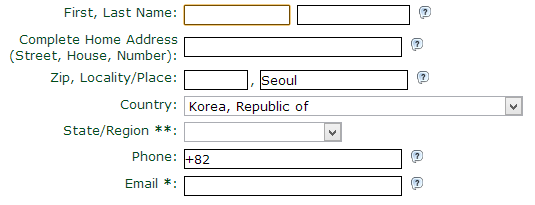


4. 이메일로 인증코드가 반송된다. 이메일을 확인한다.


5. 필자는 이런 내용의 이메일을 받았다.

> This electronic mail message was created by StartCom's Administration Personnel:
Thank you for registering with StartSSL. It seems that you provided the address details of an organization. However our terms and conditions require from our subscribers to disclose the private address of residence. Please reply to this message and send us the details of your personal residence.
<br><br>
내용은 당신이 보낸 메일이 진짜 자신의 메일인지 증명하기 위해서 아까 입력한 내용을 메일로 회신해주세요.


이것은 인증의 단계로 회원가입 시에 입력한 주소를 다시 적어서 메일로 회신하면 startssl 측에서 아래와 같이 물어볼 것이다.

> It's your company address or it's a personal residence?
<br><br>
이것이 회사 주소인가요? 집 주소인가요?


6. 아래와 같이 답변한다.

> My Personal residence.
<br><br>
집주소 입니다.


7. 그럼 인증에 성공했다는 메시지가 도착할 것이다. 내용은 아래와 비슷할 것이다.

>  Your request for an account at StartSSL™ (www.startssl.com) has been approved and is available during the next 24 hours at the following location:
<br><br>
https://www.startssl.com/?app=12&action=release
<br><br>
The verification code in order to continue the process is ***
<br><br>
Thank you!


8. 위의 주소로 ***로 표시한 부분이 자신의 인증코드이다. 인증코드를 복사한 후에 링크를 클릭해보자. 아래와 같은 메시지가 출력될 것이다.
인증코드를 붙여넣기 한다.


9. 비공개의 암호화 방식을 지정한다. 2048을 사용하자

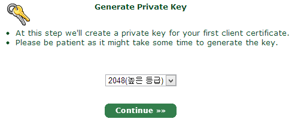
 
 
10.install 버튼을 누른다.

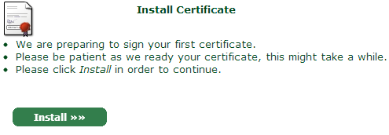


11. 축하 메시지가 출력되면 인스톨에 성공한 것이다.

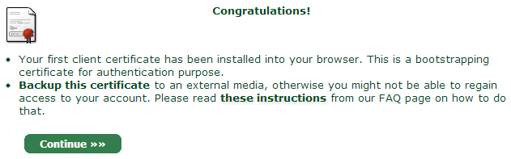

이 때 크롬의 경우 브라우저 상단에 클라이언트 인증서가 설치되었다는 메시지가 보일 것이다. 앞으로 startssl의 관라자에 접속할 때는 이 인증서를 
이용할 것이기 때문에 등록된 이메일에 해당하는 startssl 계정의 관리자로 접속할 때는 꼭 이 인증서가 설치된 브라우저로 접속해야 한다. continue를 누른다.

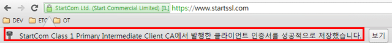


12. 도메인 주소를 입력한다.

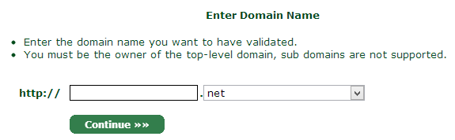


13. 인증 메일을 선택한다. 

자신의 도메인임을 증명하기 위해서 도메인과 연관된 이메일 주소 중에 하나를 선택한다. 꼭 사용할 수 있는 이메일 주소를 선택해야 한다. 
만약 사용할 수 있는 이메일 주소가 없다면 네임서버의 설정을 변경해야 한다. 

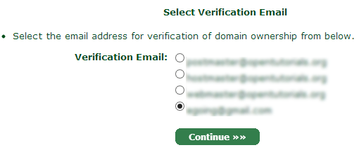


14. 수신 받은 이메일을 확인한다. 메시지는 아래와 유사할 것이다.

> This mail is intended for the person who requested verification of domain control at StartSSL™ (http://www.startssl.com).
<br><br>
Your verification code is ***<br>
Copy and paste this code now into the form at your open browser window.


15. *** 표시된 텍스트를 복사해서 Verification code 필드에 입력한다.

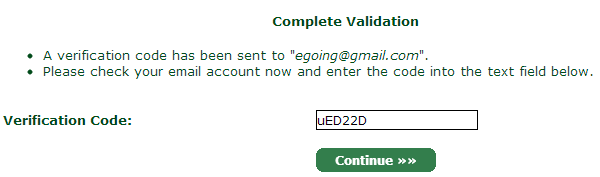


16. 아래와 같은 화면이 출력된다면 인증에 성공한 것이다. 30일 안에 인증서를 발급받아야 한다는 내용이다.

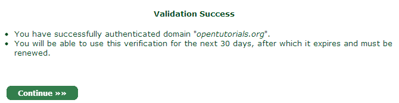

<label id="generate-privatekey"></label>
17. 비공개키를 발급 받는다. 비공개키는 직접 생성할 수도 있지만 startssl 제공하는 키를 사용하면 편리하다.

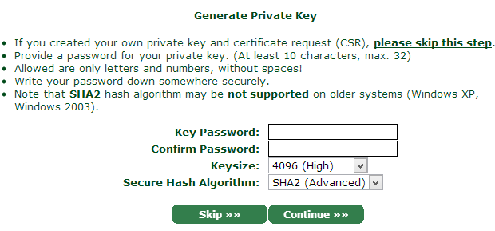

Key Password는 비공개키가 유출 되었을 때 비공개키를 보호해주는 수단이다. 비공개키가 있다고해도 이 비밀번호가 없다면 데이터를 복호화 
할 수 없다. 이 값을 설정하면 보안의 레벨은 상승 하지만 서버를 재부팅 할 때마다 Apache와 같은 웹서버에 비밀번호를 입력해줘야 하는 불편함이 있다. 
이 비밀번호는 꼭 기억해야 한다. keysize 는 2048, Secure Hash Algorithm은 sha1을 선택한다.


18. 비공개키를 복사한다.

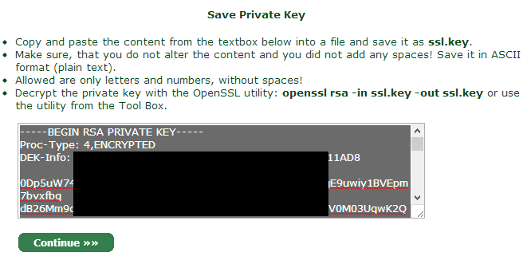

비공개키는 매우 중요한 정보다. 비공개키가 유출되면 ssl을 통해서 서버로 전달되는 정보가 해독될 수 있기 때문에 절대로 노출되서는 안된다. 
이 정보는 별도의 파일로 복사해서 저장한다. 파일명으로 필자는 ssl.key를 사용했다.


19. 도메인 추가

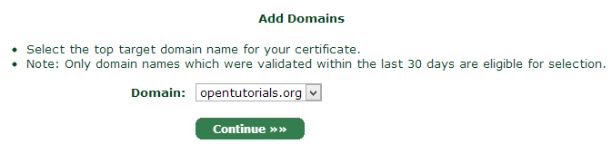

> 만약 opentutorials.org의 서브 도메인인 www.opentutorials.org로 ssl로 보호하고 싶다면 아래 화면에서 www를 입력한다.

> 아래와 같이 입력하면 StartSSL은 opentutorials.org와 www.opentutorials.org에 대해서만 보호 기능을 제공한다. 
만약 dev.opentutorials.org에 대해서 SSL 서비스를 하고 싶다면 인증서를 하나 더 만들어야 한다. 
www나 dev와 같은 부분을 호스트 네임이라고 하는데 모든 호스트 네임에 대해서 보호되는 인증서를 사용하고 싶다면 와일드 카드 인증서를 구입해야 한다. 
인증서를 비교한 차트에서 와일드 카드 항목을 참고하면 된다. http://www.startssl.com/?app=40

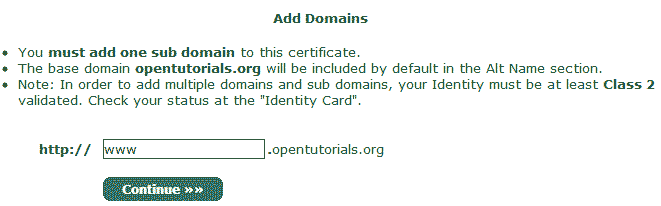


20. 인증서 발급을 위한 모든 정보의 입력이 끝났다. Continue를 누른다.

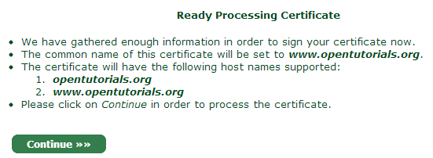


21. 인증서가 발급되었다. 이 내용을 복사해서 ssl.crt 파일에 저장한다. 

화면 하단에 "Save also the intermediate and root CA certificates for the installation at your server(Save AS...)" 라고 되어 
있는 부분의 내용을 클릭해서 파일로 저장한다.

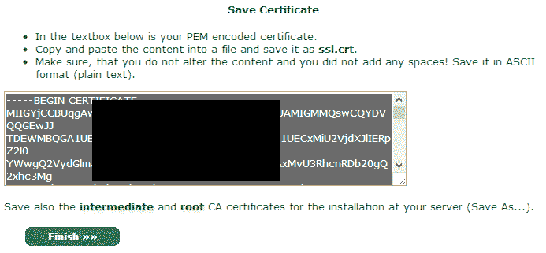

인증서 발급이 끝났다. 이제 StartSSL을 통해서 발급 받은 인증서를 이용해서 서버쪽 셋팅을 하면 SSL을 사용할 수 있다.


### 정리

이상의 절차를 통해서 얻은 정보는 크게 4가지다. 이 정보들을 이용해서 SSL을 제공하는 방법을 알아보자.

- ssl.key : 서버쪽 비공개키
- ssl.crt : 디지털 인증키
- ca.pem : ROOT CA 인증서
- sub.class1.server.ca.pem : 중계자 인증서


## 웹서버 셋팅

SSL을 서비스하는 마지막 단계는 웹서버에 인증서를 설치하는 것이다. SSL 통신을 할 때 사용할 인증서를 웹서버에게 알려주면 웹서버는 
정해진 절차에 따라서 SSL 통신을 하게 된다.

인증서를 웹서버에 설치하는 방법은 웹서버 별로 다르다. 이번 시간에는 가장 표준적인 웹서버인 Apache에 인증서를 설치하는 방법을 살펴볼 
것이다. 다른 웹서버에 인증서를 설치하는 방법은 인증기관에서 메뉴얼을 제공하기 때문에 그것을 참고하면 된다. StartSSL은 아래 URL을 
통해서 메뉴얼을 제공하고 있다.

http://www.startssl.com/?app=20

1. apache 설치
```bash
$ sudo apt-get install apache2;
```

2. 아파치의 SSL 모듈을 활성화 한다.
```bash
$ sudo a2enmod ssl
```

3. 아파치를 재시작 한다.
```bash
$ sudo service apache2 restart
```

4. SSL 인증서 관련된 파일을 위치시킬 디렉토리를 만든다.
```bash
$ sudo mkdir /etc/apache2/ssl
```

5. /etc/apache2/ssl 디렉토리에 인증서 파일들을 위치시킨다. 파일들의 경로는 아래와 같다.
- /etc/apache2/ssl/ca.pem
- /etc/apache2/ssl/ssl.crt
- /etc/apache2/ssl/ssl.key
- /etc/apache2/ssl/sub.class1.server.ca.pem

6. 보안을 위해서 디렉토리와 파일의 권한을 조정한다.

디렉토리와 파일의 소유자는 root로 지정한다.

```bash
$ sudo chown -R root:root /etc/apache2/ssl;
```

파일의 권한을 600(소유자만 읽기, 쓰기 허용)

```bash
$ sudo sudo chmod 600 /etc/apache2/ssl/*.*
```

디렉토리의 권한을 700(소유자만 읽기, 쓰기, 실행 허용)

```bash
$ sudo chmod 700 /etc/apache2/ssl;
```

필자의 경우 아래와 같은 상태가 되었다. 

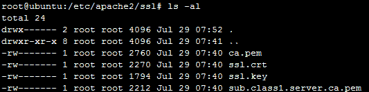

7. virtualhost를 설정한다. 하나의 웹서버(apache)에서 여러개의 서비스를 도메인 별로 운영할 수 있도록 돕는 apache의 기능이다. 
기본 설정 파일인 /etc/apache2/sites-available/default-ssl을 수정한다. 아래에서는 편집기로 nano를 사용하고 있다. nano에 대한 
사용법은 [nano 수업](https://opentutorials.org/course/128/3682)을 참고한다.

```bash
sudo nano /etc/apache2/sites-available/default-ssl
```

8. 파일의 내용에서 지시자의 값을 아래와 같이 변경한다.

```bash
SSLCertificateFile    /etc/apache2/ssl/ssl.crt
SSLCertificateKeyFile /etc/apache2/ssl/ssl.key
SSLCertificateChainFile /etc/apache2/ssl/sub.class1.server.ca.pem
SSLCACertificateFile /etc/apache2/ssl/ca.pem
```

9. 버추얼 호스트 default-ssl 을 활성화된 서비스로 등록한다.

```bash
sudo a2ensite default-ssl
```

10. apache를 재시작한다. 재시작 할 때 비밀번호를 물어보는 경우가 있다. 
이것은 [비공개키를 생성하는 단계](#generate-privatekey)에서 입력한 비밀번호를 입력하면 된다.

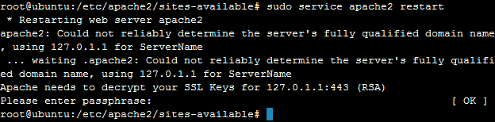

11. https 프로토콜로 접속한다. (구글 크롬 기준) 아래와 같이 녹색 자물쇠가 도메인 앞에 표시되고, 인증서와 관련된 팝업이 표시된다면 
SSL 서비스를 성공적으로 제공하기 시작한 것이다.

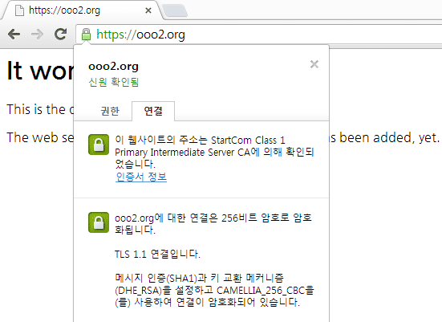


## 참고
- http://www.moserware.com/2009/06/first-few-milliseconds-of-https.html 
- SSL이란 무엇인가 [1](http://minix.tistory.com/395), [2](http://minix.tistory.com/397) (미닉스의 작은 이야기들)
- http://www.phpschool.com/link/tipntech/77347
- http://www.phpschool.com/link/tipntech/77348


## 부록 : SSL, HTTPS에 대한 7가지 미신

원본: https://blog.httpwatch.com/2011/01/28/top-7-myths-about-https/ 

--------------------------------------------------------------------------------------------------- 

미신 #7: HTTPS는 캐싱이 되지 않는다 

거짓입니다. 

Cache-Control 헤더를 사용하면 HTTPS도 모든 브라우저에서 캐싱이 가능합니다. 
오래된 익스플로러에서도 캐싱 잘만 됩니다. 

--------------------------------------------------------------------------------------------------- 

미신 #6: SSL 인증서는 비싸다 

거짓입니다. 

SSL 인증서의 가격은 기껏해야 도메인 하나 등록하는 비용과 비슷하고, 
업체에 따라서는 무료로도 인증서를 받을 수 있습니다. 

옮긴이 코멘트: 
국내에서는 Comodo PositiveSSL이 3-4만원대에 거래되고 있는데, 이건 순 바가지입니다. 
물론 해외 업체와 제휴해서 판매하시는 분들의 수고를 생각하면 어느정도 마진이 붙는 건 당연하지만, 
해외에서 직접 구매할 경우 100% 동일한 PositiveSSL 인증서를 적게는 $3.95, 보통 $7~$9에 구입 가능하죠. 
해외에서 구입하더라도 100% 동일한 제품이므로 kr 도메인 역시 100% 지원됩니다. 
국산이라고 광고하는 KISA 인증서는 브라우저 지원이 엉망이므로 패스... 

2016년 업데이트: 
무료인증서를 발급해 주던 StartSSL은 브라우저 개발사들과 대판 싸우고 망했습니다. 
앞으로 무료 인증서는 Let's Encrypt를 사용하세요. 
자주 갱신하기 귀찮다면 GoGetSSL에서 3년짜리 PositiveSSL 인증서를 14달러 내외에 구입하세요. 

--------------------------------------------------------------------------------------------------- 

미신 #5: HTTPS 사이트는 각각 공인IP가 필요하다 

거짓입니다. 

와일드카드 인증서를 사용하거나 다른 포트를 사용하거나 SNI를 사용하면 
공인IP 하나당 여러 개의 HTTPS 사이트를 사용 가능합니다. 

옮긴이 코멘트: 
카페24를 비롯한 대부분의 웹호스팅 업체들은 https://www.domain.co.kr:50123 이렇게 
도메인 뒤에 포트를 붙이는 방법으로 공인IP 하나에 여러 HTTPS 사이트를 사용하고 있습니다. 
포트 없이도 가능하도록 해주는 SNI 기술의 경우, 윈도우 XP 익스플로러를 지원하지 않기 때문에 
국내에서는 당분간 도입이 어려울 것 같네요. (같은 익스8이라도 XP에서는 안되고 윈7에서만 됩니다.) 
와일드카드 인증서는 쓸데없이 비싸므로 패스... 

2016년 업데이트: 
무료인증서인 Let's Encrypt는 인증서 1개당 100개까지 도메인을 사용할 수 있습니다. 
윈도우 XP에서도 완벽하게 지원되는 SAN 방식이므로 
도메인이 여러 개라면 유료인증서보다 오히려 무료인증서가 더 쓸모가 많습니다. 
참고로 SAN 방식의 유료인증서는 해외 최저가가 30~40달러선이예요. 

--------------------------------------------------------------------------------------------------- 

미신 #4: 서버를 옮기거나 증설하면 SSL 인증서를 새로 구입해야 한다 

거짓입니다. 

SSL 인증서는 다른 서버로 얼마든지 복사할 수 있습니다. 
(원본글에는 IIS에서 인증서를 복사하는 스샷이 나옵니다.) 

옮긴이 코멘트: 
일반적인 SSL 인증서는 특정 도메인과 연결되는 것이지, 특정 서버나 공인IP에 연결되는 것이 아니예요. 
서버 옮길 때마다 인증서 새로 사라고 하는 사람이 있다면 사기꾼입니다. 
물론 인증서나 개인키를 특정 서버에만 저장해 놓았는데 서버를 날려먹었다면 관리하는 사람 잘못이죠... 

--------------------------------------------------------------------------------------------------- 

미신 #3: HTTPS는 느리다 

거짓입니다. 

현대의 CPU에서 암호화를 수행하는 데 필요한 로드는 무시해도 좋을 만큼 적습니다. 
그러나 최초 커넥션에 시간이 많이 걸리다는 것은 사실입니다. 
자체 테스트에 따르면 첫 페이지 로드에 10% 정도 시간이 더 걸리지만, 
keepalive를 사용할 경우 두 번째 페이지부터는 속도 차이를 거의 느낄 수 없습니다. 
프록시 서버를 사용할 경우에는 프록시 설정에 따라 오히려 HTTPS가 더 빠른 경우도 있습니다. 

옮긴이 코멘트: 
정말인지 테스트해 보았습니다. 다음 글을 봐주세요. 

2016년 업데이트: 
단, 해외서버인 경우 일부 통신사에서는 443번 포트에 QoS가 좀더 심하게 걸리기 때문에 
QoS가 약하게 걸리는 80번 포트에 비해 속도 저하가 발생할 수 있습니다. 

--------------------------------------------------------------------------------------------------- 

미신 #2: HTTPS를 사용할 때는 보안이 잘 되므로 아무거나 쿠키에 막 넣어서 보내도 된다 

거짓입니다. 

HTTPS를 사용하면 스니핑을 할 수 없을 뿐이지, 
그 밖의 방법으로 세션을 가로챌 경우 동일한 보안 취약점이 발생할 수 있습니다. 
URL도 마찬가지입니다. 해커가 URL을 훔쳐볼 수는 없지만, 다른 곳에 로그가 남을 수 있으니 
아무리 HTTPS를 사용하더라도 중요한 정보를 URL에 넣어서 전송하는 것은 안됩니다. 

옮긴이 코멘트: 
예를 들어 XSS 취약점이 있다면 쿠키를 훔치는 건 전혀 어렵지 않지요. 

--------------------------------------------------------------------------------------------------- 

미신 #1: 로그인 페이지에만 HTTPS를 사용하면 된다 

거짓입니다. 

로그인하고 나서 HTTP로 돌아온다면 세션 쿠키를 얼마든지 훔칠 수 있으니 
쿠키를 훔쳐서 해당 사용자의 계정에 얼마든지 접근할 수 있습니다. 
굳이 ID와 비번을 훔칠 필요도 없지요. 

옮긴이 코멘트: 
바로 이 문제 때문에 2-3년 전부터 Gmail, Twitter, Github 등 상당수의 해외 사이트들이 
로그인 페이지뿐만 아니라 웹사이트 전체를 HTTPS로 전환했습니다. 
HTTPS 안 쓰고 끝까지 버티던 페이스북도 어느 순간 슬그머니 HTTPS를 적용하기 시작했죠. 
국내의 네이버, 다음 등은 이런 부분에 전혀 신경쓰지 않고 로그인 보안만 강조한다는 점이 아쉽네요. 
재작년쯤 국회에서 어떤 분이 옆자리에 앉은 분의 포털 세션을 가로채는 시범을 보였는데, 
뉴스에 반짝 나왔을 뿐, 아무도 반성의 기미를 보이지 않고 있습니다. 

----------------------

추가미신 #8: 라운드로빈 등을 하는 웹서버가 여러대면 각각에 대해서 인증서를 사야 한다?

거짓입니다. 

인증서는 도메인에 대한 것이고, 물리서버와는 아무 상관이 없습니다. 
같은 도메인으로 운용되는 서버들이라면 1대만 발급 받고 나머지는 그냥 copy해서 쓰면 됩니다. 

-------------------

추가미신 #9: ssl 인증서의 보험으로 보상을 받을 수 있습니다. 

절대 못받는다는 것이 개인적 생각입니다. 
SSL의 통신과정중에 일어난 해킹에 대해서만 보상이 되는데 그것은 입증하기도 어렵고 실제 해킹도 안합니다. 
보험을 가입하는 것은 위약효과 입니다. 

--------------

추가미신 #10: SSL 인증을 하는 서버는 믿을 수 있습니다. 

전혀 그렇지 않습니다. SSL 인증과 회사의 신뢰도는 아무런 상관이 없습니다. 
회사의 재무상태가 궁금하면 신용평가보고서를 보는 것이 필요할 뿐 입니다.

