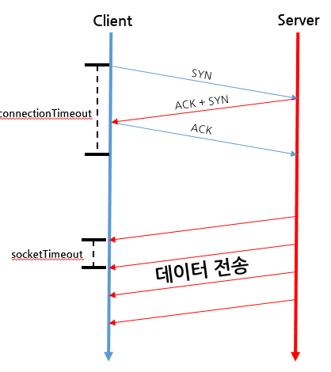

# HttpClient에서 사용하는 timeout 에 대한 고찰

> Tags:
ConnectionRequestTimeout, ConnectTimeout, SocketTimeout, httpclient, setConnectTimeout, setConnectionRequestTimeout, setSocketTimeout

참고자료
- https://www.ibm.com/support/knowledgecenter/ko/SSYGQH_5.5.0/admin/overview/t_configure_proxy_push-note_mobile.html IBM ConnectionRequestTimeout, ConnectTimeout, SocketTimeout 정의 참고
- http://kwonnam.pe.kr/wiki/java/apache_http_client



## ConnectionRequestTimeout
```xml
IBM 정의 :
<!-- Proxy Http Client: The timeout in seconds used when requesting a connection from the connection manager/pool. -->
<ConnectionRequestTimeout>300</ConnectionRequestTimeout>
```
ConnectionManager(커넥션풀)로부터 꺼내올 때의 타임아웃

## ConnectTimeout
```xml
<!-- Proxy Http Client: The timeout in seconds to establish a connection with the Proxy Server. -->
<ConnectTimeout>100</ConnectTimeout>
```
HTTP request를 날릴때 Client(송신측,browser) 에서 Server(수신측)로  서로 간에 연결(connect) 상태가 되어야 한다.
연결을 구성하기 위해서 보통 TCP Connection 과 동일하게 3-way Handshake 방식을 수행한다. 3-way Handshake를 정상적으로 수행하게 되면 Client와 Server가 연결된 상태가 되는데,
**이 때까지 소요된 시간을 ConnectionTimeout** 으로 설정한다.

## SocketTimeout
```xml
<!-- Proxy Http Client: Defines the socket timeout in seconds, which is the timeout for waiting for data or, put differently, a maximum period inactivity between two consecutive data packets). -->
<SocketTimeout>300</SocketTimeout>
```
Client(송신측,browser)와 Server(수신측)가 연결된 상태 이후 서버가 Client에 response 보낼때 한번에 Data를 보내는 것이 아니라 여러 개의 패킷으로 나눠서 전송하게 되는데,
각 **패킷이 전송될 때 시간 Gap이 생길 수 있는데, 이 시간의 임계치를 SocketTimeout**로 설정한다.