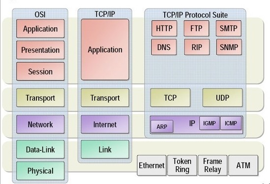

# 네트워크 계층별 프로토콜(Layer Protocol)

참고
- https://needjarvis.tistory.com/158?category=619248

## 레이어별 프로토콜 개념

네트워크 프로토콜을 설명하기 위해서는 우선 OSI 7 Layer와 TCP/IP의 4 Layer를 이해하고 있어야 한다.
특히 OSI 7 Layer를 이해하고 있으면, 해당 위치에 어느 프로토콜이 존재하는 것만으로 해당 프로토콜의 역할이 쉽게 이해가 되기 때문이고,
각각의 계층별로 데이터를 전송하는 방식이 다르기 때문이기도 하다.

OSI(Open Systems Interconnction) 7 Layer는 ISO(국제표준기구)에서 만든 네트워크를 7계층으로 만든 모델이고, 프로토콜(Protocol, 통신규약)은
상호간의 접속이나 전달방식, 통신방식, 주고받을 자료의 형식, 오류 검출 방식, 코드 변환방식, 전송속도 등에 대하여 이미 정해진 약속이기 때문에
레이어별 프로토콜은 한마디로 OSI 7 계층의 계층간에 존재하는 네트워크 통신을 위한 규약을 뜻한다.

## OSI 7 Layer별 프로토콜 구조

## OSI와 TCP/IP 프로토콜의 구조

- TCP/IP는 OSI 7 Layer를 4개로 단순화 하여 구현
- TCP/IP는 3,4 계층을 중심으로 한 통신 프로토콜의 계층 집합

## OSI 7 Layer별 주요 프로토콜 설명

1. 응용 계층(Application Layer)