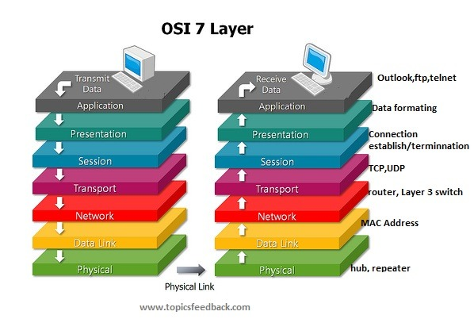
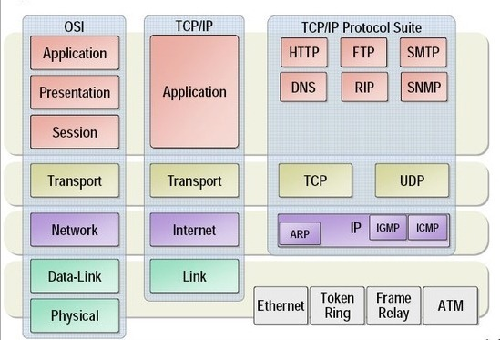

# OSI 7 Layer 와 TCP/IP

## OSI 7 Layer란?

OSI 7 Layer는 국제표준화기구(ISO)에서 개발한 모델로서 추상적인 모델이다.
개발로 따지면, Interface를 정의한 것으로 볼 수 있는데 "이렇게 만들면 된다" 정도의 가이드라고 생각하면 된다.

## OSI 7 Layer의 탄생배경

OSI 7 Layer가 탄생한 이유는, 호환성 문제 때문이었다. 여러 통신 업체의 장비들이 상호호환성이 없었기 때문에 벤더간의 종속성 및 비용 증가로 연결 되었다.
ISO에서 이로 인해서 표준을 만든 것이고, 7개의 계층으로 구분을 한 것이다.

## TCP/IP 4 layer

추후에 OSI 7 Layer의 표준 지체 및 복잡함등을 인해서, TCP/IP가 등장하게 되었는데 위 이미지는 7 Layer와 TCP/IP의 구졸르 비교한 것이다.
(TCP/IP는 OSI에서 만든 모델이 아님) 사실 둘의 큰 차이점은 OSI는 7개 계층으로 세분화하여 설명을 하였고, TCP/IP는 조금 더 심플하게 접근을 하였다는 차이가 있을 수 있다.

결국 실무적으로 많이 쓰는 방식은 TCP/IP가 되었는데, OSI 7 Layer도 쓰이는 곳이 분명 있다. OSI 7 Layer는 공식적인 표준이기 때문에 기준을 잡기에 좋은데 한 예로 L4 스위치를
말할 때 L4는 OSI는 Trasport 영역을 말하는데 좀더 세분하게 나누기 때문에 특정 장비를 설명하기 용이하다.

레이어 | 설명 | 주요 프로토콜
---|---|---
L1: 물리 계층 | 네트워크의 기본 네트워크 하드웨어 전송 기술을 이룬다. 네트워크의 높은 수준의 기능의 논리 데이터 구조를 기초로 하는 필수 계층이다. 다양한 특징의 하드웨어 기술이 접목되어 있기에 OSI 아키텍처에서 가장 복잡한 계층으로 간주한다. | RS-232, X25, X21
L2: 데이터 링크 계층 | 포인트 투 포인트(Point to Point) 간 신뢰성있는 전송을 보장하기 위한 계층으로 CRC 기반의 오류 제어와 흐름 제어가 필요하다. | Ehternet, Token Ring, PPP, HDLC
L3: 네트워크 계층 | 여러개의 노드를 거칠때마다 경로를 찾아주는 역할을 하는 계층으로 다양한 길이의 데이터를 네트워크를 통해 전달하고, 그 과정에서 전송 계층이 요구하는 서비스 품질(QoS)을 제공 | IP, ICMP, IGMP, BGP, OSPF, RIP, IPSec
L4: 전송 계층 | 양 끝단(End to end)의 사용자들이 신뢰성있는 데이터를 주고 받을 수 있도록 해 주어, 상위 계층들이 데이터 전달의 유효성이나 효율성을 생각하지 않도록 해준다. | TCP, UDP, RTP, SCTP
L5: 세션 계층 | 양 끝단의 응용 프로세스가 통신을 관리하기 위한 방법을 제공한다. 동시 송수신 방식(duplex), 반이중 방식(half-duplex), 전이중 방식(Full Duplex)의 통신과 함께, 체크 포인팅과 유휴, 종료, 다시 시작 과정 등을 수행한다. | RPC, NetBIOS, Winsock
L6: 표현 계층 | 코드 간의 번역을 담당하여 사용자 시스템에서 데이터의 형식상 차이를 다루는 부담을 응용 계층으로부터 덜어 준다. MIME 인코딩이나 암호화 등의 동작이 이 계층에서 이루어진다. | JPEG, MPEG, XDR, ASCII
L7: 응용 계층 | 응용 프로세스와 직접 관계하여 일반적인 응용 서비스를 수행한다. | HTTP, SMTP, SNMP, FTP, TELNET, SSH

