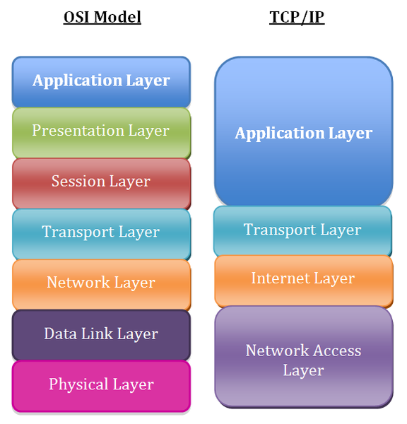
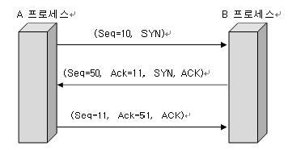

# TCP의 3 way Handshake과 4 way Handshake

참고자료
- https://needjarvis.tistory.com/157

## 선행지식

### TCP/IP 의 개념
 - TCP/IP는 네트워크를 상호 연결시켜 정보를 전송 할 수 있도록 하는 기능을 가진 다수의 프로토콜이 모여있는 프로토콜 집합
 - 인터넷은 데이터 링크 계층을 지원하는 네트워크를 TCP/IP 프로토콜을 이용하여 상호 연결하는 네트워크
 - 인터넷 상의 서로 다른 운영체제를 쓰는 컴퓨터간 데이터 전송을 가능하게 하는 정보전송을 위한 인터넷 표준 프로토콜

> 한마디로, 네트워크를 상호 연결(서로간에 연결) 시켜 전송 할 수 있도록 다양한 기능을 가진 프로토콜들을 모은 집합체이다.
TCP/IP는 OSI 7 Layer처럼 추상적인 레이어 역활을 하는 것이 아닌 실용적인 네트워크 연결을 위해 만들어졌다.

### TCP와 UDP의 차이점

TCP/IP에는 TCP와 UDP가 존재하는데 **TCP**는 **신뢰성**이 있는 연결을 지향하며, **UDP**는 **빠른 전송**을 지향하는 것에서 차이점이 있다.

> UDP의 한 예로 스트리밍 방송이 있는데, 방송을 하다가 중간에 신호가 끊어져도 다음으로 그냥 이어서 방송을 하는 것처럼 UDP는 일방적인 데이터 전송한다.

> 그래서 UDP는 알고리즘이 간단한 반면, TCP는 연결부터 끊는 과정까지 상대적으로 복잡하다.

### TCP의 3 Way (Three Way) Handshake

연결을 하여, 데이터를 전송하기 위해서 TCP는 3 Way Hanshaking 이라는 과정을 거친다.

1. A 프로세스가 연결요청 메시지 전송 (SYN)
1. B 프로세스가 수락 (SYN + ACK)
1. A 프로세스가 수락확인을 보내 연결 맺음 (ACK)

> - SYN(Synchronization) : 연결요청, 세션을 설정하는데 사용되며 초기에 시퀀스 번호를 보냄
> - ACK(Acknowledgement) : 보낸 시퀀스 번호에 TCP 계층에서의 길이 또는 양을 더한 것과 같은 값을 ACK에 포함하여 전송

### TCP의 4 Way (Four Way) Handshake

연결을 종료하기 위해서도, 3 Way Handshake 처럼, 4 Way Handshaking 이라는 과정을 거친다.

1. Client(Initiator)가 연결을 종료하겠다는 FIN 플래그를 전송한다.
1. Server(Receiver)는 일단 확인메시지를 보내고 자신의 통신이 끝날때까지 기다리는데 이때, Client 상태가 TIME_WAIT 상태(Server는 CLOSE_WAIT 상태)
1. Server 통신이 끝났으면 연결이 종료되었다고 Client에게 FIN 플래그를 전송
1. Client는 확인했다는 메시지를 보냄

> - FIN(Finish) : 세션을 종료시키는데 사용되며 더 이상 보낸 데이터가 없음을 표시

