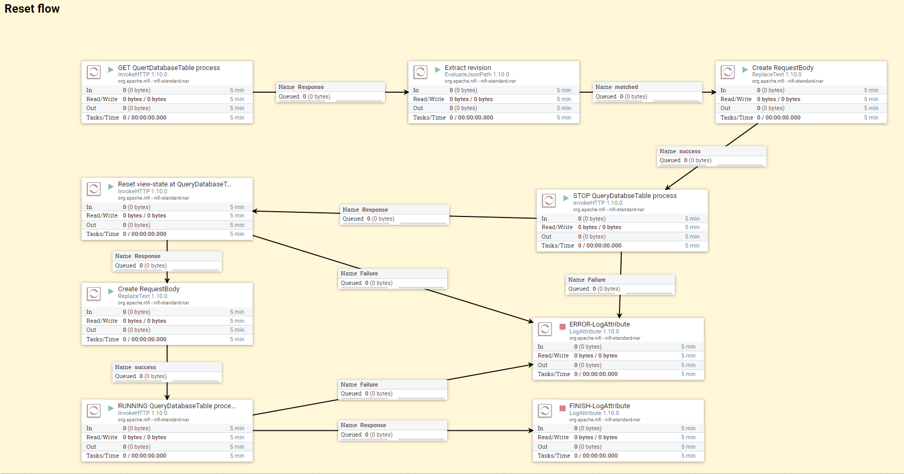

# Reset "Component State" of QueryDatabaseTable processor
이번 예제는 Nifi Proccessor API도 같이 활용, processor 사용방법 뿐만 아니라 Nifi rest-api 사용 방법까지 같이 설명한다.

이 예제를 참고로 해서 Processor 들을 자동으로 컨트롤 하고 싶을때 참고하면 좋다.

## index
1. [Overview](#index-overview)
1. [API Flow](#index-apiflow)
1. [ETL Flow](#index-etlflow)

<a id="index-overview"></a>
## Overview
QueryDatabaseTable 에서 쿼리를 할경우 "Component State" 에 마지막으로 가져온 primary key 값을 기록하고 있다.

이는 중복 row를 가져오지 않기 위함이나 때때로 초기화가 필요한 순간도 있다. curl 를 통해  nifi rest-API를 직접 호출해서 초기화하는 방법도 있지만 crontab 방식으로 매일 특정시간에 자동으로 초기화해주는 프로세스를 만들 필요가 있을때 사용한다.


> nifi rest-API
https://nifi.apache.org/docs/nifi-docs/rest-api/index.html

<a id="index-apiflow"></a>
## API flow
QueryDatabaseTable 가 `start` 상태라면 `stop` 상태로 변경해 줘야 `state` 값 삭제가 가능하다. 그렇기 때문에 processor를 `stop` 시키는 API 호출이 우선시 되어야 한다. 
그런데 `stop` 시키는 API에 들어가는 parameter 값에  현재 processor의 `revision` 정보를 필요로 한다. 그렇기 때문에 현재 `revision` 정보를 가져오기 위한 API 호출이 제일 처음 시작한다. 

> GET/processors/{id}

`{id}` 값에 QueryDatabaseTable Id 값을 넣어주고 호출 하면 response 값으로 `revision` 값을 넘겨주고 이 값만 재사용해서 컨트롤 하면된다.

reseponse body: 
```json
{
    "revision": {
	    "clientId": "value",
	    "version": 0,
	    "lastModifier": "value"
	},
    "id": "value",
    "uri": "value",
    "position": {…},
    "permissions": {…},
    "bulletins": [{…}],
    "disconnectedNodeAcknowledged": true,
    "component": {…},
    "inputRequirement": "value",
    "status": {…},
    "operatePermissions": {…}
}
```

response body 로 넘겨받은 `revision`, `id` 값을 가지고 processor 를 `stop` 상태로 변환하기 위한 api 를 호출한다. (`id`값을 이용하면 복사해서 작업할 때 변경해야할 constant 가 줄어든다는 장점이 있다. )

> PUT/processors/{id}/run-status

request body:
```json
{
    "revision": {
	    "clientId": "value",
	    "version": 0,
	    "lastModifier": "value"
	},
    "state": "stop",
    "disconnectedNodeAcknowledged": true // 생략가능
}
```
정상적인 처리로 response를 받게 되면 아래와 같이 받게 된다. 

response body:
```json
{
    "revision": {
	    "clientId": "value",
	    "version": 0,
	    "lastModifier": "value"
	},
    "id": "value",
    "uri": "value",
    "position": {…},
    "permissions": {…},
    "bulletins": [{…}],
    "disconnectedNodeAcknowledged": true,
    "component": {…},
    "inputRequirement": "value",
    "status": {
	    "groupId": "value",
	    "id": "value",
	    "name": "value",
	    "type": "value",
	    "runStatus": "value",
	    "statsLastRefreshed": "value",
	    "aggregateSnapshot": {…},
	    "nodeSnapshots": [{…}]
	},
    "operatePermissions": {…}
}
```

정상적으로 response를 받았다면 QueryDatabaseTable `state` 값을 리셋시키는 API를 호출한다.

>/processors/{id}/state/clear-requests

정상적인 reponse가 왔다면 목표하던 리셋까지 해결 된 것이다. 

> PUT/processors/{id}/run-status

이후 QueryDatabaseTable 를 `run` 시키면 timer 설정에 의해 다시 시작할 것이다.

<a id="index-etlflow"></a>
## ETL flow
실제로 nifi rest-API 호출를 어떻게 구현시키는지 설명한다.



- **InvokeHTTP 1.10.0** rest api 호출을 하고 output으로 reponse data를 전달한다.
- **EvaluateJsonPath 1.10.0** json 데이터에서 필요한 데이터를 processor properties에 등록한다.
- **ReplaceText 1.10.0** output 으로 넘어온 데이터에서 Search Value 로 걸러진 데이터를 replace 하는데, 이번 예제에서는 post를 보낼 body를 만들기 위해 사용했다.
