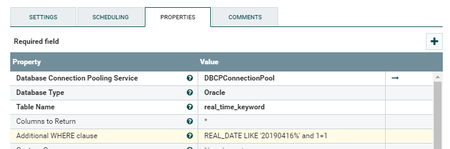
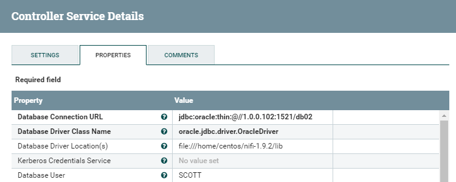
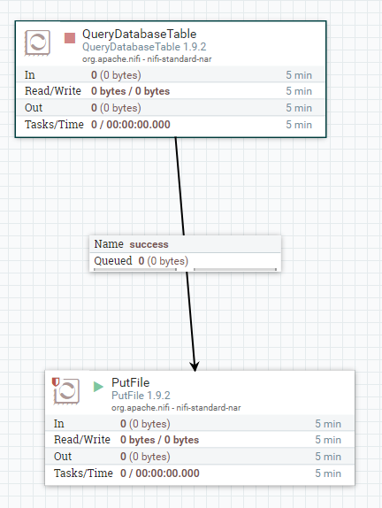

# Oracle JDBC Connector 연결 및 테스트

tags: ojdbc6.jar, oracle, jdbc, connector, dbcp pool

## 참고자료
- https://da-nika.tistory.com/37  Nifi와 oracle 연동하기
- oracle ojdbc driver 다운로드

## 1. 오라클 OJDBC 드라이브 nifi/lib 폴더안에 복사
    
1. AWS 서버에 ojdbc6.jar 파일 업로드

로컬피시에서 AWS EC2 서버에 파일 업로드 한다. 
```bash
$ scp -i MyDocuments/aws-sc2.pem MyDocuments/ojdbc6.jar ec2-user@154.180.93.83:~/ 
```

2. 파일 복사

업로드된 ojdbc6.jar 파일을 nifi/lib 폴더안에 넣는다.
```bash
$ cp ojdbc6.jar /usr/local/nifi-1.9.2/lib/

# 서버가 start 된 상태라면 restart 한다.
$ /usr/local/nifi-1.9.2/bin/nifi.sh restart
...

```
## 2. 오라클 연동
1. http://[ip:port]/nifi 접속
2. Process > QueryDatabaseTable 드래그 > 더블클릭 > configure 탭 클릭

3. `Database Type` > Oracle 버전에 맞게 선택
4. `Table Name` , `Additioal WHERE clause` 입력
5. Database Connection Pooling Service  > DBCPConnectionPool 선택 > 화살표 클릭해 DBCP 셋팅

6. `Database Connection URL` > jdbc:oracle:thin:@//IP:PORT/SID
7. `Database Driver Class Name` > oracle.jdbc.driver.OracleDriver
8. `Database User` / `Password` 입력


## 3. 테스트 oracle table to output file
1. Process > PutFile 드래그
1. `PutFile` 더블클릭 > PROPERTIES 탭 클릭
1. `Directory` /home/ec2-user/nifi_temp/
1. 맵에 만들어놨던 `QueryDatabaseTable` 와 `PutFile` 연결

1. `QueryDatabaseTable` , `PutFile` start 버튼 클릭


## :bomb: troubleshooting

### 1. jdbc잘 넣었는데 안될때 
- nifi restart 해준다. ojdbc lib 파일을 여러 버전으로 올렸을 경우 하나만 남기고 다 지워보자

### 2. `failed to process session due to oracle.jdbc.driver.t4cconection`
- jdbc 버전이 안 맞거나 서로 충돌하는 경우다. 하나만 남기고 다 지워보자

### 3. `cannot create poolableconnectionfactory`
- sid 부분에 콜론 대신 `/`를 넣어준다.


 


