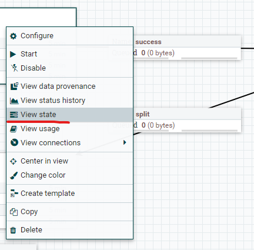

# nifi processor 정리
참고 : 
- https://www.popit.kr/%EC%BD%94%EB%93%9C-%ED%95%9C%EC%A4%84-%EC%97%86%EC%9D%B4-%EC%84%9C%EB%B9%84%EC%8A%A4-dashboard-%EB%A7%8C%EB%93%A4%EA%B8%B02/
- https://eyeballs.tistory.com/290 (유용한 정보들)
- https://eyeballs.tistory.com/397?category=875897 (security 적용하는 방법(TLS), 아무나 nifi 접근 하지 못하도록 하는 방법, 그냥 IP접근 제한을 하는게 더 나을지도 ;) )
### 용어
- properties
- attributes : 데이터의 흐름(List queue 메뉴) 에서 "i" 아이콘을 누르면 확인가능하다. , processor에서 접근시 `${attributeName}` 형태로 접근
- contents : 데이터 내용, processor 에서 접근시 `$.변수명` 형태로 접근

## 1. QueryDatabaseTable
DB에서 쿼리를 통해 데이터를 추출.

### properties
- Database Connection Pooling Service : 접속할  datasource connection pool 선택 (선택할 connection pool 이 없다면 `NiFi Flow Configuration`에서 생성한다.)
- Database Type : Database 선택
- **Table Name (중요)** : 임의의 쿼리를 실행해 컬럼들을 가져오려면 `Table name` 을 `dummy`로 입력한다.
- Custom Query : `Table name`을 `dummy`로 입력했다면 원하는 쿼리를 이 필드안에 작성할 수 있다.
- Maximum-value Columns : 시쿼스 컬럼을 지정. 설정된 값은 QueryDatabaseTable > 우측클릭 > `View state` 에 보면 key:value 값으로 현재 상태를 기록하고 있다. 
**해당 컬럼은 Custom Query 에서 order by 로 꼭 지정해줘야 한다.** (이유는 모르겠다.)

- output(content type): `application/avro-binary` 

## 2. SplitAvro
[QueryDatabaseTable](#idx-QueryDatabaseTable) output 은 `application/avro-binary` 로 리턴되는데 이게 하나의 파일에 리스트로 리턴된다. 이것을 각각의 파일로 split 시키기 위해 `SplitAvro` 를 사용한다. 나중에 각각의 파일로 접근해 데이터 변형이라던지 sql문으로 convert 시키기 위함이다.
- 특별히 속성을 수정할 필요는 없다.

## 3. InvokeHTTP 1.10.0
RestAPI 호출시 사용한다.

### 주의사항
- request Header 추가 방법 : process Propery name에 원하는 header name 추가하면 된다.
- reponse header 확인 방법 : relationship connection 에 `List queue` 에서 리스트 제일 앞 `i` 아이콘을 눌러 확인해보면 atturibute 로 기본적인 response header 값 확인이 가능하다. `Response` relationship `List queue`에서는  `view content` 를 통해서 response body도 확인 가능하다. 

### properties
- HTTP Method : 호출 method 선택
- RemoteURL : 호출할 RestAPI url 입력

## 4. EvaluateJsonPath
json data 에서 속성(Attribute)으로 추출 하기 위한 Processor. 변수 대입이라고 할수 있다. 파일을 받은 Processor 에서는 추후 `$.변수명`(또는 `${변수명}`) 형태로 가져올 수 있다.

### properties
- Destination : flowfile-attribute 값으로 설정하자 

## 5. RouteOnAttribute
Attribute 값을 가지고 분기 처리 하는 Process.

### properties
- Routing Strategy : routing 방법을 설정한다. 기본 값 `Route to Property name` 으로 설정하자. 
- `+` 버튼으로 route 할 property name 작성하고 value에는 이전 processor 에서 받은 데이터에 attribute에서 연산식(`${변수명:contains('foo')}`) 등을 이용해서 해당 되는 Property에 `true` 값이 되도록 하고 `relationship` 되도록 한다.

## 6. ReplaceText
넘어온 Content 를 변경하는 processor로 주로 json body를 만들어야 할때 이용했다.

### properties
- Search Value : FlowFile content 내 정규식 패턴으로 수정할 곳을 검색하는 것 같은데, 기본 설정 `(?s)(^.*$)`에서 손대지 말자
- Replacement Value: FlowFile content 내용을 작성한다. 넘어온 Attribute 를 대입하려면 `${속성명}` 을 이용한다.
- 기타 Property는 수정하지 않는다.