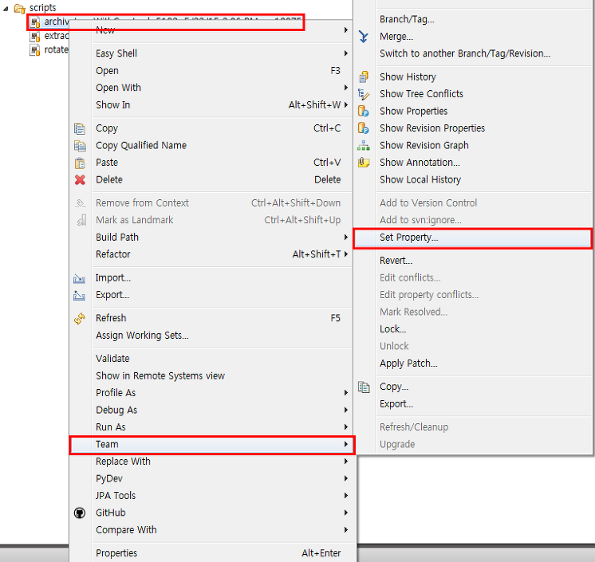
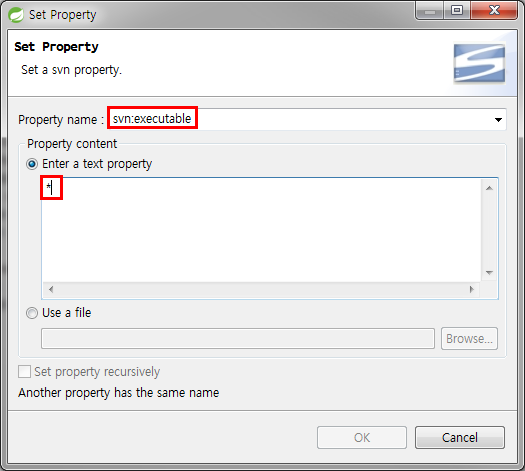
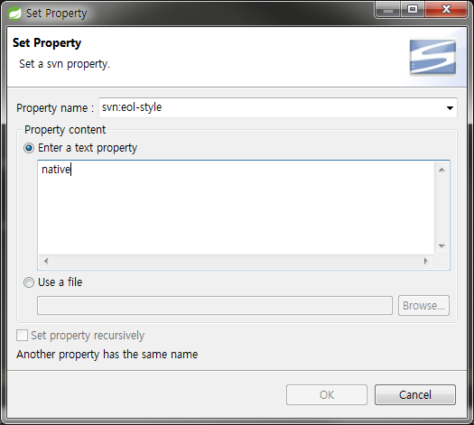

# SVN 사용법

## 용어정리
* `저장소` : 리포지토리(Repository)라고도 하며 모든 프로젝트의 프로그램 소스들은 이 저장소 안에 저장이 됩니다. 그리고 소스뿐만이 아니라 소스의 변경 사항도 모두 저장됩니다. 네트워크를 통해서 여러 사람이 접근 할 수 있습니다. 버전 관리 시스템 마다 각각 다른 파일 시스템을 가지고 있으며 Subversion은 Berkeley DB를 사용합니다. 한 프로젝트 마다 하나의 저장소가 필요합니다.

* `리비전(Revision)` : 소스 파일등을 수정하여 커밋하게 되면 일정한 규칙에 의해 숫자가 증가 합니다. 저장소에 저장된 각각의 파일 버전이라 할 수 있습니다. Subversion의 경우 파일별로 리비전이 매겨지지 않고 한번 커밋 한 것으로 전체 리비전이 매겨 집니다. 리비전을 보고 프로젝트 진행 상황을 알 수 있습니다.

* `trunk` : 단어 자체의 뜻은 본체 부분, 나무줄기, 몸통 등 입니다. 프로젝트에서 가장 중심이 되는 디렉토리입니다. 모든 프로그램 개발 작업은 trunk 디렉토리에서 이루어집니다. 그래서 위의 구조에서 trunk 디렉토리 아래에는 바로 소스들의 파일과 디렉토리가 들어가게 됩니다.

* `branches` : 나무줄기(trunk)에서 뻗어져 나온 나무 가지를 뜻합니다. trunk 디렉토리에서 프로그램을 개발하다 보면 큰 프로젝트에서 또 다른 작은 분류로 빼서 따로 개발해야 할 경우가 생깁니다. 프로젝트안의 작은 프로젝트라고 생각하면 됩니다. branches 디렉토리 안에 또 다른 디렉토리를 두어 그 안에서 개발하게 됩니다.

* `tags` : tag는 꼬리표라는 뜻을 가지고 있습니다. 이 디렉토리는 프로그램을 개발하면서 정기적으로 릴리즈를 할 때 0.1, 0.2, 1.0 하는 식으로 버전을 붙여 발표하게 되는데 그때그때 발표한 소스를 따로 저장하는 공간입니다. 위에서 보면 tags 디렉토리 아래에는 버전명으로 디렉토리가 만들어져 있습니다.

## 명령어

* `Import` : 맨 처음 프로젝트 시작할때 저장소에 등록하는 명령어 한 번 하고 나면 쓸일이 잘 없을 듯.

```bash
svn import sampledir svn+ssh://svn-domain/svn/sample/trunk
```

*  `Checkout` : 저장소에서 소스를 받아 오는 명령어. 받아온 소스에는 소스 뿐만이 아니라 버젼관리를 위한 파일도 같이 받아 온다. 지우거나 변경시 저장소와 연결 불가능

```bash
svn checkout svn+ssh://svn-domain/svn/sample/trunk sample
```

*  `Export` : 체크아웃과는 달리 버젼관리 파일을 뺀 순수한 소스만 가져오는 명령어 마지막에 사용.

```bash
svn export svn+ssh://svn-domain/svn/sample2/trunk sample
```

*  `Commit` : 체크아웃 한 소스를 수정, 파일 추가, 삭제 등을 한 뒤 저장소에 저장하여 갱신 하는 명령어. Revision이 1 증가 한다.

```bash
svn commit
```

* `Update` : 체크아웃 해서 받은 소스를 최신의 소스로 업데이트 하는 명령어. 소스 수정이나 Commit 하기전에 한 번씩 해줘야 할 듯. 잘 못하면 소스 망치는 경우가 있을 듯.

```bash
svn update
```

* `Log` : 저장소에 어떠한 것들이 변경 되었는지 확인 할 수 있는 log 명령어

```bash
svn log
```

* `Diff` : diff 명령은 예전 소스 파일과 지금의 소스 파일을 비교해 보는 명령어

```bash
svn diff --revision 4 sample.c
```

* `Blame` : Blame은 한 소스파일을 대상으로 각 리비전 대해서 어떤 행을 누가 수정했는지 알아보기 위한 명령어

```bash
svn blame sample.c
```

* `lock` : 파일에 락을 걸어 락을 건 사용자만이 수정할 수 있게 해주는 명령어. 해제는 svn unlock

    왜 파일에 락을 걸었는지 로그를 기록 할 수 있다.

```bash
svn lock hello.c
```

* `Add` : 새 파일을 만들었을 경우에 파일을 추가 해주는 명령어. 그 뒤엔 꼭 svn commit를 꼭 해줘야 한다.

    새 파일을 생성해서 올릴 때에도 꼭 add를 해줘야 함. 안해주면 commit을 해도 안 올라감.

```bash
svn add hello.c
```

* `svn status` : 자신이 수정하고 있는 파일의 상태를 알려주는 명령어

```bash
svn status
```


### 파일 백업및 복구

* dump : svnadmin dump sample > sample.dump

* load : svnadmin load sample < sample.dump

### 새 파일을 만들었을 경우

1. svn add filename.*
2. svn ci filename.*

> `ci` => `commit` shortcut command

### 그냥 기존 소스 수정할 경우
1. svn ci filename.*

항상 svn update는 꼭 해주자


출처 : http://arunin.net/tt/15


## :bomb: troubleshooting
### 1. client에서 svn 명령어 실행시 `svn: 인증 방법 협상 불가능` 오류 발생

    sasl 인증 방식을 사용하여 cyrus package 설치가 되어있어야 한다. 설치가 안되어있으면 발생할 수 있다.

```bash
(Centos 64Bit 일 경우)
$ rpm -qa | grep sasl
cyrus-sasl-lib-2.1.23-15.el6_6.2.x86_64
cyrus-sasl-2.1.23-15.el6_6.2.x86_64

(만약 설치가 안되어있다면... )
$ yum list | grep cyrus
cyrus-sasl.x86_64                           2.1.23-15.el6_6.2            @base
cyrus-sasl-devel.x86_64                     2.1.23-15.el6_6.2            @base
cyrus-sasl-lib.x86_64                       2.1.23-15.el6_6.2            @base
cyrus-sasl-md5.x86_64                       2.1.23-15.el6_6.2            @base
cyrus-imapd.x86_64                          2.3.16-15.el6                base
cyrus-imapd-devel.i686                      2.3.16-15.el6                base
cyrus-imapd-devel.x86_64                    2.3.16-15.el6                base
cyrus-imapd-utils.x86_64                    2.3.16-15.el6                base
cyrus-sasl-devel.i686                       2.1.23-15.el6_6.2            base
cyrus-sasl-gssapi.i686                      2.1.23-15.el6_6.2            base
cyrus-sasl-gssapi.x86_64                    2.1.23-15.el6_6.2            base
cyrus-sasl-ldap.i686                        2.1.23-15.el6_6.2            base
cyrus-sasl-ldap.x86_64                      2.1.23-15.el6_6.2            base
cyrus-sasl-lib.i686                         2.1.23-15.el6_6.2            base
cyrus-sasl-md5.i686                         2.1.23-15.el6_6.2            base
cyrus-sasl-ntlm.i686                        2.1.23-15.el6_6.2            base
cyrus-sasl-ntlm.x86_64                      2.1.23-15.el6_6.2            base
cyrus-sasl-plain.i686                       2.1.23-15.el6_6.2            base
cyrus-sasl-plain.x86_64                     2.1.23-15.el6_6.2            base
cyrus-sasl-sql.i686                         2.1.23-15.el6_6.2            base
cyrus-sasl-sql.x86_64                       2.1.23-15.el6_6.2            base

$ yum install cyrus-sasl-md5.x86_64
(또는)
$ yum install cyrus-sasl-plain.x86_64
```

### 2. yes / no 질문에 '예' 라고 답해야한다.
```
$ svn list svn://localhost/STATIC/trunk/ --username=static --password=privia1234
-----------------------------------------------------------------------
ATTENTION!  Your password for authentication realm:

   <svn://172.16.0.21:8889> STATIC

can only be stored to disk unencrypted!  You are advised to configure
your system so that Subversion can store passwords encrypted, if
possible.  See the documentation for details.

You can avoid future appearances of this warning by setting the value
of the 'store-plaintext-passwords' option to either 'yes' or 'no' in
'/home/jboss/.subversion/servers'.
-----------------------------------------------------------------------
Store password unencrypted (yes/no)? yes
Please type 'yes' or 'no': 예

```

### 3. SVN LOCK 해제

검색결과 1차로는 team - cleanup을 하고, 그래도 에러가나면 lock이 걸린 위치로 가서 .svn 폴더(숨김폴더이다.) 안에 lock파일을 삭제하라는데 
찾아보니 나는 lock 이라는 파일이없다...

그것도 안되면 프로젝트를 새로받으라는.... 멋진 해결책이 적혀있었다-_- 
에러가 날 때마다 프로젝트를 새로 받을 수는 없으니.. 계속 구글링하다 찾아낸 해법!

.svn폴더 안에 wc.db 파일이 존재한다. 

이 파일을 sqlite로 열어보자 (Sqlite Browser 링크 -> http://sqlitebrowser.org/)

설치하고 데이터베이스 열기를 한 후 파일을 오픈해보면 내부에 
WC_LOCK 테이블이 있다.

SVN에 이상이 없다면 이 테이블에는 아무데이터도 존재하지 않는다. 
select 해보면 아마 데이터가 들어있을 것이다. (lock이 걸린 위치가 적혀있다.)

과감하게 해당 테이블의 데이터를 모조리 지워버리자.
DELETE FROM WC_LOCK

완료 후 변경사항을 저장하고 해당 LOCK이 걸린 곳에서 cleanup 해주고 작업을 하면 정상적으로 동작하는 것을 볼 수 있다.

출처: https://piterjige.tistory.com/22 [뭐라도 해야 뭐가되지]


### 4. 쉘(sh script) 셀 스크립트 배포시 주의사항

참고 자료: [SVN에서 특정 파일에 실행권한 설정하기&줄바꿈 변환](https://blog.managr.us/entry/SVN%EC%97%90%EC%84%9C-%ED%8A%B9%EC%A0%95-%ED%8C%8C%EC%9D%BC%EC%97%90-%EC%8B%A4%ED%96%89%EA%B6%8C%ED%95%9C-%EC%84%A4%EC%A0%95%ED%95%98%EA%B8%B0)

#### 1) 실행권한이 있는 상태로 배포가 되어야한다.
svn에 파일을 올리고 linux에 배포하게 되면 기본적으로 읽기권한(644)만 부여된다. 
하지만 shell script 파일 등과 같이 실행이 필요한 파일인 경우, 
매번 배포한 script 파일에 chmod를 이용해 실행권한을 다시 부여해야하는 불편함이 있다. 
이 경우 파일에 svn property를 설정하여 배포 시 실행권한이 있는 상태에서 배포가 되도록 만들어두면 편리하다.

CLI: 
```bash
# 문법
# svn propset <property-name> <property-value> <path>

$ svn propset "svn:executable" "*" "archiveLogsWithCrypto.sh" 
property 'svn:executable' set on 'extractLogsWithCrypto.sh'

```

Eclipse: 이클립스에서는 아래와 같은 방법으로 설정할 수 있다.

1) 설정할 파일 우클릭 -> Team -> Set Property... 클릭

    

2) Property name에는 "svn:executable"을 입력하고, Property content에는 "*"을 입력한다.

    


#### 2) windows 식의 줄바꿈(CRLF)이 linux 방식 줄바꿈(LF)으로 바뀌였는지 확인해야한다. ([Windows, Linux 줄바꿈 차이](/OS/windows-to-linux-LFCR-차이.md))

윈도우즈에서 작업한 파일을 svn에 저장하고 리눅스 시스템에 배포하고 실행시키면 아래와 같은 에러를 만나는 경우가 있다.

에러 내용:
```bash
line 57: syntax error: unexpected end of file

```

이것은 검색해보면 문법 자체에 대한 것부터 다양한 문제들과 얽혀있다. 
그 중 한 가지는 파일 포맷이 각 OS마다 달라서 발생하는 문제이다. 
OS별로 파일의 각 라인 마지막에 newline을 의미하는 문자를 넣는 방식이 다르기 때문에 윈도우에서 생성한 쉘스크립트 파일을 
리눅스에서 받아서 실행하면 위와 같은 에러가 발생하는 경우가 있다. 리눅스에서 vi로 간단히 확인해볼 수 있는데, 
파일을 열 때 '-b' 옵션을 주고 실행하여 각 라인 마지막에 '^M'라는 문자열이 붙어 있다면 윈도우즈에서 사용하는 CR+LF이며, 
별다른 문자가 없다면 unix에서 사용하는 LF방식의 newline으로 구성되어 있는 것이다. 
또한 vi에서 다음 명령어로도 확인해볼 수 있다.

```
:set ff?
```
파일을 vi로 연 상태에서 위와 같은 명령어를 입력하면 'fileformat=unix' 혹은 'fileformat=dos'와 같은 문구를 확인할 수 있다.


CRLF 방식으로 된 파일을 실행할 때 위와 같은 에러가 발생한다면, `svn:eol-style native`라는 옵션을 설정해서 
svn 업데이트 시 각 운영체제에 맞는 파일포맷으로 배포되도록 할 수 있다.

CLI:
```bash
# 문법
# svn propset <property-name> <property-value> <path>

$ svn propset "svn:eol-style" "native" "shutdown-tomcat.sh"
property 'svn:eol-style' set on 'shutdown-tomcat.sh'
```

Eclipse: 이클립스에서는 아래와 같은 방법으로 설정할 수 있다.

1) 설정할 파일 우클릭 -> Team -> Set Property... 클릭

    

2) Property name에는 "svn:eol-style"을 입력하고, Property content에는 "native"을 입력한다.



