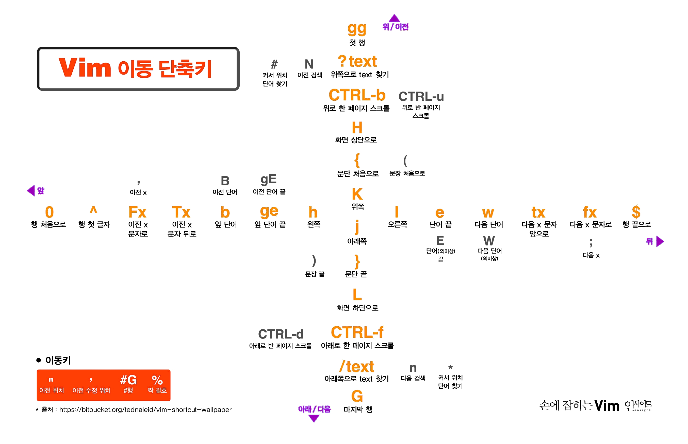
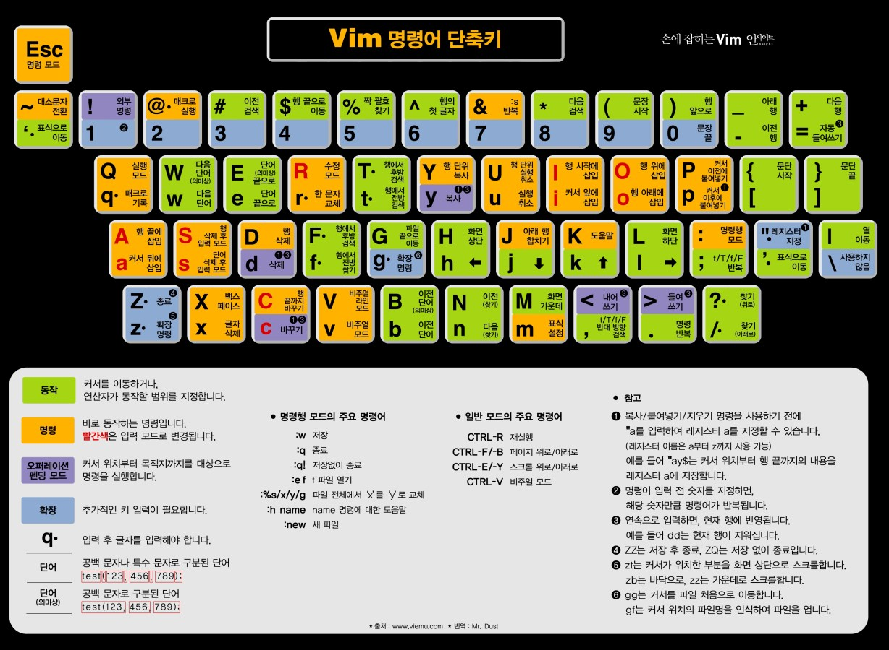

# VIM

### 유용한 사이트
- https://nolboo.kim/blog/2016/11/15/vim-for-beginner/ 완전 초보를 위한 Vim
- http://www.mimul.com/pebble/default/2014/07/15/1405420918073.html 점진적으로 학습하기
- https://vim.rtorr.com/lang/ko/ Vim Cheat Sheet
- https://vim-adventures.com/  vim-adventures
## 쉘로 빠져나가기
```vim
:shell 또는 :sh

되돌아오기

exit
```


## :! 명령어 실행
```vim
:! ls
```

#### :r ! 명령어로 출력된 내용 editor에 가져와 뿌려주기
```vim
:r ! ls
```


## sp, vsp 창 분리
```
가로형으로 분리
:sp 파일명

세로형으로 분리
:vsp 파일명

창닫기
:q

창이동
Ctrl + w
```

## 단축키



